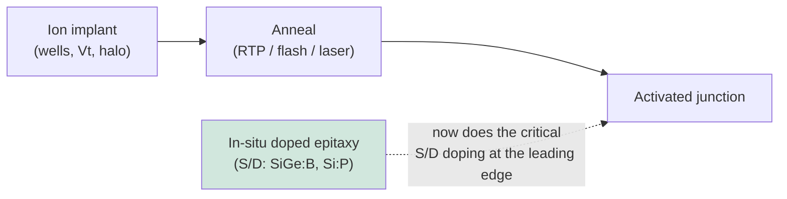

# Ion Implantation, Doping, and Thermal Processing

Doping — the deliberate introduction of impurity atoms to control the electrical properties of silicon — is what turns inert crystalline silicon into a working transistor. The dominant method for introducing dopants is **ion implantation**, in which dopant atoms are ionized, accelerated to high energy, and fired into the wafer with exquisite control over dose and depth. Implantation is invariably paired with **annealing**, a thermal step that repairs the crystal damage caused by implantation and electrically activates the dopants by moving them onto lattice sites. Together, implant and anneal define the junctions that make transistors switch, and as devices have scaled into three dimensions, both have faced profound new challenges. This file covers implantation physics, implanter types, junction and well engineering, GAA-specific doping, the full range of annealing technologies, epitaxial and emerging doping methods, the vendor landscape, and the roadmap.

---

## 📊 Visual Overview

*Original schematics; Mermaid diagrams render natively on GitHub.*

**Implanted dopant depth profile (roughly Gaussian)**

```
 dopant
 conc.  │        ____
        │      /      \      Rp  = projected range (set by ion energy)
        │     /        \     ΔRp = straggle (spread)
        │   /            \   tail extended by channeling
        │_/               \____
        └────────────────────────── depth into wafer →
```

**Annealing — "hotter but shorter" to activate dopants without diffusion**

```
 Furnace    minutes-hours  ████████████████████  (much diffusion)
 Spike RTP  seconds        ████
 Flash      milliseconds   ██
 Laser      micro/nano-s   ▏  (least diffusion, highest activation, layer-selective)
```

**Implant → anneal flow, and the modern shift to in-situ doping**



---

## 1. Ion Implantation Physics

In ion implantation, a dopant source (a gas such as BF₃, PH₃, or AsH₃, or a solid source) is ionized in a plasma, the desired ion species is selected by a mass-analyzing magnet, and the resulting beam is accelerated and scanned across the wafer. As each energetic ion penetrates the silicon, it loses energy through collisions with electrons (electronic stopping) and with atomic nuclei (nuclear stopping), finally coming to rest at a depth determined by its energy and mass. The statistical distribution of stopping depths produces a roughly Gaussian dopant profile characterized by:

- the **projected range (Rₚ)** — the mean penetration depth, increasing with ion energy,
- the **straggle (ΔRₚ)** — the spread around the mean depth,
- and the **Bragg peak** — the depth of maximum energy deposition.

Several physical effects complicate this picture. **Channeling** occurs when ions travel down the open channels of the crystal lattice and penetrate anomalously deep; it is suppressed by tilting the wafer (typically 7°), by pre-amorphizing the surface, or by using screen oxides. The collision cascade displaces silicon atoms from their lattice sites, creating **implant damage** that can range from isolated point defects to complete **amorphization** of the near-surface region at high doses. This damage must subsequently be repaired by annealing; if poorly managed, residual damage causes junction leakage and defects. The implanted dopants are, as implanted, mostly **electrically inactive** (sitting on interstitial sites); only after annealing moves them onto substitutional lattice sites do they donate or accept carriers.

---

## 2. Implanter Types

Different doping tasks require very different combinations of dose, energy, and throughput, and the industry uses several distinct implanter classes:

- **High-current implanters** deliver large doses at low-to-moderate energy, used for source/drain doping and other heavy-dose steps where throughput (atoms per second) is critical.
- **High-energy implanters** accelerate ions to MeV-class energies to place dopants deep below the surface — used for retrograde wells, buried layers, and triple wells in advanced CMOS and imagers.
- **Medium-current implanters** balance dose and energy with precise dose control and good angle control, used for threshold-voltage adjustment, halo/pocket implants, and extension implants.
- **PLAD (Plasma Doping / Plasma Immersion Ion Implantation)** immerses the wafer in a dopant plasma and pulses a bias to drive ions into the surface conformally — valuable for doping the sidewalls of three-dimensional structures (such as fins and trench capacitors) and for ultra-shallow, high-dose junctions where conventional beamline implant struggles with conformality.

Modern implanters are sophisticated machines combining ion sources, mass analysis, acceleration columns, beam scanning, and precise wafer angle and dose control, with stringent requirements on metallic contamination, dose uniformity, and angle accuracy.

---

## 3. Junction and Well Engineering

The art of doping lies in sculpting precise dopant profiles to control transistor behavior:

- **Ultra-shallow junctions (USJ)** for source/drain **extensions** must be extremely shallow yet highly doped to minimize short-channel effects while keeping series resistance low — a fundamental tension that grows more acute at every node.
- **Halo / pocket implants** introduce a localized, angled, oppositely doped region near the channel edges to suppress punch-through and control threshold-voltage roll-off in short devices.
- **Retrograde wells** place the peak doping below the surface (using high-energy implants) to improve latch-up immunity and short-channel control while keeping the surface lightly doped for mobility.
- **Threshold-voltage (Vt) adjust implants** finely tune the channel doping to set the transistor's switching voltage, often providing multiple Vt flavors (low, standard, high) on the same chip for power/performance trade-offs.

Several auxiliary techniques sharpen these profiles. **Pre-amorphization implants (PAI)**, typically with germanium, deliberately amorphize the surface to eliminate channeling and enable abrupt, shallow junctions. **Co-implants** of species such as carbon or fluorine suppress unwanted dopant diffusion (e.g., carbon retards boron transient-enhanced diffusion), helping maintain abrupt junctions through the anneal.

---

## 4. GAA-Specific and Advanced Doping Challenges

The transition to FinFET and then gate-all-around devices fundamentally disrupted conventional implantation. In a planar transistor, the doped regions are flat surfaces easily reached by a vertical or slightly tilted ion beam. In three-dimensional devices, the surfaces to be doped — fin sidewalls, stacked nanosheet channels surrounded on all sides by gate — are no longer simply accessible to a directional beam, and the channels themselves are often kept lightly doped (relying on the gate's electrostatic control) to avoid dopant-fluctuation-induced variability.

As a result, the industry has shifted much of the critical doping away from beamline implantation toward **in-situ doped epitaxy** (see below), conformal **plasma doping (PLAD)** for three-dimensional surfaces, and **work-function engineering** of the metal gate (rather than channel doping) to set the threshold voltage. In GAA, controlling **source/drain doping and contact resistance** becomes the dominant concern: the dopant must be placed and activated to maximum concentration right at the contact interface to minimize the parasitic resistance that increasingly dominates device performance. **Replacement-metal-gate work-function tuning** — selecting and layering metals (TiN, TiAl, TaN, and others) to set the precise work function for n- and p-type devices — is the modern equivalent of the old channel Vt implant, performed by ALD/PVD rather than implantation.

---

## 5. Annealing — Repairing Damage and Activating Dopants

Annealing is the thermal partner to implantation, and the history of annealing is a history of delivering ever-higher peak temperatures for ever-shorter times — because high temperature activates dopants and repairs damage, while short time prevents the dopants from diffusing and smearing out the carefully engineered shallow junctions. The progression of annealing technologies reflects this drive toward "hotter but shorter":

- **Furnace annealing** — the original method, holding wafers at temperature for minutes to hours in a batch furnace. Too much diffusion for modern shallow junctions, but still used for some bulk and well anneals.
- **Rapid Thermal Processing (RTP) / spike anneal** — lamp-based heating that ramps the wafer to peak temperature (~1,000–1,100°C) in seconds and immediately cools, with a "spike" profile that minimizes time at peak. The workhorse for activation through many nodes.
- **Flash Lamp Anneal (FLA)** — high-intensity flash lamps deliver a millisecond-scale thermal pulse to the surface, achieving high peak temperature with even less diffusion than spike RTP.
- **Laser Spike Anneal (LSA)** — a scanned laser heats the surface for microseconds (or, in the most advanced nanosecond/melt variants, even shorter), achieving the highest activation with the least diffusion. LSA is essential at the leading edge for the shallowest, most abrupt junctions and for minimizing contact resistance, and its low thermal penetration makes it compatible with already-formed structures.
- **Microwave annealing** — a lower-temperature, research/specialty technique that activates dopants through microwave coupling with reduced thermal budget.

The choice of anneal is a delicate optimization: maximizing electrical activation and damage repair while minimizing dopant diffusion and respecting the thermal budget of structures already on the wafer — a budget that has become extraordinarily tight at advanced nodes, especially where metal gates, silicides, and (in 3D integration) already-bonded device tiers cannot tolerate high temperatures.

---

## 6. Epitaxial and Emerging Doping Methods

As beamline implantation has reached its limits for three-dimensional, ultra-shallow doping, alternative methods have grown in importance:

- **In-situ doped epitaxy** is now the dominant way to dope source/drain regions at the leading edge. During the selective epitaxial growth of SiGe (for pMOS) or Si:P (for nMOS), dopant gases are flowed simultaneously, incorporating boron or phosphorus into the growing crystal at high, uniform concentration with perfect conformality and no implant damage. This in-situ approach achieves higher active dopant concentrations than implant-and-anneal can, which is critical for minimizing contact resistance.
- **Monolayer doping (MLD)** is a research technique in which a self-assembled monolayer of dopant-containing molecules is chemically attached to the surface and then driven in by a brief anneal, achieving extremely shallow, conformal, damage-free doping of three-dimensional surfaces — attractive in principle for GAA and beyond, though not yet in high-volume manufacturing.
- **Plasma doping (PLAD)** bridges implant and these surface methods, offering conformal, high-dose doping of complex topographies.

---

## 7. Vendor Landscape

| Vendor | Position |
|---|---|
| **Applied Materials (AMAT)** | A major force across both implant (the VIISta family of high-current, high-energy, and medium-current implanters) and thermal processing (RTP, and laser anneal via its DSA/Vantage platforms); a broad, integrated portfolio. |
| **Axcelis Technologies** | The **specialist ion-implant leader** (the Purion platform spanning high-current, high-energy, and medium-current), with particularly strong positions in memory and power-device implantation; implant is its entire business and core moat. |
| **ULVAC, Sumitomo Heavy Industries (Japan)** | Implant suppliers serving the Japanese and memory markets. |
| **Mattson Technology** | RTP/thermal and strip (now part of a China-linked group). |
| **SCREEN, Kokusai, TEL** | Thermal-processing and furnace suppliers (overlapping with the thermal coverage in File 09). |

The implant market is notable for Axcelis's success as a focused pure-play competing against the much larger Applied Materials, sustained by deep specialization and strong positions in the memory and power segments. Annealing, especially the high-value laser-anneal segment, is dominated by Applied Materials.

---

## 8. Roadmap

The implant-and-anneal roadmap is driven by the same forces reshaping the rest of the front end:

- **Junction depth scaling to below 3nm:** extensions and contacts must be ever shallower yet more highly doped, pushing the limits of low-energy implant, in-situ epitaxy, and ultra-short anneals.
- **Contact-resistance minimization:** widely regarded as the single binding constraint at 2nm and below, this demands maximum active dopant concentration precisely at the contact interface — driving in-situ doped epitaxy, advanced silicides, and millisecond/nanosecond laser anneal.
- **Three-dimensional doping for GAA and CFET:** conformally and controllably doping stacked nanosheet channels and the dual tiers of CFET requires conformal doping methods (PLAD, MLD) and a continued shift from channel doping toward work-function engineering.
- **Ultra-low thermal budget for 3D integration:** as sequential 3D integration and backside processing spread, dopant activation must increasingly be achieved with localized, surface-confined anneals (laser, flash) that do not disturb already-formed lower tiers — making the lowest-thermal-budget activation methods strategically critical.

Doping and thermal processing thus remain quietly decisive technologies: less visible than lithography, but increasingly the limiting factor in how fast and how efficiently the smallest transistors can be made to switch.

---

## Extended Analysis: Contact Resistance, 3D Doping, and the Annealing Frontier

### A. Contact Resistance — The Binding Constraint

As established in File 15, **contact resistance (Rc)** is widely regarded as the single binding constraint on device performance at 2nm and below, and doping-and-annealing technology sits at the heart of the battle against it. The total resistance of a scaled transistor is increasingly dominated not by the channel but by the **parasitic resistances** — and chief among these is the resistance of the source/drain contact, which rises sharply as the contact area shrinks. Minimizing Rc requires several things that implant and anneal must deliver together: **maximum active dopant concentration** right at the contact interface (so the Schottky barrier is thin and tunneling is easy), an **optimal silicide** (NiPtSi, Ti-based) with low barrier height, and minimal damage. The dopant concentration achievable is limited by **solid solubility** (how much dopant the silicon lattice can hold in active, substitutional sites), and pushing beyond equilibrium solubility requires non-equilibrium techniques — above all **melt or near-melt laser anneal**, which can freeze in dopant concentrations above the equilibrium limit. This is why the highest-value annealing (millisecond and nanosecond laser anneal) has become strategically critical: it is one of the few levers that can meaningfully reduce the contact resistance that otherwise caps performance gains at the leading edge.

### B. The Shift from Beamline Implant to In-Situ Doping

The transition to three-dimensional devices has driven a profound shift in *how* doping is done. In a planar transistor, the doped regions are flat, accessible surfaces easily reached by a directional ion beam — making **beamline implantation** the natural choice. But in FinFET and especially GAA devices, the surfaces to be doped (fin sidewalls, the ends of stacked nanosheet channels surrounded by gate) are no longer simply accessible to a beam, and the channels are often kept lightly doped to avoid dopant-fluctuation variability. The industry has therefore shifted much critical doping to **in-situ doped epitaxy** — incorporating boron or phosphorus during the selective epitaxial growth of the SiGe or Si:P source/drain — which achieves higher active concentrations, perfect conformality, and no implant damage. This shift is one of the quieter but more consequential changes in front-end processing: the source/drain doping that most affects contact resistance is now done primarily by the **epitaxy** tool (Files 04), not the implanter, while beamline implant retains roles in wells, threshold-voltage adjustment, and other steps. **Plasma doping (PLAD)** and research-stage **monolayer doping** address the conformal-doping needs of three-dimensional surfaces where in-situ epitaxy does not reach.

### C. Work-Function Engineering Replaces Channel Doping

A related shift is that **work-function engineering of the metal gate** has largely replaced channel doping as the means of setting the threshold voltage. In older planar devices, Vt was set by implanting the channel; but in GAA devices the channel is kept lightly doped (for mobility and variability), and Vt is instead set by carefully selecting and layering the **gate metals** (TiN, TiAl, TaN, and others) whose work functions determine the switching voltage, deposited by ALD/PVD. Providing multiple Vt flavors on the same chip (low, standard, high Vt for power/performance trade-offs) is achieved by varying these work-function metal stacks — or, in GAA, by varying the nanosheet width (the "multi-Vt by width" capability). This means the modern equivalent of the old channel-Vt implant is performed by the deposition tools, not the implanter — another example of how the device transition has redistributed doping functions across the equipment set.

### D. The Annealing Frontier — Localized and Tier-Selective

The annealing roadmap is defined by an intensifying demand for **localized, ultra-low-thermal-budget, tier-selective** activation. As devices go three-dimensional and as 3D integration (sequential CFET, monolithic 3D, backside power) places already-completed structures on the wafer, the anneal must deliver high local temperature to activate dopants **without heating the buried or adjacent structures** that cannot tolerate it. This is precisely what **melt and near-melt laser anneal** provide: by heating only the surface (or a specific region) for nanoseconds, they activate dopants and form low-resistance contacts while leaving the rest of the wafer — and any underlying device tier — cool. This capability is becoming indispensable for CFET (activating an upper tier without damaging the lower gate), for backside processing (activating near a backside contact), and for any build-on-top integration. The premium on the most localized, most controllable, lowest-thermal-budget anneal grows with every step toward three-dimensional integration, making advanced laser anneal one of the higher-growth, higher-value corners of the front-end equipment set — and tying the future of doping-and-annealing technology directly to the three-dimensional, contact-resistance-limited frontier that defines the leading edge.

### E. Equipment Landscape Reprised

The doping-and-annealing equipment landscape reflects these shifts. **Implant** remains a two-player market (Applied Materials' VIISta and Axcelis's Purion), with Axcelis especially strong in the memory and SiC-power segments that remain implant-intensive (memory and power devices use far more implant than leading-edge logic, where in-situ epitaxy has taken over much of the critical doping). **Annealing** is led by Applied Materials, particularly in the high-value laser-anneal segment that has become strategically central. As leading-edge logic shifts critical doping toward epitaxy and its activation needs toward localized laser anneal, while memory and power devices sustain robust implant demand, the doping-and-annealing equipment market splits along application lines — a microcosm of the broader industry pattern in which the hardest, highest-value problems migrate toward the three-dimensional, contact-resistance-limited, thermal-budget-constrained frontier.

---

## Further Analysis: The Implant Market's Resilience and the Power-Device Tailwind

### A. Why Implant Endures Despite the Shift to Epitaxy

Although in-situ doped epitaxy has taken over much of the *critical* source/drain doping at the leading edge (Section B above), **ion implantation remains a large, resilient, and essential market** — a reminder that the leading edge is only part of the story. Implant retains numerous essential roles: well formation, threshold-voltage adjustment, halo/pocket implants, and various specialized doping steps in logic; and it remains absolutely central in **memory and power devices**, which use far more implantation than leading-edge logic. DRAM and 3D NAND require extensive implantation for wells, cell structures, and various doping steps, and the enormous and growing volumes of memory manufacturing sustain robust implant demand. **Power devices** (silicon power MOSFETs and IGBTs, and especially SiC power devices) are heavily implant-intensive, and the explosive growth of SiC for EV electrification (File 12) is a significant and growing implant tailwind, because SiC device fabrication requires extensive high-dose implantation (SiC cannot be doped by diffusion as easily as silicon, making implantation essential). This diversity of demand — across logic, memory, and power — gives the implant market resilience even as leading-edge logic shifts critical doping toward epitaxy, and it is why **Axcelis** (the implant specialist) has thrived with strong positions in the memory and power segments, competing successfully against the much larger Applied Materials.

### B. The SiC Power Tailwind for Implant

The growth of **silicon carbide power devices** deserves emphasis as a significant tailwind for the implant market. SiC device fabrication is unusually implant-intensive: because SiC's extremely low dopant-diffusion coefficients make diffusion-based doping impractical, virtually all SiC doping is done by **ion implantation** (often high-dose, high-energy, and sometimes hot implantation), followed by the extreme high-temperature activation anneals (1,600–1,800°C) that SiC requires. As SiC power devices ramp rapidly to serve EV electrification, fast charging, and grid applications (File 12), the demand for SiC-capable implanters grows correspondingly — a tailwind that benefits the implant specialists (Axcelis has a strong SiC-power position) and that exemplifies how the electrification megatrend creates equipment demand beyond the silicon-logic mainstream. The SiC power tailwind, together with the resilient memory implant demand, ensures that ion implantation — though displaced from some leading-edge logic roles by epitaxy — remains a large, growing, and strategically important equipment market, tied to the electrification and memory megatrends as much as to logic scaling.

### C. The Doping-and-Annealing Synthesis

The synthesis of this file is that doping and annealing, though less visible than lithography or etch, are increasingly the **limiting factors** in how fast and how efficiently the smallest transistors can be made to switch — and that they have evolved in profound ways as devices have gone three-dimensional. The critical source/drain doping that most affects contact resistance (the binding constraint at 2nm and below) has shifted toward **in-situ doped epitaxy**; the threshold-voltage setting has shifted toward **work-function engineering** of the metal gate; conformal doping of three-dimensional surfaces uses **plasma doping** and research-stage methods; and activation increasingly demands **localized, ultra-low-thermal-budget laser anneal** that can activate dopants without damaging the buried structures of three-dimensional and stacked devices. Meanwhile, **beamline implantation** remains essential and resilient across logic (wells, Vt, halo), memory (heavily implant-intensive), and power devices (especially SiC, with its electrification tailwind). The doping-and-annealing equipment market thus splits along application lines — leading-edge logic shifting toward epitaxy and laser anneal, memory and power sustaining robust implant demand — in a pattern that mirrors the broader industry: the hardest, highest-value problems migrating toward the three-dimensional, contact-resistance-limited, thermal-budget-constrained frontier, while a large and resilient base of demand persists across the diverse applications that the full breadth of the semiconductor industry serves.
