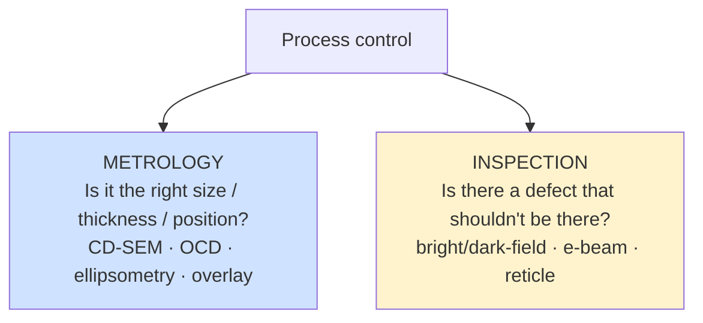
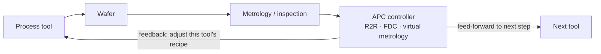

# Metrology, Inspection, and Process Control

If lithography, deposition, and etch *build* the chip, then metrology and inspection are what make it possible to build the chip **reliably and profitably**. Process control — the combined disciplines of metrology (measuring dimensions, films, and overlay), inspection (finding defects), and advanced process control (using those measurements to steer the process) — is the nervous system of the fab. It is also one of the fastest-growing and most yield-critical segments of wafer-fab equipment, typically representing 11–13% of WFE spending and rising, because the difficulty of catching tiny, often stochastic defects and of holding atomic-scale dimensions has escalated dramatically with EUV and gate-all-around. This file covers CD metrology, film metrology, overlay metrology, defect inspection, computational and AI-driven inspection, in-situ and APC control, the vendor landscape (overwhelmingly dominated by KLA), and the roadmap.

A useful distinction underlies everything that follows: **metrology** answers "is the feature the right size, thickness, and position?", while **inspection** answers "is there a defect that shouldn't be there?". Both are essential, and both have become harder at every node.

---

## 📊 Visual Overview

*Original schematics; Mermaid diagrams render natively on GitHub.*

**Metrology vs. inspection — two distinct questions**



**The Advanced Process Control (APC) feedback loop — the fab's nervous system**



**The inspection trade-off triangle**

```
              SENSITIVITY
             (find smallest defects)
                  /\
                 /  \
                /    \      pick any point — gaining one
               /      \     costs the others; different
              /        \    modalities sit at different corners
   THROUGHPUT ▔▔▔▔▔▔▔▔▔▔ NUISANCE
   (wafers/hr)            (false events)
```

---

## 1. Critical Dimension (CD) Metrology

CD metrology measures the physical dimensions of patterned features — line widths, space widths, contact diameters, fin and nanosheet dimensions — with sub-nanometer precision. Several complementary techniques are used:

- **CD-SEM (Critical-Dimension Scanning Electron Microscopy):** the workhorse inline CD tool, imaging the top-down profile of features with an electron beam to measure widths and pitches at thousands of sites per wafer. CD-SEM is fast and direct but provides limited information about the three-dimensional profile and can induce slight resist shrinkage. Key suppliers are Hitachi High-Tech (the leader) and Applied Materials.
- **OCD / Scatterometry (Optical Critical Dimension):** an indirect, model-based technique that measures the optical response (reflectance/polarization versus wavelength and angle) of a periodic test structure and fits it to an electromagnetic model (typically using Rigorous Coupled-Wave Analysis, RCWA) to extract the full three-dimensional profile — heights, sidewall angles, widths, and even subtle shape parameters. **Mueller-matrix spectroscopic ellipsometry** captures the complete polarization response for maximum sensitivity. OCD is non-destructive, fast, and rich in three-dimensional information, making it indispensable for complex structures like fins, nanosheets, and high-aspect-ratio features. KLA, Onto Innovation, and Nova are the leaders.
- **CD-AFM (Atomic Force Microscopy):** uses a physical probe tip to trace the surface, providing direct three-dimensional profile and sidewall information; slower than optical methods, used as a reference and for difficult structures.
- **TEM / STEM (Transmission/Scanning Transmission Electron Microscopy):** offers atomic-resolution cross-sectional imaging — the ultimate reference for dimensions and material structure — but is destructive and slow, so it is used for process development, reference metrology, and failure analysis rather than high-volume inline control.

The leading-edge challenge for CD metrology is measuring features that are now only a few atoms wide, buried inside three-dimensional structures (e.g., the width of a nanosheet hidden within a stack), with the precision and throughput needed for production control.

---

## 2. Film Metrology

Film metrology measures the thickness, composition, and properties of the many deposited layers:

- **Ellipsometry** — including single-wavelength, spectroscopic (SE), and Mueller-matrix variants — measures film thickness and optical constants by analyzing how the polarization of reflected light changes; it is the primary tool for dielectric and many other film thicknesses, capable of sub-angstrom thickness precision.
- **XRF (X-Ray Fluorescence)** measures composition and thickness of metal films by detecting the characteristic X-rays emitted under excitation.
- **XRR (X-Ray Reflectivity)** measures thickness, density, and interface roughness of thin films and multilayers with high precision, important for ALD films and complex stacks.
- **Four-point probe** measures sheet resistance of conductive films, providing a direct electrical check on metal and doped-layer properties.

As films thin to a few atomic layers (ALD high-k, barrier, and channel layers), film metrology must resolve thickness and composition differences at the angstrom and sub-angstrom level, often on three-dimensional surfaces.

---

## 3. Overlay Metrology

Overlay measures how accurately each patterned layer is aligned to the layers beneath it — a quantity that has become critically tight as multi-patterning and EUV demand overlay budgets approaching and below two nanometers. Misregistration between layers causes shorts, opens, and yield loss, so overlay is measured at many sites on every production wafer.

- **IBO (Image-Based Overlay)** measures the relative position of specially designed overlay targets (box-in-box or AIM targets) by imaging them optically. KLA's Archer series and ASML's YieldStar (which doubles as an in-line overlay and CD tool tightly integrated with ASML scanners) are the leading systems.
- **DBO (Diffraction-Based Overlay)** measures overlay from the diffraction signal of overlaid gratings, offering high precision and robustness to certain process variations.

A distinctive EUV-era challenge is that **stochastic effects** introduce random placement variation that complicates overlay measurement and control, and the extremely tight overlay budgets at 2nm require not only better metrology but dense sampling and sophisticated correction feeding back to the scanner.

---

## 4. Defect Inspection

Defect inspection scans wafers (and reticles) to find physical defects — particles, pattern bridges and breaks, residues, scratches, and the increasingly important **stochastic** defects of EUV. The fundamental trade-off in inspection is **sensitivity versus throughput versus nuisance**: higher sensitivity finds smaller real defects but also more "nuisance" (harmless) events, and slower scanning. Several modalities span this trade space:

- **Bright-field optical inspection** (e.g., KLA's 29xx/39xx broadband-plasma series) uses broadband light and high-resolution optics for high-sensitivity patterned-wafer inspection; the mainstay for catching pattern defects at high throughput.
- **Dark-field optical inspection** (e.g., KLA Surfscan and dark-field patterned tools) detects scattered light from defects against a dark background, excellent for particles and certain defect types at high speed.
- **E-beam inspection** (e.g., KLA's eSxxx series and the HMI/ASML e-beam tools, plus Applied Materials' e-beam) offers the highest resolution — able to detect the smallest defects and to perform voltage-contrast inspection that reveals electrical opens/shorts — but at far lower throughput than optical, making it a complement used for the most critical layers and for defect-of-interest discovery. **Multi-beam** e-beam inspection is an active development area aimed at overcoming the throughput limitation.
- **Reticle (mask) inspection** is a specialized discipline: defects on a mask print on every wafer, so masks are inspected with dedicated tools (KLA Teron) and, for EUV, increasingly require **actinic** inspection at the 13.5nm wavelength (ZEISS AIMS EUV) to see EUV-relevant defects and to qualify the stochastic-defect behavior of the mask.

The defining inspection challenge at the leading edge is **EUV stochastic defectivity**: random, low-probability bridges and breaks that occur at acceptable doses and must be caught at densities below 0.001/cm² — pushing inspection toward higher sensitivity, larger sampled area, and AI-driven classification.

---

## 5. Computational and AI-Driven Inspection

The flood of data from high-sensitivity inspection has made **computation** as important as the optics. **AI-driven defect classification** uses convolutional neural networks and, increasingly, vision transformers to automatically sort detected events into defect types and to separate real "defects of interest" from harmless nuisance — dramatically improving the signal-to-noise of inspection and reducing the engineer time needed to review images. **Nuisance filtering** and **synthetic-defect augmentation** (using generative models to create training images of rare defects) further sharpen classifier performance. These capabilities are increasingly bundled into the inspection platforms and into yield-management software (File 22 covers AI/ML in depth).

---

## 6. In-Situ Metrology and Advanced Process Control (APC)

Beyond standalone metrology tools, process control is increasingly embedded **inside** the process tools and woven into closed control loops:

- **In-situ sensors** monitor the process in real time: **optical emission spectroscopy (OES)** detects etch endpoint by watching plasma emission lines change as a layer clears; **optical/spectroscopic endpoint** detects CMP completion; in-situ reflectometry monitors deposition thickness.
- **Advanced Process Control (APC)** uses metrology results to steer the process. **Run-to-run (R2R) control** adjusts each tool's recipe based on measurements of prior wafers (feedback) and incoming-wafer conditions (feed-forward), holding the process on target despite drift. **Fault Detection and Classification (FDC)** monitors hundreds of tool sensor signals to detect excursions and predict failures.
- **Virtual metrology** uses machine-learning models to *predict* a wafer's measured result from tool sensor data, so that every wafer effectively gets a (modeled) measurement without the throughput cost of measuring it physically — enabling tighter control with less sampling.

APC is what converts raw measurements into yield: it closes the loop so that the fab continuously self-corrects, which is essential when the process window has shrunk to atomic dimensions.

---

## 7. Vendor Landscape

| Vendor | Position |
|---|---|
| **KLA Corporation** | The **dominant** process-control company, with leading positions in optical and e-beam defect inspection, reticle inspection, overlay (Archer), film and OCD metrology, and yield-management software; KLA's broad, deep portfolio and data-analytics franchise give it one of the strongest moats in all of SemiCap, with industry-leading margins. |
| **Applied Materials (AMAT)** | A significant process-control player, especially in **e-beam** inspection/review and in select metrology, leveraging its breadth across process and control. |
| **ASML** | Provides **YieldStar** (overlay/CD metrology tightly integrated with its scanners) and, via its **HMI** acquisition, e-beam inspection — using metrology to close the loop on its own lithography. |
| **Onto Innovation** | Formed from the Rudolph/Nanometrics merger; strong in OCD, thin-film, overlay, and packaging/advanced-node inspection and lithography systems. |
| **Nova Measuring Instruments** | Specialist in OCD/scatterometry, materials metrology, and XPS-based composition metrology; a focused, fast-growing pure-play. |
| **ZEISS** | Provides EUV **actinic mask inspection** (AIMS EUV) and electron microscopy, alongside its lithography-optics role. |
| **Hitachi High-Tech** | The CD-SEM leader, plus FIB-SEM and process-analysis tools. |
| **SCREEN** | Inspection and review tools, alongside its wet-process franchise. |

The standout feature of this landscape is KLA's dominance: in a SemiCap industry generally characterized by category-specific leaders, KLA holds a commanding, broad position across nearly the whole of inspection and much of metrology, making process control one of the most concentrated and profitable corners of the equipment world.

---

## 8. Roadmap

The process-control roadmap is shaped by the device transitions and the data deluge:

- **AI-native metrology and inspection:** machine learning moves from a bolt-on classifier to the core of how measurements are made, predicted, and interpreted — virtual metrology, generative defect modeling, and AI-driven recipe optimization become standard.
- **Actinic EUV mask inspection:** as 2nm-class pitches make stochastic mask defects decisive, faster actinic inspection (next-generation AIMS EUV) becomes a gating capability for HVM mask qualification.
- **In-cell 3D metrology for GAA and CFET:** measuring the dimensions of nanosheets and dual-tier CFET channels *buried inside* the device — the width of a sheet hidden within a stack, the profile of an inner spacer — requires new model-based optical, X-ray, and e-beam techniques capable of seeing in three dimensions inside the cell.
- **High-throughput e-beam:** multi-beam e-beam inspection and review aim to break the resolution-versus-throughput trade-off, bringing e-beam-class sensitivity to a larger sampled area to catch the smallest stochastic defects in production.
- **Tighter overlay and CD control:** sub-2nm overlay and angstrom-level CD control demand denser sampling, better targets, and faster feedback to the scanner — making metrology and lithography ever more tightly co-engineered.

As the physical margins of manufacturing shrink toward the atomic scale, the ability to *see* and *control* what is happening on the wafer has become as decisive as the ability to pattern, deposit, and etch it — which is why process control, led by KLA, has become one of the most strategically important and defensible franchises in the entire semiconductor-equipment industry.

---

## Extended Analysis: The Process-Control Imperative and the KLA Moat

### A. Why Process Control Grows Faster Than the Rest of WFE

A defining trend is that **process control (metrology + inspection) grows as a share of WFE at each node** — a structural advantage rooted in the physics of scaling. As features shrink toward the atomic scale, three things happen simultaneously: the **tolerance for variation shrinks** (a 2nm node cannot tolerate the CD or overlay variation that a 28nm node could), the **number of things that can go wrong rises** (more layers, more steps, more materials, EUV stochastics, GAA 3D structures), and the **cost of a yield excursion rises** (each wafer is more valuable, each defect more expensive). All three drive more measurement and more inspection, more densely sampled, with greater sensitivity. EUV's stochastic defects must be caught at densities below 0.001/cm²; GAA nanosheet dimensions must be measured *inside* the device; overlay budgets approach 2nm and must be controlled across the wafer. The result is that process-control intensity — measurements and inspections per wafer, and process-control spending as a share of WFE — rises node over node, making it one of the few WFE segments with a structural tailwind independent of the cycle. This is the deep reason KLA's franchise strengthens as nodes get harder.

### B. The Anatomy of the KLA Moat

KLA's dominance of process control is among the most durable competitive positions in all of SemiCap, and its anatomy is instructive. First, **breadth**: KLA leads across optical and e-beam defect inspection, reticle inspection, overlay, and film/OCD metrology — a portfolio that lets it offer integrated process-control solutions and that few rivals can match. Second, **the installed base and data franchise**: KLA's vast installed base generates an enormous, growing body of defect and metrology data, and its yield-management software (KLARITY and related) turns that data into yield insight — a franchise that compounds with each tool sold, because more tools mean more data mean better algorithms mean more value. Third, **the difficulty of the problem**: process control is technically deep (high-sensitivity inspection, model-based metrology, defect classification) and yield-critical, so customers are reluctant to switch from a proven leader. Fourth, **the rising-intensity tailwind**: because process control grows faster than WFE, KLA's market expands structurally. Together these create a moat — breadth, data, difficulty, and a growth tailwind — that has kept KLA dominant and highly profitable (among the highest margins in SemiCap) and that is unusually resistant to competitive challenge.

### C. The Inspection Sensitivity-Throughput-Nuisance Triangle

The central engineering challenge of inspection is the **three-way trade-off** between sensitivity (finding the smallest real defects), throughput (scanning wafers fast enough for production), and nuisance (avoiding flooding engineers with harmless events). These pull against each other: higher sensitivity finds smaller defects but also more nuisance and scans slower; higher throughput sacrifices sensitivity; lower nuisance requires better classification. Different inspection modalities occupy different points in this triangle — **bright-field optical** for high-sensitivity patterned inspection at moderate throughput, **dark-field** for fast particle detection, **e-beam** for the highest sensitivity at low throughput. The frontier challenge is **EUV stochastic defectivity**: catching random, low-probability bridges and breaks requires high sensitivity over a large sampled area, pushing against the throughput limit — which is why **multi-beam e-beam inspection** (parallelizing the high-sensitivity-but-slow e-beam approach) and **AI-driven classification** (taming the nuisance problem) are the key development frontiers. The triangle is also why no single inspection tool suffices, and why fabs deploy a suite of complementary modalities, each optimized for different defect types and stages — a complexity that further entrenches the breadth advantage of a leader like KLA.

### D. The Rise of AI-Native Process Control

Machine learning (File 22) is moving from a bolt-on to the **core** of process control. In inspection, deep-learning classifiers separate defects of interest from nuisance and discover new defect types; in metrology, ML enables **virtual metrology** (predicting measurements from sensor data, so every wafer is effectively measured without the throughput cost) and improves model-based techniques; and across both, generative models augment training data for rare defects, and ML closes the control loop faster. The trajectory is toward **AI-native** process control — measurement and inspection in which ML is not an add-on but the fundamental method, enabling tighter control with less physical sampling and faster yield learning. This deepens the data-and-software dimension of the process-control franchise (favoring the leaders with the largest data sets) and is one of the clearest examples of the recursive relationship between AI and semiconductor manufacturing: the inspection and metrology that yield the chips increasingly run on the AI that those chips enable.

### E. The In-Cell 3D Metrology Frontier

The hardest metrology challenge of the GAA and CFET era is **seeing inside the device**. As transistors become three-dimensional, the critical dimensions to be controlled are increasingly *buried*: the width and thickness of a nanosheet hidden within a stack, the lateral recess of an inner spacer, the profile of a high-aspect-ratio etch, the alignment of bonded tiers, the geometry of a backside via. These cannot be measured by simple top-down imaging; they require **model-based optical (scatterometry), X-ray (XRR, CD-SAXS), and advanced e-beam** techniques pushed toward true three-dimensional, in-cell capability — measuring features that are physically inside the device, non-destructively, at production throughput. This is one of the defining metrology frontiers, because the very three-dimensionality that delivers density also hides the structures that must be measured to control the process. Solving it — developing metrology that can see in three dimensions inside the cell, for nanosheets, CFET tiers, and backside structures — is essential to yielding the three-dimensional devices of the coming decade, and it is a primary focus of the process-control leaders (KLA, Onto, Nova, and the X-ray and e-beam specialists) as they extend their techniques to keep pace with the architectures they must control.

---

## Further Analysis: Process Control as the Yield Engine

### A. Why Process Control Is the Economic Heart of Yield

Process control is, in the end, the **engine of yield**, and yield is the economic heart of semiconductor manufacturing (Files 15, 24). The connection is direct: every defect must be *found* (inspection), *understood* (classification and root-cause analysis), and *eliminated* (process correction), and the speed and accuracy with which a fab does this determines how fast its defect density falls and its yield rises along the learning curve. A fab that can find, diagnose, and eliminate defects faster ramps its yield faster, reaches profitability sooner, captures the lucrative early-node market, and amortizes its enormous fixed costs faster — making process control a decisive competitive weapon, not a cost center. This is why process-control intensity rises at each node (the harder the node, the more critical the ability to find and fix defects), why KLA's franchise strengthens as nodes get harder, and why fabs invest so heavily in metrology and inspection despite their cost. The economic logic is compelling: the cost of process control is far less than the value of the yield it enables, and at advanced nodes, where each wafer is worth $15,000–20,000+ and yield difficulties can be ruinous, the ability to see and control what is happening on the wafer is worth almost any price.

### B. The Co-Evolution of Process Control and the Process

A defining dynamic is the **co-evolution** of process control with the processes it must control. Every new process capability — a new EUV layer, a GAA channel release, a hybrid bond, a backside via — creates a new metrology or inspection challenge: a new dimension to measure, a new defect type to find, a new structure to characterize. Process control must advance in lockstep with the process, developing the new measurement and inspection capabilities each new process demands. This co-evolution is why process control is not a static, solved discipline but a continually advancing one, and why the process-control leaders (KLA, Onto, Nova, and the metrology specialists) work closely with the process-tool makers and fabs to develop the control capabilities for each new process generation. The in-cell 3D metrology for GAA and CFET, the actinic mask inspection for EUV, the stochastic-defect inspection, the hybrid-bonding overlay and surface metrology, the backside-via alignment — each is a process-control capability developed to enable a specific process advance, and each exemplifies how process control and the process co-evolve, each enabling and demanding advances in the other. As the process pushes toward atomic-scale, three-dimensional, multi-material devices, process control must push equally hard to see and control them — making it one of the most continually innovating, and most strategically essential, corners of the equipment industry.

### C. The Data Dimension

A final, increasingly important dimension of process control is **data**. The flood of measurements and images from high-sensitivity, densely-sampled metrology and inspection constitutes one of the richest data sets in manufacturing, and turning that data into yield insight — through classification, correlation, root-cause analysis, and prediction — is increasingly where the value lies. This is the foundation of the **yield-management and analytics** franchises (KLA's software, PDF Solutions' Exensio, and others), and it is increasingly powered by machine learning (File 22). The data dimension creates a compounding advantage for the process-control leaders: more tools generate more data, which trains better algorithms, which deliver more value, which sells more tools — a virtuous cycle that further entrenches the leaders (KLA above all) and makes process control as much a data-and-software business as a hardware business. As fabs grow more data-driven and more AI-native (File 22), the data dimension of process control grows in importance, and the ability to extract yield insight from the vast process-control data set becomes an ever-more-decisive competitive factor — completing the picture of process control as the nervous system, the yield engine, and increasingly the data brain of the modern fab.
