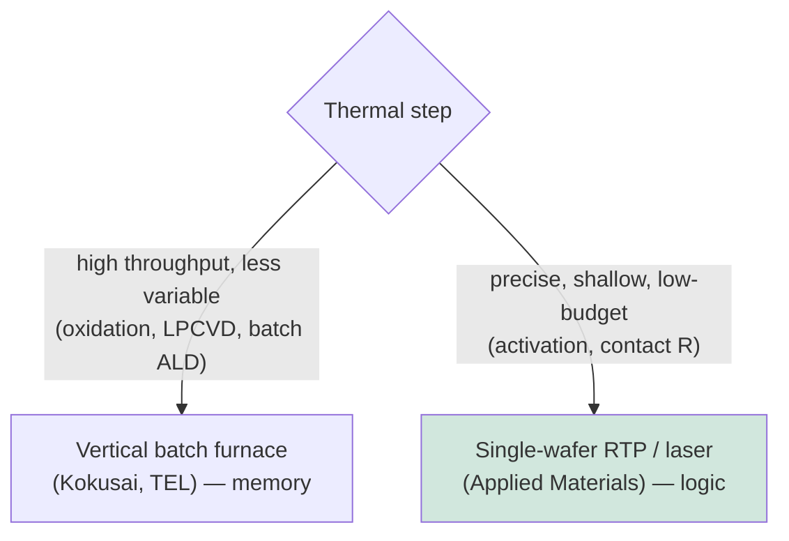

# Thermal Processing, Oxidation, and Diffusion Furnaces

Thermal processing is one of the oldest and most fundamental pillars of semiconductor manufacturing. Long before plasma etch or EUV lithography, the ability to grow a high-quality silicon-dioxide film by simply heating silicon in oxygen was the foundation of the entire planar process that made integrated circuits possible. Today thermal processing spans a wide range — from classic high-temperature oxidation and diffusion in batch furnaces, to millisecond rapid thermal processing, to the ultra-low-temperature regimes demanded by 3D integration. This file covers thermal oxidation and the Deal-Grove model, diffusion furnaces and batch LPCVD, rapid thermal processing, the advanced low-thermal-budget frontier, the vendor landscape, and the special thermal demands of compound semiconductors.

---

## 📊 Visual Overview

*Original schematics; Mermaid diagrams render natively on GitHub.*

**Thermal oxidation grows by consuming silicon (Deal-Grove kinetics)**

```
   Before:                 After (oxide grows INTO the wafer):
   ┌──────────────┐        ┌──────────────┐
   │              │        │░░░ SiO2 ░░░░░│  ← ~46% above original surface
   │   silicon    │   →    ├──────────────┤  ← original surface line
   │              │        │   silicon    │  ← interface moves down as Si is consumed
   └──────────────┘        └──────────────┘
   Thin oxide: linear in time.  Thick oxide: parabolic (diffusion-limited).
```

**Two roles of thermal processing — batch throughput vs. single-wafer precision**



---

## 1. Thermal Oxidation

Thermal oxidation grows silicon dioxide by reacting silicon with oxygen (dry oxidation) or water vapor (wet oxidation) at high temperature, typically 800–1,100°C. Uniquely, the oxide grows by *consuming* the underlying silicon — the silicon-oxide interface moves into the wafer as oxygen diffuses through the already-grown oxide to react at the interface. This produces an exceptionally clean, electrically excellent Si/SiO₂ interface, which is precisely why silicon (rather than other semiconductors with better intrinsic transport) came to dominate microelectronics: no other material system offered such a high-quality native oxide.

The kinetics are described by the **Deal-Grove model**, which predicts that oxide growth is **reaction-rate-limited** (linear in time) for thin oxides and **diffusion-limited** (parabolic in time, growing as the square root of time) for thicker oxides, as oxygen must diffuse through an ever-thicker oxide to reach the interface. **Dry oxidation** (O₂) grows slower but produces denser, higher-quality oxide used for thin gate dielectrics; **wet oxidation** (H₂O) grows much faster and is used for thicker field and masking oxides.

The history of the gate dielectric traces the relentless thinning of thermal oxide: pure **SiO₂** served for decades, thinned node by node until at ~90/65nm it reached about 1.2nm — only a few atomic layers — where quantum-mechanical tunneling leakage became intolerable. **Nitrided oxide (SiON)** extended the limit somewhat by raising the dielectric constant slightly and blocking boron penetration. Finally, at 45nm, the industry abandoned thermal gate oxide altogether in favor of ALD-deposited **high-k (HfO₂)** dielectrics with a thin interfacial oxide — ending the era in which the most important film on the chip was simply grown by heating silicon in a furnace. Thermal oxidation nonetheless remains essential for interfacial layers, isolation, sacrificial oxides, and many other steps.

---

## 2. Diffusion Furnaces

Diffusion furnaces — large, precisely controlled tube furnaces — are the classic high-temperature batch tools, processing many wafers (often 50–150) at once for high throughput. Originally used for **dopant diffusion** (driving dopants in from surface sources, the predecessor to ion implantation), modern furnaces serve several roles:

- **Oxidation and annealing** of large wafer batches.
- **Batch LPCVD** of films such as polysilicon (gate and 3D NAND channel material), silicon nitride (Si₃N₄, for hardmasks and spacers), and TEOS-based silicon dioxide — where the furnace's excellent uniformity and throughput make it economical.
- **Batch ALD** of films like the ONON stacks of 3D NAND and DRAM capacitor dielectrics, where conformality and throughput both matter.

Furnaces come in **horizontal** (older) and **vertical** (modern, better for particle control and automation) configurations. The vertical batch furnace remains a high-volume workhorse, particularly in memory manufacturing, where the sheer number of layers makes batch throughput economically vital.

---

## 3. Rapid Thermal Processing (RTP)

As junction depths shrank, the long times of furnace annealing caused too much dopant diffusion, driving the industry toward **Rapid Thermal Processing (RTP)** — single-wafer, lamp-based heating that ramps a wafer to peak temperature (1,000–1,100°C) in seconds and cools it just as fast. RTP delivers the high temperature needed for dopant activation and damage repair while minimizing the time at temperature, thereby preserving shallow junctions.

RTP demands extraordinary engineering: **uniform heating** across the wafer (non-uniformity creates stress and slip dislocations), accurate **pyrometry** (measuring wafer temperature optically without contact, a challenge complicated by varying surface emissivity), and tight ramp-rate control. RTP and its faster successors — **spike anneal, flash-lamp anneal (FLA), and laser spike anneal (LSA)** — form the modern annealing toolkit detailed in File 07, each pushing toward higher peak temperature for shorter time to maximize activation while minimizing diffusion.

---

## 4. Advanced and Low-Thermal-Budget Processing

The leading edge has pushed thermal processing in two opposite directions simultaneously: toward higher peak temperatures for ultra-shallow junction activation (laser anneal), and toward **ultra-low thermal budgets** for everything that comes after the transistor is formed. Several trends define this frontier:

- **Ultra-fast anneal for contact resistance:** the lowest junction series resistance requires maximum dopant activation right at the contact, achieved by microsecond/nanosecond laser anneal that heats only the surface for the briefest possible time.
- **Low-temperature BEOL processing:** once copper interconnect is present, the thermal budget is capped at roughly 400°C to avoid degrading the metal and low-k dielectrics. Every BEOL deposition, anneal, and cure must respect this ceiling, driving the use of plasma-enhanced and other low-temperature methods.
- **Even tighter budgets for 3D integration:** in sequential 3D integration and backside power processing, an already-completed bottom device tier must survive the processing of an upper tier or the backside, demanding localized, surface-confined thermal steps (laser, flash) that activate dopants or crystallize films without heating the buried structures. This ultra-low-thermal-budget regime is one of the defining process challenges of CFET and advanced 3D-IC (Files 15 and 23).
- **Selective thermal processing:** localized heating (by laser or other means) that processes only the desired region, leaving the rest of the wafer cool.

The tension between needing high temperature for the best films and junctions, and needing low temperature to protect everything already on the wafer, is one of the enduring balancing acts of advanced manufacturing — and it grows sharper as more of the device is built in three dimensions.

---

## 5. Vendor Landscape

| Vendor | Position |
|---|---|
| **Applied Materials (AMAT)** | Broad thermal portfolio spanning RTP, oxidation/nitridation, and the high-value **laser anneal** segment (DSA/Vantage); a leader across thermal processing. |
| **Tokyo Electron (TEL)** | Strong in **batch furnaces** and thermal processing, especially for memory; broad coater/developer and thermal franchise. |
| **Kokusai Electric** | A leader in **vertical batch furnaces** and batch ALD/CVD, central to memory manufacturing (3D NAND ONON, DRAM); formerly part of Hitachi. |
| **ASM International** | Furnace and epitaxy/thermal systems, alongside its ALD leadership. |
| **Centrotherm, SCREEN** | Furnace and thermal-processing suppliers, with Centrotherm also serving solar and power-device markets. |

The thermal-processing market is split between the high-throughput **batch-furnace** franchise (dominated by TEL and Kokusai, especially for memory) and the **single-wafer RTP/laser-anneal** franchise (led by Applied Materials), reflecting the two distinct roles thermal plays in the modern fab.

---

## 6. SiC and GaN Thermal Processing

Compound semiconductors impose thermal demands far beyond those of silicon, requiring dedicated equipment:

- **Silicon carbide (SiC)** processing requires extraordinarily high temperatures. Dopant activation in SiC demands anneals at **1,600–1,800°C** — far above anything used for silicon — typically with a carbon cap to protect the surface from decomposition. SiC oxidation and epitaxy likewise occur at much higher temperatures, requiring specialized high-temperature furnaces and CVD reactors.
- **Gallium nitride (GaN)** processing, while not requiring SiC's extreme activation temperatures, demands careful thermal management during MOCVD epitaxy and device anneals, and the materials' different thermal-expansion and decomposition behavior requires dedicated thermal equipment.

These elevated thermal requirements are one reason compound-semiconductor manufacturing uses a distinct equipment ecosystem (covered in File 12), separate from the silicon-CMOS thermal toolset, even though both rely on the same fundamental principles of oxidation, diffusion, and annealing.

---

Thermal processing thus spans the full history and future of the industry — from the elegantly simple thermal oxide that made silicon king, to the millisecond laser anneals and ultra-low-budget thermal steps that will enable the three-dimensional devices of the next decade. Though less visible than lithography or etch, it remains an indispensable and continually evolving pillar of semiconductor manufacturing.

---

## Extended Analysis: Anneal Physics, Control, and Applications

### A. The Diffusion-Activation Trade-Off in Depth

The central physics of annealing is a race between two thermally-driven processes: **dopant activation** (and damage repair), which requires high temperature, and **dopant diffusion**, which smears out the carefully engineered junction and which also increases with temperature and time. The dopant diffusion length scales roughly as √(D·t), where D (the diffusion coefficient) rises exponentially with temperature and t is the time at temperature. Because activation has a higher thermal activation energy than diffusion over the relevant range, going **hotter but shorter** improves the activation-to-diffusion ratio — which is the entire logic behind the historical progression from furnace (minutes–hours) to spike RTP (seconds) to flash (milliseconds) to laser (microseconds and below). At the limit, **melt laser anneal** (briefly melting and recrystallizing the surface) achieves near-complete activation with essentially no diffusion, producing ultra-abrupt, highly-doped junctions — at the cost of extreme process control to avoid damage.

### B. RTP Temperature Control

The defining engineering challenge of RTP is measuring and controlling the wafer temperature accurately and uniformly during a process lasting only seconds. **Pyrometry** (inferring temperature from emitted infrared radiation) is complicated because the wafer's **emissivity** varies with its films, doping, and backside condition, so the same radiance can correspond to different true temperatures. Solutions include ripple pyrometry, multi-point and multi-wavelength pyrometry, and careful chamber design to control reflections. **Temperature uniformity** across the wafer is critical: a hot or cold spot creates thermal stress that can generate **slip dislocations** (crystal defects) that ruin devices, so the lamp array and chamber are engineered for uniform heating, with multi-zone control to compensate for edge effects and pattern-density variations.

### C. Laser Anneal Variants and Applications

Laser spike anneal comes in several flavors distinguished by dwell time and whether the surface melts:
- **Sub-melt (non-melt) microsecond LSA:** a scanned laser (often CO₂ or diode) heats the surface for microseconds without melting, used for activation and to improve contact resistance with minimal diffusion. Applied Materials' dynamic surface anneal (DSA) is a leading platform.
- **Nanosecond / melt laser anneal:** an excimer or solid-state laser melts the surface for nanoseconds, achieving the most abrupt, highly-activated junctions; used at the leading edge and increasingly for **low-thermal-budget, layer-selective** activation in 3D and backside-power processing, where only the surface or a specific tier must be heated.

Laser anneal has become strategically critical precisely because it can deliver high local temperature **without heating the underlying structures** — exactly what is needed to activate dopants in an upper CFET tier, or near a backside contact, without damaging the already-formed device below. This makes the laser-anneal segment (led by Applied Materials, with Veeco, Sumitomo, and others) one of the higher-growth, higher-value corners of thermal processing.

### D. Furnace Processing Economics

Batch furnaces remain economically vital in memory manufacturing because the enormous layer counts of 3D NAND (hundreds of ONON pairs) make per-wafer single-wafer processing prohibitively slow for many steps. A vertical batch furnace processing 100+ wafers at once amortizes the long deposition or anneal time across the whole batch, delivering the throughput and cost-per-wafer that commodity memory demands. The trade-off is reduced run-to-run flexibility and longer cycle time per batch, so the industry balances batch (for throughput-critical, less-variable steps) against single-wafer (for control-critical steps) — a balance that varies by application and by manufacturer. **Kokusai Electric and TEL** dominate the batch-furnace market, with their fortunes tied closely to the memory cycle.

### E. Vendor and Technology Summary

| Thermal technology | Time scale | Primary use | Leaders |
|---|---|---|---|
| Batch furnace | Minutes–hours | Oxidation, LPCVD, batch ALD, bulk anneal | Kokusai, TEL, ASM, Centrotherm |
| Spike RTP | Seconds | Dopant activation, general anneal | Applied Materials, Mattson |
| Flash lamp anneal | Milliseconds | Ultra-shallow junction activation | Applied Materials, others |
| Laser spike (sub-melt) | Microseconds | Contact resistance, advanced activation | Applied Materials (DSA), Veeco |
| Melt laser anneal | Nanoseconds | Most abrupt junctions, layer-selective 3D | Applied Materials, Sumitomo |

As the industry moves to three-dimensional and backside-processed devices, the premium on **localized, ultra-low-thermal-budget** processing rises, making advanced laser anneal one of the technologies whose strategic importance grows even as classical furnace thermal processing matures — a microcosm of the broader pattern, seen throughout this database, in which the hardest and highest-value problems migrate toward the atomic-scale, three-dimensional frontier.
