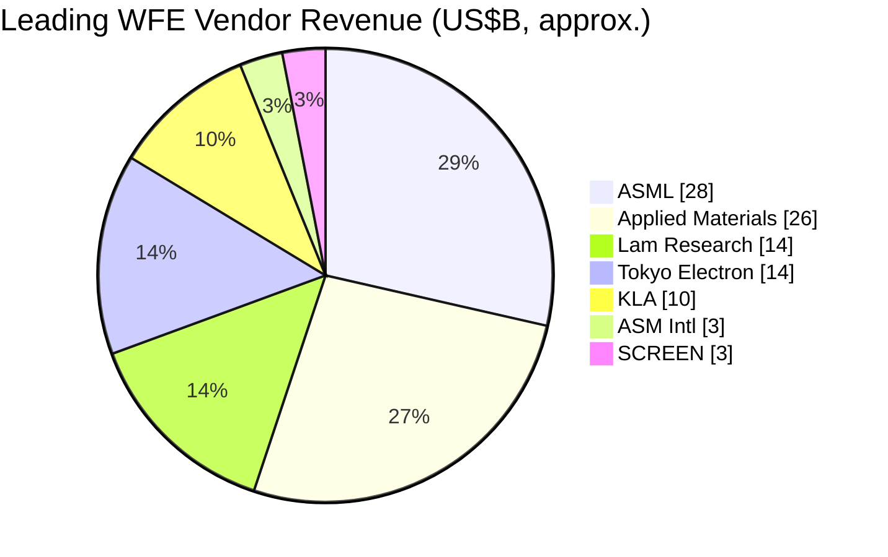

# SemiCap Vendor Competitive Landscape — Deep Market Analysis

The semiconductor-equipment industry is one of the most concentrated in the global economy. A small number of companies — many holding monopoly or near-monopoly positions in their categories — control the tools on which all digital technology depends. This file profiles the major vendors in depth, covering business description, key products, market position, competitive moat, key customers, and strategic outlook, and concludes with market-share and financial-context tables and an analysis of customer concentration and export-control exposure.

A unifying theme: most SemiCap categories are **oligopolies or monopolies**, defended by decades of accumulated process know-how, deep customer co-development relationships, enormous installed bases (which generate recurring service/spares revenue and lock in the next purchase), and patent portfolios. These moats make the industry remarkably stable at the top — the leaders rarely change — even as it is violently cyclical in revenue.

---

## 📊 Visual Overview

*Original schematics; Mermaid diagrams render natively on GitHub.*

**Who leads what — category leadership at a glance**

```mermaid
flowchart TB
    LITHO["Lithography → ASML (EUV monopoly)"]
    OPT["EUV optics → ZEISS (sole supplier)"]
    TRACK["Coater/developer → TEL"]
    ETCH["Etch → Lam (then TEL, AMAT)"]
    DEP["Deposition → AMAT (then Lam, TEL, ASM)"]
    ALD["ALD → ASM International"]
    PC["Process control → KLA (dominant)"]
    CMP["CMP → AMAT, Ebara"]
    CLEAN["Wet clean → SCREEN"]
    style LITHO fill:#cfe2ff
    style PC fill:#cfe2ff
    style OPT fill:#cfe2ff
```



**Concentration spectrum — from monopoly to competitive**

```
 MONOPOLY ─────────────────────────────────────────► COMPETITIVE
 ASML(EUV)   ZEISS   TEL(track)   KLA   ASM(ALD)   Lam(etch)   AMAT   |   packaging · subsystems · materials
 (highest margins & most defensible)                                  (more players)
```

**Leading WFE vendors by ~2023 revenue (US$B, approx.)**



---

## 1. ASML (Netherlands)

The single most strategically important company in SemiCap, and arguably in all of technology. ASML is the **sole supplier of EUV and High-NA EUV lithography** worldwide and the leading supplier of DUV immersion scanners. Its EUV monopoly — built over two decades and €10B+ of R&D, in partnership with ZEISS (optics), TRUMPF (drive laser), and Cymer (light source, acquired 2013) — gates the entire leading edge: no fab can make advanced logic or DRAM below ~7nm economically without ASML. Key products: NXE/EXE EUV scanners (~$150–200M for EUV, ~$380M+ for High-NA), TWINSCAN DUV immersion scanners, YieldStar metrology, and (via HMI) e-beam inspection. **Moat:** an essentially unassailable monopoly resting on an irreproducible supply ecosystem and integration know-how. **Customers:** TSMC, Samsung, Intel, SK Hynix, Micron. **Outlook:** secular growth from rising EUV layer counts, High-NA adoption, and the AI capex cycle, tempered by China export restrictions (no EUV to China since 2018; DUV restrictions tightening) and cyclicality.

## 2. Applied Materials (AMAT) (USA)

The **largest and broadest** WFE company, with the widest product portfolio in the industry. AMAT leads or contends in **deposition (PVD — the Endura leader; CVD; ALD; epitaxy), etch, CMP (the Reflexion leader), ion implant, thermal/RTP and laser anneal, and e-beam inspection/metrology**, plus a growing advanced-packaging business. Its strategy of **Integrated Materials Solutions (IMS)** — co-engineering multiple process steps (deposit-etch-treat) within a single integrated platform — is a key differentiator at the leading edge. **Moat:** breadth, scale, the largest installed base in the industry (huge recurring service revenue), and deep materials-engineering expertise. **Customers:** all major foundries, logic, and memory makers. **Outlook:** broad exposure to every growth driver (GAA, advanced packaging, new materials), balanced by significant China revenue exposure and cyclicality.

## 3. Lam Research (USA)

The **etch leader** and a deposition powerhouse, especially strong in **memory**. Lam dominates plasma etch (CCP and ICP, including the critical 3D NAND HAR etch) and holds leading positions in **deposition (tungsten and metal fill, PECVD/ALD dielectrics, the ALTUS and VECTOR/Striker platforms)** and in **clean**. Its tight coupling of etch and deposition enables integrated module solutions for the most demanding steps (3D NAND, GAA channel release). **Moat:** etch dominance, deep memory relationships, and process know-how in the hardest etch and fill applications. **Customers:** Samsung, SK Hynix, Micron, TSMC, Intel. **Outlook:** leveraged to the memory cycle (a strength in upturns, a vulnerability in downturns), to 3D NAND layer growth, and to GAA/advanced-packaging etch; meaningful China exposure.

## 4. KLA Corporation (USA)

The **dominant process-control company** — the leader in defect inspection (optical and e-beam), reticle inspection, overlay (Archer), and film/OCD metrology, plus a strong yield-management software and data-analytics franchise. KLA enjoys one of the **highest margins and strongest moats** in all of SemiCap: process control is concentrated, technically deep, and increasingly critical as EUV stochastics and GAA make yield harder to achieve. **Moat:** breadth and depth across inspection and metrology, a vast installed base, and a data/software franchise that compounds with each tool. **Customers:** all leading-edge fabs (process control is most intensive at the leading edge). **Outlook:** structurally advantaged by rising process-control intensity at each node; KLA's share of WFE tends to *grow* as nodes get harder.

## 5. Tokyo Electron (TEL) (Japan)

A broad Japanese WFE giant and the **dominant supplier of coat/develop track systems** (the photoresist-processing tools paired with every lithography scanner — a near-monopoly that makes TEL an essential ASML complement). TEL is also a major force in **etch, deposition (CVD/ALD), thermal/furnace, clean, and wafer bonding**. **Moat:** the coater/developer monopoly, strong memory and Japanese-customer relationships, and broad process breadth. **Customers:** TSMC, Samsung, SK Hynix, Micron, Intel, plus the Japanese ecosystem. **Outlook:** broad exposure to leading-edge and memory growth; the coater/developer franchise grows directly with EUV adoption (every EUV scanner needs a track).

## 6. ASM International (Netherlands)

The **ALD leader**, especially for the high-k/metal-gate and gate-stack ALD that is central to FinFET, GAA, and CFET, plus strong **epitaxy (Intrepid/Epsilon)** and PECVD. ASM's focus on ALD — the fastest-growing deposition technology — gives it strong growth and margins. **Moat:** foundational ALD IP (tracing to Suntola) and process leadership in the most critical conformal-deposition steps. **Customers:** all leading-edge logic and memory makers. **Outlook:** a prime beneficiary of GAA (inner-spacer and gate-stack ALD), selective deposition, and the growing number of ALD steps per node.

## 7. Onto Innovation (USA)

Formed from the merger of Rudolph Technologies and Nanometrics, Onto is a focused **process-control and metrology** specialist — OCD/scatterometry, thin-film and overlay metrology, macro-defect inspection, and lithography/inspection systems for advanced nodes and **advanced packaging** (a growth area where Onto is well positioned). **Moat:** focused metrology expertise and a strong packaging-inspection position. **Outlook:** leveraged to advanced-packaging growth and rising metrology intensity.

## 8. Nova Measuring Instruments (Israel)

A fast-growing metrology pure-play specializing in **OCD/scatterometry, materials metrology, and XPS-based composition metrology**. Nova's dimensional and materials metrology is increasingly important for GAA and complex 3D structures. **Moat:** specialized, high-precision metrology and strong R&D. **Outlook:** structural growth from rising process-control intensity and 3D-device metrology challenges.

## 9. Axcelis Technologies (USA)

The **specialist ion-implant leader** (the Purion platform), competing successfully against the much larger Applied Materials by deep focus. Axcelis is especially strong in **memory and power-device (including SiC) implantation**. **Moat:** implant specialization and strong memory/power positions. **Outlook:** leveraged to the memory cycle and to the secular growth of SiC power (which is implant-intensive); some China exposure.

## 10. Entegris (USA)

Not a tool maker but a critical **materials and consumables** supplier — CMP slurries (via the CMC Materials acquisition), advanced filtration, gas and liquid purification, specialty chemicals, and wafer carriers/FOUPs. Entegris provides the recurring, process-critical consumables that every fab consumes continuously. **Moat:** deep co-engineering of materials with specific processes, creating sticky recurring revenue. **Outlook:** grows with wafer volumes and with the rising materials-purity requirements of advanced nodes.

## 11. SCREEN Semiconductor Solutions (Japan)

The **dominant single-wafer wet-clean supplier**, with a particularly strong position in Japan and globally. Cleaning is performed hundreds of times per wafer, making SCREEN's tools high-throughput and yield-critical. **Moat:** wet-process know-how and strong customer relationships. **Outlook:** grows with the rising number and stringency of cleaning steps at advanced nodes.

## 12. Kokusai Electric (Japan)

A leader in **batch (furnace) CVD/ALD**, central to memory (3D NAND ONON stacks, DRAM high-k) and to thermal processing. Formerly Hitachi Kokusai; the subject of an aborted KKR/Applied Materials acquisition, now independent and publicly listed. **Moat:** batch-deposition leadership and memory relationships. **Outlook:** leveraged to memory and to the growing layer counts of 3D NAND.

## 13. Hitachi High-Tech (Japan)

The **CD-SEM leader** (critical-dimension metrology), plus FIB-SEM, etch, and process-analysis tools. **Moat:** electron-microscopy and CD-metrology expertise. **Outlook:** steady demand from advanced-node CD control and failure analysis.

## 14. ZEISS (Germany)

The exclusive supplier of **EUV and High-NA projection optics** to ASML — a co-equal technical partner in the EUV monopoly (ASML took a stake in ZEISS SMT). ZEISS also provides **EUV actinic mask inspection (AIMS)** and electron microscopy. **Moat:** the world's most advanced optics manufacturing, irreproducible at scale. **Outlook:** grows directly with EUV/High-NA; High-NA optics are even more complex and valuable.

## 15. EV Group / SUSS MicroTec (Austria / Germany)

The leaders in **wafer bonding** (including hybrid bonding and temporary bonding/debonding) and in **lithography for MEMS and advanced packaging**. As hybrid bonding becomes central to 3D integration and HBM, these companies occupy a strategically rising niche. **Moat:** bonding and alignment expertise. **Outlook:** strong growth from hybrid bonding, 3D integration, and backside power processing.

## 16. DISCO Corporation (Japan)

The dominant supplier of **dicing (blade, stealth laser) and grinding/thinning** equipment — essential for singulation and for the wafer thinning that underpins 3D stacking and backside processing. **Moat:** near-monopoly in precision dicing/grinding and the consumable blades. **Outlook:** strong growth from advanced packaging, HBM, and backside power (all thinning-intensive).

## 17. Kulicke & Soffa / BESI / ASM Pacific (USA / Netherlands / Hong Kong)

The leaders in **packaging assembly** — die attach, wire bonding, thermo-compression bonding, and increasingly **hybrid-bonding placement**. BESI in particular is a key hybrid-bonding tool supplier (partnered with Applied Materials). **Moat:** assembly precision and packaging relationships. **Outlook:** leveraged to advanced packaging and the transition from wire bond and micro-bump to hybrid bonding.

## 18. Cohu / Teradyne / Advantest (USA / USA / Japan)

The **test** ecosystem: **Advantest and Teradyne** dominate automated test equipment (ATE) for logic, memory, and SoC; **Cohu** leads test handlers and contactors. Test intensity is rising at advanced nodes and for complex AI/HBM devices. **Moat:** ATE platform breadth and software. **Outlook:** growth from AI-chip and HBM test complexity and from system-level test. (File 25 covers test in depth.)

## 19. MKS Instruments / Novanta (USA)

Critical **subsystem** suppliers — RF power generators and matching networks, vacuum and pressure measurement, gas-flow control, photonics, and lasers — that go *inside* the process tools of AMAT, Lam, TEL, and others. MKS (which acquired Newport and Atotech) is a bellwether for the whole equipment supply chain. **Moat:** essential, designed-in subsystems. **Outlook:** tracks overall WFE demand. (File 20 covers subsystems.)

## 20. Brooks Automation / Azenta (USA)

Suppliers of **fab automation** (vacuum and atmospheric wafer-handling robotics, EFEMs), **cryogenics** (vacuum pumps), and life-sciences sample management (Azenta). **Moat:** automation and contamination-control expertise designed into tools and fabs. **Outlook:** tracks WFE and new-fab construction.

## 21. China Domestic Players: NAURA, AMEC, Piotech, ACM, SiCarrier, SMEE, and others

China's domestic equipment industry, propelled by the **Big Fund** and the urgent drive for self-sufficiency under export controls, is growing rapidly though still trailing the leading edge. **NAURA** is the largest, with etch, deposition (PVD/CVD/ALD), thermal, and clean tools. **AMEC (Advanced Micro-Fabrication Equipment China)** is a credible etch (CCP/ICP) supplier used by domestic and some international fabs, plus MOCVD. **Piotech** (deposition/PECVD/ALD), **ACM Research** (clean), **Kingsemi** (coat/develop track), **SiCarrier** (a Huawei-linked broad-equipment effort), and **SMEE (Shanghai Micro Electronics)** (domestic lithography, currently limited to mature-node DUV) round out the field. **Position:** strong and growing in mature-node and many front-end categories; significant gaps remain at the leading edge (especially EUV, advanced metrology, and the most demanding etch/deposition). **Drivers:** heavy government support, a captive domestic market (SMIC, CXMT, YMTC), and the strategic imperative of localization. **Outlook:** rapid share gains in mature nodes and steady climbing of the technology ladder, constrained at the leading edge by the same export controls that motivate the effort.

---

## 22. Market-Share Snapshot by Segment

| Segment | Leader(s) | Approx. position |
|---|---|---|
| EUV lithography | ASML | ~100% (monopoly) |
| DUV lithography | ASML; Nikon, Canon | ASML majority |
| Coat/develop track | TEL | dominant (~80%+) |
| Etch | Lam; TEL, AMAT | Lam leads, three-way at the top |
| Deposition (overall) | AMAT; Lam, TEL, ASM | AMAT leads |
| ALD | ASM; AMAT, Lam, TEL | ASM strong leader |
| CMP tools | AMAT; Ebara | AMAT leads |
| Ion implant | AMAT, Axcelis | two-player |
| Process control / inspection | KLA | dominant (~50%+ of inspection) |
| CD-SEM | Hitachi High-Tech | leader |
| Wet clean | SCREEN; TEL, Lam | SCREEN leads single-wafer |
| EUV optics | ZEISS | sole supplier to ASML |
| Dicing/grinding | DISCO | dominant |
| Wafer bonding | EVG, SUSS, BESI | leaders |
| Test (ATE) | Advantest, Teradyne | two-player |

## 23. Financial and Strategic Context

The major WFE firms share a recognizable financial profile: **R&D intensity of roughly 12–18% of revenue** (among the highest in any industry), **gross margins typically in the 40–60% range** (with KLA and ASML at the high end, reflecting their monopoly/oligopoly positions), large **recurring service and spares revenue** from huge installed bases (which smooths the cycle and funds R&D), and **significant cyclicality** tied to the WFE spending cycle and especially to memory.

**Customer concentration risk** is acute: a handful of customers (TSMC, Samsung, Intel, SK Hynix, Micron) account for the majority of leading-edge equipment demand, so the capex decision of a single customer can move an OEM's revenue materially. **Export-control exposure** is the other defining strategic risk: China historically represented 20–45% of sales for AMAT, Lam, KLA, ASML, and TEL, and the escalating restrictions since 2022 have curtailed China-bound leading-edge sales while paradoxically boosting near-term Chinese *mature-node* tool buying (pull-forward ahead of further restrictions) and accelerating Chinese domestic competition (File 18).

The strategic outlook across the sector is shaped by several secular tailwinds — the AI-driven capex super-cycle, rising EUV/High-NA and process-control intensity per node, the explosion of advanced packaging, and the electrification-driven growth of SiC/GaN — set against the headwinds of cyclicality, China decoupling, and the slowing (and rising cost) of classical transistor scaling. The leaders' moats are deep enough that the competitive *order* is unlikely to change soon; the open questions are the pace of the cycle, the trajectory of China localization, and which firms best capture the new growth in packaging, new materials, and process control.

---

## Extended Analysis: Moats, Concentration, and the Forces Reshaping the Landscape

### A. The Anatomy of a SemiCap Moat

The remarkable stability of the SemiCap competitive order — the same leaders dominating their categories decade after decade — rests on a set of mutually reinforcing moats that are worth dissecting. **Process know-how** is the foundation: decades of accumulated learning about how to make a tool yield reliably in production, embodied in people, procedures, and tacit knowledge that cannot be quickly replicated or bought. **Customer co-development relationships** deepen the moat: tools are co-engineered with lead customers over years through joint-development agreements, creating trust and switching costs that newcomers cannot match. **The installed base** generates recurring service and spares revenue (smoothing the cycle and funding R&D) and, crucially, **locks in the next purchase** — a fab running thousands of a vendor's tools, with its processes qualified on them and its engineers trained on them, faces enormous cost and risk in switching. **R&D scale** (12–18% of revenue) lets the leaders out-invest challengers in the relentless innovation each node demands. And **patents and trade secrets** (File 17) provide legal protection atop the practical barriers. Together these moats explain why the competitive order changes so slowly, why the leaders are so profitable, and why even well-funded challengers (including China's subsidized domestic makers) find the leading edge so hard to penetrate.

### B. The Spectrum of Concentration

The SemiCap landscape spans a spectrum from monopoly to competitive, and a vendor's position on this spectrum largely determines its profitability and strategic security:
- **Monopoly:** ASML (EUV/High-NA) — the most extreme, and most valuable, position.
- **Near-monopoly / dominant:** ZEISS (EUV optics), TEL (coater/developer), KLA (process control), ASM (ALD), DISCO (dicing/grinding).
- **Strong leadership in a 2-3 player oligopoly:** Lam (etch), AMAT (deposition, CMP, implant), KLA (inspection).
- **Two-player:** Advantest/Teradyne (ATE), AMAT/Axcelis (implant).
- **More competitive / fragmented:** packaging assembly, subsystems, materials.

The more concentrated a vendor's position, the higher its margins and the more secure its franchise — which is why the monopoly and near-monopoly holders (ASML, KLA, ASM) command the highest margins and valuations, and why the strategic prize in any category is to achieve and defend a dominant position. This concentration is not accidental but a consequence of the moats above: the difficulty, capital intensity, and know-how requirements of each category naturally support only a few viable players, and often just one at the leading edge.

### C. The Forces Reshaping the Landscape

Several forces are reshaping the vendor landscape even as the core order remains stable. **The AI super-cycle** is shifting demand toward the leading edge, advanced DRAM/HBM, and advanced packaging — favoring ASML, the advanced-process and process-control leaders, and the packaging/bonding specialists (BESI, EVG, DISCO), while the rise of advanced packaging draws the WFE giants into a new arena. **Geopolitics and China localization** (File 18) are bifurcating the market, structurally reducing the incumbents' China leading-edge revenue while nurturing Chinese domestic competitors (NAURA, AMEC, Piotech) that are gaining mature-node share. **The new-materials and 3D transitions** (GAA, backside power, CFET, new interconnect metals) are elevating the categories that enable them — ALD (ASM), selective etch and deposition, wafer bonding (EVG, SUSS, BESI), thinning (DISCO), and process control (KLA) — and creating new high-value demand. And **the rising intensity of process control and lithography per node** structurally grows the share of KLA and ASML. These forces redistribute value among the categories and create new growth, even as the leaders within each category remain largely unchanged.

### D. The China Question

The single greatest uncertainty in the vendor landscape is the long-run trajectory of **China's domestic equipment industry**. Propelled by the Big Fund and the imperative of self-sufficiency under export controls, and guaranteed a captive domestic market (SMIC, CXMT, YMTC), the Chinese makers — NAURA (the largest, spanning etch, deposition, thermal, clean), AMEC (etch, MOCVD), Piotech (deposition), ACM (clean), Kingsemi (track), SiCarrier (a broad Huawei-linked effort), and SMEE (lithography) — are climbing the technology ladder rapidly. They are gaining strong share in **mature nodes** and many front-end categories, where their tools are increasingly competitive on cost and adequate on performance, and where the export controls (which restrict the incumbents' China sales) give them room to grow. The open questions are how far up the technology ladder they can climb (the leading edge, especially EUV and advanced metrology, remains a formidable gap), how much global mature-node share they will ultimately capture (a real threat to the incumbents' mature-node business), and whether they will eventually challenge the incumbents outside China. The answer will shape the vendor landscape over the coming decade more than any other factor, and it is the central strategic uncertainty for every incumbent.

### E. The Durable Order and the Open Frontiers

The synthesis is that the SemiCap vendor landscape combines a **remarkably durable core order** — the same leaders dominating their categories, protected by deep moats — with **open frontiers** where the forces of AI, 3D integration, new materials, geopolitics, and Chinese competition are redistributing value and creating new growth. The leaders' positions in lithography (ASML), process control (KLA), etch (Lam), deposition (AMAT, ASM), and the rest are unlikely to be overturned by direct challenge, because the moats are too deep. But the *relative* growth of the categories is shifting (toward lithography, process control, packaging, and the 3D-enabling technologies), new categories are rising (bonding, thinning, backside processing), and the China question looms over the mature-node market. For investors and strategists, the landscape rewards understanding both the durable order (which leaders will remain dominant) and the shifting frontiers (which categories will grow fastest and where new competition will emerge) — a combination of stability and change that makes SemiCap one of the most analytically rich and strategically consequential industries in the world.
