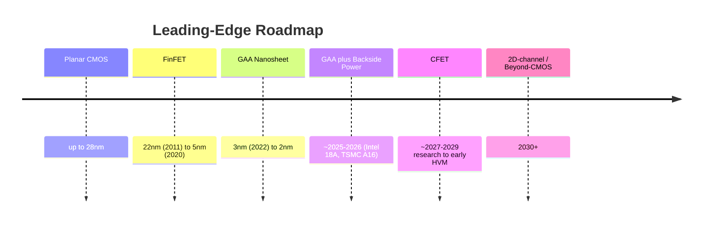
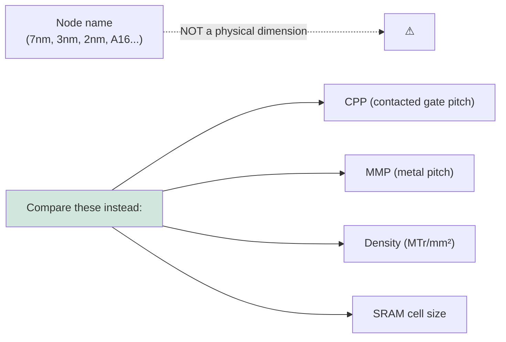

# Process Technology Roadmaps — Comprehensive Node-by-Node Analysis

> **Primary learning target.** This file is one of the two deepest sections of the database, tracing the semiconductor technology roadmap from the FinFET era through GAA, backside power, CFET, and beyond-silicon channels, with node-by-node detail on architecture, process integration, equipment requirements, and the governing roadmap frameworks.

---

## 📊 Visual Overview

*Original schematics; Mermaid diagrams render natively on GitHub.*

**Transistor architecture evolution — more gate control at every step (cross-sections)**

```
 PLANAR (≤28nm)     FinFET (22-5nm)      GAA NANOSHEET (3-2nm)    CFET (research)
                                                                   ┌─ gate (p) ─┐
    gate               ┌ gate ┐            ┌──── gate ────┐        │═══ pMOS ═══│
  ┌──────┐            ┌┴──────┴┐           │ ═══ sheet ═══ │       ├─ gate (n) ─┤
  │ chan │            │  fin   │           │ ═══ sheet ═══ │       │═══ nMOS ═══│
  └──────┘            │ (chan) │           │ ═══ sheet ═══ │       (n over p,
  ─substrate─         └────────┘           └──────────────┘        stacked)
  gate on 1 side     gate on 3 sides       gate wraps all 4        ~50% smaller cell
```

**Leading-edge architecture & power-delivery roadmap**



**Backside power delivery (BSPDN) — power moves to the wafer backside (cross-section)**

```
   ░░░░ backside power network (Vdd / Vss planes) ░░░░
        │ nano-TSV ↑ lands directly on transistor source/drain
   ████ transistors (RibbonFET / nanosheet) ████
   ════ frontside BEOL: SIGNAL ROUTING ONLY (power rails removed) ════
   Result: less IR-drop, ~10-15% denser standard cells, freed routing
```

**The node-naming problem — names are marketing; compare physical metrics instead**



---

## SECTION 1: Roadmap Frameworks and Governing Bodies

### 1.1 The ITRS — Origins and the Logic of Consensus Roadmapping

The modern practice of semiconductor roadmapping was institutionalized with the **International Technology Roadmap for Semiconductors (ITRS)**, which grew out of U.S. industry roadmaps in the late 1980s and became fully international in 1998, building on the U.S. **National Technology Roadmap for Semiconductors (NTRS)** first published in 1992–1994. The ITRS was a consortium effort coordinated through SEMATECH and the regional industry associations of the United States, Europe, Japan, Korea, and Taiwan. Its purpose was profound and economically rational: the semiconductor industry is a vast, interdependent ecosystem in which the timing of one company's innovation depends on the readiness of dozens of others. A foundry cannot move to a new node unless the equipment makers have qualified tools, the materials suppliers have qualified resists and gases, the EDA vendors have provided design tools, and the metrology exists to control the process. Left uncoordinated, these timelines would drift out of alignment, and the whole industry would stall.

The ITRS solved this coordination problem by publishing a **consensus forecast** of where the industry would be in two, five, ten, and fifteen years — specifying target values for hundreds of parameters (gate length, gate-oxide thickness, metal pitch, defect density, overlay, and so on) for each future node. This was not a prediction so much as a **shared commitment**: by agreeing that, for example, the industry would need a particular gate dielectric or a particular lithography wavelength by a particular year, the ITRS told every player in the ecosystem what to build and when. Equipment makers used it to time their R&D; materials suppliers used it to plan new chemistries; researchers used it to identify the "red brick wall" problems (parameters for which no manufacturable solution yet existed, flagged in red in the famous ITRS tables) that needed urgent invention.

The ITRS was structured around the cadence of **Moore's Law** — the doubling of transistor density roughly every two years — and for decades it served as the metronome of the industry, keeping the whole ecosystem marching in step. Consensus was reached through a structure of International Technology Working Groups (ITWGs) covering each domain (lithography, front-end processes, interconnect, metrology, assembly and packaging, and others), staffed by experts from IDMs, foundries, OEMs, and academia, who negotiated the targets and identified the gaps.

### 1.2 Why the ITRS Was Discontinued

By the early 2010s, the ITRS's foundational assumption — that progress could be described primarily as the **geometric shrinking of a planar transistor on a predictable two-year cadence** — had broken down. Several developments undermined it. First, classical Dennard scaling had ended around 2005–2007, decoupling the simple relationship between shrinking dimensions and improving power/performance. Second, the move to FinFETs (2011) and the looming move to gate-all-around meant that "the node" was no longer a single shrink factor but a bundle of architectural, materials, and three-dimensional innovations that did not map cleanly onto a single roadmap number. Third, the industry was fragmenting: only a handful of companies (Intel, TSMC, Samsung) remained at the leading edge, and their roadmaps diverged, making a single consensus "node" increasingly fictional. Fourth, value was migrating from raw transistor scaling toward **system-level integration** — packaging, heterogeneous integration, specialized accelerators — which the device-centric ITRS captured poorly.

The final ITRS report was published for 2015 (released 2016), after which the roadmap was reconstituted under a new framework better suited to the post-Dennard, post-planar, system-driven era.

### 1.3 The IRDS — IEEE's Successor Roadmap

The **International Roadmap for Devices and Systems (IRDS)**, sponsored by the **IEEE** (specifically the IEEE Rebooting Computing initiative and the Electron Devices Society), launched in 2016 as the ITRS's successor. The IRDS differs from the ITRS in scope and philosophy in several important ways:

- **Systems-first, not device-first.** The IRDS begins from application and system requirements (the "Application Benchmarking" and "Systems and Architectures" focus teams) and works downward to devices and processes, reflecting the reality that scaling is now driven by what systems need rather than by abstract density doubling.
- **Broader than CMOS.** The IRDS explicitly covers **More Moore** (continued CMOS scaling), **More than Moore** (functional diversification — sensors, RF, power, integration), and **Beyond CMOS** (entirely new device technologies — 2D materials, spintronics, neuromorphic, quantum). This tripartite structure acknowledges that the future is not a single scaling path but several parallel ones.
- **Packaging and 3D integration elevated.** The IRDS treats heterogeneous integration and advanced packaging as first-class scaling vectors, not afterthoughts.
- **Annual updates** with periodic full editions, maintained by international focus teams spanning the same global community as the ITRS.

**Key IRDS focus tables and metrics.** The "More Moore" tables track the parameters that define logic scaling, and learning to read them is essential to understanding the roadmap. The most important metrics are:

- **Contacted (or contacted poly) pitch — CPP / CGP:** the minimum distance between adjacent transistor gates including the contact — the single most important measure of horizontal logic density, because it sets how tightly transistors can be packed along the gate direction.
- **Minimum metal pitch — MMP / M0 or M1 pitch:** the tightest wiring pitch, set by lithography, which bounds interconnect density.
- **Cell height in metal tracks:** standard-cell height expressed in number of metal tracks (e.g., a "6-track" library), which together with CPP determines cell area.
- **Fin width / nanosheet width and thickness:** the critical device dimensions.
- **Drive current (Ion) and off current (Ioff):** the on/off performance metrics.
- **Subthreshold slope (SS):** how sharply the transistor turns off (the Boltzmann limit is ~60mV/decade at room temperature; getting close to it is the goal of better electrostatics).
- **Supply voltage (Vdd):** which has scaled down only slowly since Dennard scaling ended, contributing to the power-density problem.

Reading an IRDS table means tracking how these parameters are projected to evolve year by year, which architectures enable each step, and — crucially — which parameters are flagged as lacking a known manufacturable solution.

### 1.4 Fab-Internal Roadmaps versus the Public IRDS

It is essential to distinguish the **public, consensus IRDS roadmap** from the **carefully curated public roadmaps** that TSMC, Intel, and Samsung publish, and from the **closely guarded internal roadmaps** that actually govern those companies' development. The IRDS describes where the industry as a whole is heading and what generic problems must be solved; it does not reveal any single company's process recipe. The foundries' *public* roadmaps (N3, N2, A16; Intel 4, 3, 18A, 14A; SF3, SF2) are marketing-and-investor communications that announce node names, rough timing, and headline benefits, while deliberately concealing the physical process details (exact pitches, materials, layer counts) that constitute competitive advantage. The *internal* roadmaps — the actual integration schemes, design rules, and equipment sets — are among the most tightly held secrets in industry.

This three-layer structure (public consensus roadmap, public company roadmaps, secret internal roadmaps) is why analyzing the technology roadmap requires triangulating among IRDS targets, company announcements, conference disclosures (IEDM, VLSI), and the equipment roadmaps of the OEMs.

### 1.5 IMEC and the Role of Pre-Competitive Consensus

A critical institution in roadmap formation is **IMEC** (Leuven, Belgium) and its annual **ITF (IMEC Technology Forum)**. IMEC occupies a unique position as a **neutral, pre-competitive research hub** where the otherwise-fierce competitors — TSMC, Samsung, Intel — plus the equipment makers (ASML, Applied, Lam, TEL) and materials suppliers co-develop next-generation modules on a shared 300mm pilot line. Because IMEC is neutral and works years ahead of production, its own process roadmap (often labeled with technology generations such as A14, A10, A7 and research vehicles for CFET) functions as a de facto industry roadmap, shaping the direction and timing of the leading edge. IMEC's research programs — its CFET integration program, its 2D-material (MoS₂) channel program, its high-NA EUV insertion work, its BSPDN module development — effectively de-risk the technologies that later appear in commercial fabs, and IMEC's published results at IEDM and VLSI are among the most important signals of where the roadmap is going.

### 1.6 How Equipment Roadmaps Align to Process Roadmaps

The process roadmap and the equipment roadmap are two sides of one coin. For each future node, the OEMs must deliver **"technology enablement"** — tools capable of the required patterning, deposition, etch, and metrology — on a timeline that runs *ahead* of the fab's production schedule. This alignment is managed through **joint development agreements (JDAs)** between fabs and OEMs and through the IMEC pilot line. The typical timeline runs: **research** (concept demonstrated at IMEC or in an OEM lab) → **alpha tool** (first prototype) → **beta tool** (installed at a lead customer or IMEC under a JDA) → **production (HVM) tool** (qualified and copied into fleets). This pipeline spans years, which is why decisions about a node like 2nm — what lithography, what channel-release etch, what gate-fill ALD — were effectively made half a decade before the node entered production, and why High-NA EUV, shipping to customers in 2024, had been under development at ASML and ZEISS since the early 2010s.

---

## SECTION 2: The "Node Naming" Problem — Marketing versus Physics

### 2.1 Why "nanometer" Node Names No Longer Mean What They Say

Perhaps the single most misunderstood fact about the semiconductor industry is that the **"nanometer" in a node name no longer corresponds to any physical dimension on the chip**. In the early decades, the node name (e.g., "1 micron," "0.35 micron," "90nm") roughly tracked the gate length or the minimum half-pitch — a real physical feature. But as scaling continued and the relationship between the node name and any single dimension broke down, the node name became a **marketing label** denoting a "generation" of technology, not a measurement.

The consequences are striking. A transistor at "Intel 10nm" has roughly the same density as one at "TSMC 7nm" and "Samsung 8nm" — these nominally different node names describe physically comparable technologies. Intel's historical naming was more conservative (its "10nm" was genuinely as dense as competitors' "7nm"), which for years made Intel appear a node behind when it was not — a perception problem so acute that Intel **renamed its nodes in 2021** (its "10nm Enhanced SuperFin" became "Intel 7," and subsequent nodes "Intel 4," "Intel 3," "Intel 20A," "Intel 18A") explicitly to align its naming with the foundries' more aggressive conventions.

### 2.2 What Metrics Actually Matter

Because node names are unreliable, meaningful comparison requires looking at **physical and density metrics**:

- **Contacted gate pitch (CPP):** the horizontal density driver.
- **Minimum metal pitch (MMP):** the interconnect density driver.
- **Logic cell height** (in tracks): together with CPP, sets standard-cell area.
- **SRAM cell size (μm²):** a sensitive, widely reported indicator of a process's true density (and a leading indicator of scaling difficulty, since SRAM has scaled more slowly than logic in recent nodes).
- **Transistor density (MTr/mm² — millions of transistors per square millimeter):** the headline density figure, though it depends on the assumed mix of high-density and high-performance cells.

### 2.3 Comparison Across Companies at Nominally Equivalent Nodes

The table below illustrates the node-naming problem with representative figures (exact values are company-confidential and estimates vary by source; these are widely cited approximations):

| Metric | TSMC N7 | Intel 10nm ("Intel 7") | Samsung 8nm | GlobalFoundries 12nm |
|---|---|---|---|---|
| CPP (nm) | ~57 | ~54 | ~64–66 | ~84 |
| Minimum metal pitch (nm) | ~40 | ~36 | ~44 | ~64 |
| Logic cell height | ~6 tracks | ~6 tracks | ~6.75 tracks | taller |
| SRAM cell size (μm²) | ~0.027 | ~0.0312 | ~0.026 (approx) | ~0.10+ |
| Transistor density (MTr/mm²) | ~91 | ~100 | ~61 | ~37 |

The key takeaway: **Intel "10nm" and TSMC "N7" are physically comparable** (Intel's was even slightly denser by transistor count), while Samsung's nominally similar node was somewhat less dense, and GlobalFoundries' "12nm" is a full generation behind despite the close-sounding name. Node names cannot be compared across companies; only physical metrics can.

### 2.4 Why Foundries Use Aggressive Node Naming

Foundries have strong incentives to use the most aggressive plausible node name: **customer perception** (a "5nm" chip sounds more advanced than a "7nm" chip to end customers and the public), **investor relations** (node leadership drives valuation), and **competitive positioning** (no foundry wants to appear a node behind a rival offering comparable density). This dynamic produced a steady "node-name inflation" in which the marketing number ran ahead of any physical dimension, culminating in the angstrom-era names (TSMC A16, A14; Intel 20A, 18A, 14A, 10A) where the "A" denotes angstroms (10A = 1nm) but again corresponds to no physical feature.

### 2.5 Dimensional Scaling versus Equivalent Scaling

The IRDS formalizes a crucial distinction that helps make sense of the post-Moore era:

- **Dimensional scaling** is the classical shrinking of physical features — making the transistor and wires geometrically smaller. This is what "Moore's Law" originally meant, and it is slowing and growing more expensive.
- **Equivalent scaling** is improving performance, power, and effective density **without** (or with less) dimensional shrink, through new materials (high-k, strained silicon, new channel materials), new device architectures (FinFET, GAA, CFET), and **3D integration and packaging**. The IRDS recognizes that increasingly, the gains attributed to a "new node" come from equivalent scaling rather than from pure dimensional shrink.

This reframing is essential: when TSMC or Intel announces a new node delivering "X% more performance or Y% less power," much of that benefit now comes from architecture, materials, and integration — equivalent scaling — rather than from simply making everything smaller.

### 2.6 The End of Dennard Scaling

Underlying all of this is the **end of Dennard scaling** around 2005–2007. Robert Dennard's 1974 scaling theory held that as transistors shrank, voltage and current scaled down proportionally so that **power density remained constant** — meaning each new node delivered more transistors *and* more performance at the same power per unit area, essentially for free. This was the engine of the industry's golden age.

Dennard scaling broke down because **voltage could no longer scale down** with dimensions: as supply voltage (Vdd) approaches the transistor threshold voltage (Vt), the device cannot turn off properly, and leakage current explodes. Threshold voltage itself cannot be lowered indefinitely because of the ~60mV/decade subthreshold-slope (Boltzmann) limit. With voltage scaling stalled near ~0.7–0.8V, shrinking transistors no longer reduced power proportionally, so **power density began rising** with each node. The immediate consequence was the **end of frequency scaling** (clock speeds plateaued around 3–4 GHz in the mid-2000s) and the pivot to **multi-core** architectures, and ultimately to specialized accelerators (GPUs, NPUs) — because the only way to keep using more transistors within a fixed power budget was parallelism and specialization, not faster serial execution. This is also the origin of **"dark silicon"** (the inability to power all of a chip's transistors simultaneously) and a primary motivation for every subsequent architectural innovation, including backside power delivery (to reduce IR-drop losses) and 3D integration (to shorten interconnects and save energy).

---

## SECTION 3: The FinFET Era — From 22nm to 5nm in Detail

### 3.1 Intel 22nm (2011) — The First Commercial FinFET

The planar MOSFET, which had served since the dawn of integrated circuits, ran out of road around the 22nm node. The problem was **electrostatic control**: as the gate length shrank, the gate's ability to control the channel weakened relative to the drain's influence, causing short-channel effects — rising off-state leakage, degraded subthreshold slope, and threshold-voltage roll-off. In a planar transistor the gate touches the channel on only one side, and below ~25nm gate length that single-sided control became inadequate.

Intel's solution, introduced in its **22nm node in 2011**, was the **tri-gate (FinFET)** transistor — the most significant transistor-architecture change in decades. Instead of a flat channel, the silicon channel is etched into a thin vertical **fin**, and the gate wraps over the top and both sides of the fin, controlling the channel from **three sides**. This dramatically improved electrostatic control, allowing the transistor to turn off more completely (better subthreshold slope, lower leakage) and to operate at lower voltage. Intel reported that its 22nm tri-gate delivered a large performance gain at low voltage and a significant active-power reduction versus its 32nm planar node — benefits that came precisely from the restored gate control.

Key dimensions and concepts of the first FinFET generation: the **fin height** sets the effective channel width (taller fins drive more current per footprint — "for free" width), the **fin width** must be very thin (a few nanometers) for good electrostatics, and the **fin pitch** sets density. The distinction from gate-all-around is that the tri-gate controls three sides but the bottom of the fin remains connected to the substrate; GAA would later wrap all four sides.

### 3.2 Process-Flow Changes from Planar

Moving from planar to FinFET required substantial new process capability:
- **Fin formation** by patterning and etching the silicon into tall, thin, uniform fins — initially using self-aligned double patterning (SADP) to achieve the tight, regular fin pitch.
- **Fin recess and isolation:** the fins are surrounded by STI oxide, which is then recessed to expose the desired fin height.
- **Replacement (gate-last) integration:** Intel used a gate-last (replacement metal gate) flow, forming a dummy gate, completing the strained source/drain epitaxy, and then replacing the dummy with the high-k and metal gate — protecting the high-k from the high-temperature S/D processing.
- **Conformal gate-stack deposition** wrapping the three-dimensional fin, demanding ALD high-k and conformal work-function metals.

A defining new manufacturing challenge was **fin line-edge roughness (LER)**: because the fin is so thin, tiny variations in its width or edge straightness translate directly into variations in drive current and threshold voltage, making fin uniformity (and the metrology to control it) critical. Fin-to-fin spacing control and the move to a **"quantized" device width** (you can only add drive current in increments of whole fins) also changed how designers built circuits.

### 3.3 22nm → 14nm → 10nm FinFET Scaling (2011–2017)

Over the next several nodes, FinFETs scaled through a combination of pitch reduction, multi-patterning, and materials engineering:

- **Pitch scaling:** the gate (contacted poly) pitch and fin pitch shrank node over node. Intel's **14nm** node featured a contacted poly pitch of ~70nm, a minimum metal pitch of ~52nm, and a fin pitch of ~42nm — figures that exemplify how the real dimensions are far larger than the "14nm" label.
- **Multi-patterning introduction:** at 14nm the industry leaned on **LELE (litho-etch-litho-etch)** double patterning for the tightest layers, and at **10nm** on **SADP/SAQP (self-aligned double/quadruple patterning)** for fins and gates, because 193i immersion lithography could not resolve the required pitches in a single exposure. This multi-patterning was expensive (each layer needing several exposures plus deposition and etch) and was precisely the cost pressure that later justified EUV.
- **High-k/metal-gate work-function tuning:** nMOS and pMOS require different gate work functions, achieved by layering metals such as **TiN, TiAl, and TaC/TaN** to set the threshold voltage for each device type — an ALD/PVD-intensive process that grew more complex with each node and with the need for multiple Vt flavors.
- **Source/drain epitaxy:** **SiGe** (with rising Ge content node over node) for pMOS compressive strain and **Si:P** for nMOS tensile strain, grown by selective epitaxy with careful facet control to shape the stressor and minimize resistance.
- **Self-aligned contacts and silicide:** the contact silicide evolved (CoSi₂ → NiSi → Ti-based) to reduce contact resistance, with tungsten contact fill (later cobalt at the lower layers), as contact resistance became an ever-larger share of total device resistance.
- **BEOL scaling:** copper dual damascene with progressively lower-k dielectrics (k≈3.0 → 2.5 → ultra-low-k) and an increasing number of metal layers (from ~10 toward 15+ at the leading edge) to route ever-denser logic.

**Company variations.** TSMC's **16nm FinFET** (2015) made different geometry and integration choices from Intel's 22nm — a later but commercially enormous FinFET debut that powered a generation of mobile SoCs. **Samsung's 14nm** progressed through **LPE → LPP → LPU** variants, illustrating the industry pattern of squeezing multiple incremental improvements out of a single node platform without a full node transition.

### 3.4 10nm and 7nm — Foundry Divergence Begins

The 10nm/7nm generation is where the leading-edge field, once crowded, narrowed dramatically and the players diverged:

- **Intel's 10nm struggle (2016–2019):** Intel's 10nm was extraordinarily aggressive (targeting ~100 MTr/mm², genuinely 7nm-class density) and aimed to introduce **COAG (Contact Over Active Gate)** and cobalt interconnect simultaneously. The combination proved very hard to yield, and Intel suffered years of delay, staying on 14nm (with "+++" refreshes) far longer than planned. This stumble — a cautionary tale about introducing too many risky innovations at once — cost Intel its long-held process leadership and let TSMC pull ahead.
- **TSMC's 10nm → 7nm (2017–2018):** TSMC executed a smoother path, with an EUV-free **N7** using SADP/SAQP multi-patterning, followed by **N7+** (introducing EUV on a few layers) and N6. TSMC's disciplined, lower-risk approach (mature multi-patterning first, EUV inserted gradually) won it the leading-edge mobile and HPC business and established its dominance.
- **Samsung's 10nm → 8nm → 7nm:** Samsung pushed EUV earliest, making **7nm (SF7/7LPP)** its first EUV node and inserting EUV more aggressively than TSMC initially did — a bold bet that gave Samsung early EUV learning.
- **GlobalFoundries' exit (2018):** GlobalFoundries made the pivotal business decision to **abandon 7nm development** entirely, judging that the enormous cost of leading-edge scaling could not earn an adequate return against TSMC and Samsung. It pivoted to **differentiated specialty nodes** — RF-SOI, SiGe BiCMOS, FDX (FD-SOI) — a strategy that proved financially sound and left only three companies (TSMC, Samsung, Intel) at the leading edge.

**EUV insertion strategy.** The decision of *which layers* to switch from 193i multi-patterning to EUV single-patterning was governed by a **cost-crossover analysis**: a layer requiring, say, three or four immersion exposures (each with its deposition/etch) became cheaper to do as a single EUV exposure once EUV throughput and uptime were adequate, despite the EUV scanner's ~$150M cost. Fabs therefore inserted EUV first on the layers with the most multi-patterning passes (the tightest pitches), gradually expanding EUV usage as the technology matured and as more layers crossed the cost threshold.

### 3.5 5nm (2020–2022) — EUV Goes Mainstream

The 5nm generation marked EUV's transition from a few layers to the **mainstream patterning method** for critical layers:

- **TSMC N5 (2020):** the first node with **full EUV integration** (more than ten EUV layers), with a contacted poly pitch of ~51–54nm, a minimum metal pitch of ~30nm, and a transistor density around **171 MTr/mm²**. The **Apple A14** was the first N5 product. N5 cemented TSMC's leadership and demonstrated that EUV could be run in true high volume.
- **TSMC N5P and N4:** performance-enhanced variants within the same design-rule family, with SRAM and design-rule refinements — again illustrating the multi-variant-per-platform pattern.
- **Samsung SF5 (5LPE):** Samsung's 5nm, competitive in concept but generally regarded as somewhat behind TSMC's N5 in density and yield maturity, with a different EUV-layer count and integration.
- **Intel's 10nm evolution:** while the foundries reached "5nm," Intel was refining its 10nm into **10nm SuperFin** and **Enhanced SuperFin** (rebranded **Intel 7**), with improvements in strained silicon, higher-mobility channels, gate-dielectric quality, and interconnect — squeezing major gains from the troubled 10nm base while preparing the EUV-based **Intel 4** and the RibbonFET-based **Intel 20A/18A** that would mark its intended return to leadership.

By the end of the FinFET era, the leading edge had consolidated to three players, EUV had become indispensable, multi-patterning and materials engineering had been pushed to their limits, and the stage was set for the next great architectural transition — gate-all-around — which is the subject of the next section.

---

## SECTION 4: GAA (Gate-All-Around) Nanosheet Transition — The Current Frontier

### 4.1 Why GAA? The Electrostatic Case

The FinFET, for all its success, faced the same fundamental enemy that killed the planar transistor: as gate length continued to shrink below ~16nm, even three-sided gate control became insufficient. Short-channel effects re-emerged — **DIBL (Drain-Induced Barrier Lowering)** rose (the drain voltage began to lower the source barrier, degrading control), the **subthreshold slope** degraded (the transistor turned off less sharply), and **threshold-voltage roll-off** worsened (Vt drifted with gate length). The fin could in principle be made thinner to improve control, but below a few nanometers the fin becomes difficult to manufacture uniformly and suffers mobility degradation and quantum confinement effects.

The answer is the **gate-all-around (GAA)** transistor, in which the gate wraps **completely around the channel — all four sides, 360°**. This provides the maximum possible electrostatic control for any given gate length, restoring the ability to turn the transistor off cleanly and to scale the gate length further. GAA is, in essence, the logical endpoint of the trend from one-sided (planar) to three-sided (FinFET) to fully-surrounded gate control.

### 4.2 Nanosheet versus Nanowire

GAA can be implemented with channels of different cross-sections:
- A **nanowire** is a narrow channel (roughly square or circular), giving the best electrostatics (the gate surrounds a small cross-section) but carrying relatively little current per wire.
- A **nanosheet** is a wide, thin ribbon, carrying much more current per sheet (more effective width) while still being thin enough (a few nanometers) for excellent gate control on the top and bottom surfaces.

The industry chose the **nanosheet** for logic because drive current matters: a wide nanosheet provides more current per footprint than a narrow nanowire, and the thinness of the sheet (rather than its narrowness) provides the electrostatic control. A typical implementation **stacks 2–4 nanosheets vertically** (separated by a few nanometers), with each sheet **4–7nm thick** and **15–70nm wide**. Critically, the sheet width is **adjustable**, allowing designers to trade drive current for area and to set different widths for nMOS and pMOS — a capability branded **"multi-Vt by width"** or, in TSMC's marketing, **NanoFlex**, and in Samsung's, part of its **MBCFET** approach. Stacking nanosheets increases the effective channel width per unit footprint relative to a FinFET, helping drive current scale even as the device shrinks.

### 4.3 Samsung SF3 / SF3E (2022) — First Commercial GAA

Samsung was the **first to bring GAA to production**, introducing it at its **3nm node (SF3E, 2022)** ahead of TSMC — a strategically bold move to leapfrog on architecture. Samsung brands its nanosheet transistor **MBCFET (Multi-Bridge-Channel FET)**, the "bridges" being the stacked nanosheets.

The SF3 process flow illustrates the defining new steps of GAA manufacturing:
1. **SiGe/Si superlattice epitaxy:** grow an alternating stack of sacrificial **SiGe** and channel **Si** layers (typically 3–5 pairs), each a few nanometers thick, by selective epitaxy with precise germanium concentration (25–35%) and thickness control.
2. **Fin/stack patterning** of the superlattice into the device shapes.
3. **Dummy gate and spacer** formation (gate-last flow).
4. **Inner-spacer formation** — the signature GAA step (see below).
5. **Source/drain epitaxy** in the recessed S/D regions, contacting the exposed Si channel ends.
6. **Dummy-gate removal** and **channel release:** selectively etch away the SiGe, leaving the Si nanosheets suspended.
7. **Gate-stack fill:** deposit the high-k dielectric and work-function/fill metals **into the gaps around each released nanosheet** by ALD.

**The inner spacer** is the defining process challenge of GAA. Because the gate now wraps all the way around the channel, it would — without intervention — come into direct, high-capacitance proximity with the source/drain. To prevent this, the sacrificial SiGe is **laterally recessed** (etched back horizontally) at the channel ends, and the resulting small cavity is **filled with a low-k dielectric "inner spacer"** by ALD. This inner spacer isolates the gate from the S/D and controls the parasitic gate capacitance (Cgg). Forming it requires a highly selective lateral etch of SiGe relative to Si, followed by conformal ALD gap-fill of a cavity only a few nanometers in size, then a precise etch-back — a sequence at the very limit of process control and one of the hardest modules in all of manufacturing.

**Yield and ramp challenges.** Samsung's first-generation SF3 reportedly suffered **yield difficulties and a slower-than-expected ramp**, a reminder that being first to a new architecture carries risk. The inner-spacer process, channel-release uniformity across the stack, and parasitic-resistance control are all difficult, and Samsung's early GAA experience reflected these challenges. The enhanced **SF3E** and subsequent variants improved the inner spacer and reduced external resistance (Rext).

### 4.4 TSMC N2 (2025) — TSMC's First GAA

TSMC, characteristically, took the **conservative path**: it remained on FinFET through its entire **N3** family (N3, N3E, N3P, N3X) — extracting maximum value and yield from the mature FinFET architecture — and made the GAA transition only at **N2 (2nm), entering production around 2025**. TSMC's rationale was its trademark prioritization of yield maturity and customer trust: rather than rush GAA, it let FinFET carry it through N3 and introduced nanosheets only when the process was ready for high yield.

N2 architecture highlights (based on disclosures and estimates): **nanosheet** channels (reportedly ~3 sheets), a contacted poly pitch around **45nm**, a minimum metal pitch around **20nm**, an estimated density around **200–215 MTr/mm²**, and **20+ EUV layers** covering all critical levels (active, gate, contact, lower metal). TSMC's **NanoFlex** allows mixing standard-cell variants with different nanosheet widths for power/performance/area optimization. The **Apple A20** is expected to be among the first N2 products, with AMD, Qualcomm, NVIDIA, and others following. A **N2P** variant (around 2026) adds performance enhancements, and the **A16** node adds backside power delivery (Section 5).

### 4.5 Intel 20A and 18A — RibbonFET + PowerVia

Intel's GAA implementation is branded **RibbonFET** (the nanosheets are "ribbons," typically four per stack), and Intel paired it with a second, independent innovation — **PowerVia** backside power delivery — in a strategy to leapfrog back to leadership:

- **Intel 20A** was the first RibbonFET node, intended primarily as a **technology vehicle and learning step** for 18A (Intel ultimately de-emphasized 20A as a product node to focus resources on 18A).
- **Intel 18A** is the headline node — combining **RibbonFET + PowerVia** — and Intel's most aggressive process in many years, positioned to compete with TSMC N2 and Samsung SF2. Key parameters (estimated): CPP ~45nm, MMP ~21nm or below, with **EUV on critical layers** and Intel positioned as the **first to insert High-NA EUV** into an HVM flow on certain layers. PowerVia moves power delivery to the wafer backside (Section 5), freeing frontside routing. Intel has publicly emphasized improving 18A yield through 2024, as 18A's success is central to the credibility of **Intel Foundry**. Reported early customers and engagements include Amazon (AWS), Microsoft, and U.S. government programs (DoD RAMP-C).

It is essential to understand that **RibbonFET and PowerVia are two distinct innovations**: RibbonFET is the GAA transistor, while PowerVia is the backside power-delivery network. Intel chose to introduce both at 18A — an aggressive double-innovation that, if it yields well, gives Intel both an architecture and a power-delivery advantage simultaneously.

### 4.6 GAA Process-Integration Challenges in Detail

The GAA transition stresses nearly every process module. The most demanding challenges:

- **SiGe/Si superlattice epitaxy:** the foundation of GAA. Requires precise **germanium concentration** (typically 25–35%) — too little and the SiGe won't etch selectively, too much and defects form — plus uniform, abrupt **layer thicknesses** (each layer ~6–8nm) across many stacked pairs, with low defect density. This is one of the most precise epitaxy challenges in manufacturing.
- **Inner-spacer formation:** as described, requires (a) a highly selective **isotropic lateral SiGe recess etch** (Si/SiGe selectivity ~30:1 or higher), (b) conformal **ALD gap-fill** of a sub-5nm cavity with a low-k dielectric (SiOCN, SiN, or SiO₂), and (c) a uniform **etch-back**. Each sub-step is at the edge of capability, and the inner spacer's dielectric constant directly sets the parasitic capacitance.
- **Channel release:** selectively etching away **all** the SiGe from between the Si sheets, using a dilute-HF or TMAH-based wet etch or, increasingly, a **gas-phase (dry) selective etch** (e.g., HF/H₂O₂ vapor), with uniformity maintained across all the sheets in the stack and without damaging or collapsing the delicate suspended sheets.
- **Gate fill in the released gaps:** the high-k dielectric and work-function metals must conformally fill the **few-nanometer gaps** between and around the released nanosheets by ALD, with no voids, and a low-resistivity fill metal (often **W, Ru, or Co**) completing the gate. Filling a sub-7nm gap completely is an extreme ALD challenge.
- **Source/drain contact resistance (Rc):** widely regarded as the **single largest scaling challenge** at GAA and beyond. As the contact area shrinks, Rc rises and consumes an ever-larger share of total device resistance. Mitigations include **cobalt or ruthenium liners and fill**, advanced **silicides**, and **laser anneal** for maximum activation right at the contact. The target is on the order of **<10 Ω·μm²** — extraordinarily difficult.
- **Parasitic capacitance (Cgg):** controlled chiefly by the inner-spacer dielectric. Moving from a higher-k spacer (SiN, k≈7) to a lower-k spacer (SiOCN, k≈4.5) can reduce Cgg by ~10–15%, a meaningful performance gain — which is why low-k inner-spacer materials are an active development area.

GAA thus represents not a single new step but a **cascade of new, interlocking, extremely demanding modules** — epitaxy, selective etch, conformal ALD, and contact engineering — each pushed to the atomic scale. This is why the transition has been difficult even for the best manufacturers, and why it has driven a wave of new equipment capability in selective etch, gap-fill ALD, and in-cell 3D metrology.

---

## SECTION 5: Backside Power Delivery Network (BSPDN) — Deep Dive

### 5.1 The Power-Delivery Problem at Advanced Nodes

As transistors scale, delivering clean power to them becomes a crisis. The power-delivery network (PDN) must carry current to billions of transistors with minimal **IR drop** (the voltage lost to resistance in the wiring). Traditionally, the **Vdd and Vss power rails are routed on the lower BEOL metal layers (M0, M1, M2)** alongside the signal wires. This creates two compounding problems: first, as wires shrink, their resistance rises, worsening IR drop just as power demand grows; second, the power rails **compete with signal routing** for the scarce lower-metal resources, constraining standard-cell density and forcing taller cells.

This congestion has become a primary scaling bottleneck. Even if transistors could be packed tighter, the inability to route both power and signal in the lower layers limits how dense the standard-cell library can be.

### 5.2 Buried Power Rail (BPR) — The Intermediate Step

An intermediate solution is the **buried power rail (BPR)**: instead of routing the power rail in the BEOL metal, a trench is etched **down into the silicon substrate (or STI)** and filled with a refractory metal (**ruthenium, tungsten, or cobalt** — refractory because it must survive subsequent high-temperature FEOL processing). The BPR connects directly to the transistor source/drain and **removes the power rail from M0/M1**, freeing those layers for signal routing and increasing standard-cell routing efficiency by an estimated **10–15%**. BPR is a stepping stone toward full backside power.

### 5.3 Backside Power Delivery — The Full Solution

The full solution is to move the **entire power-delivery network to the wafer backside**. The frontside then carries **only signal routing**, while a dedicated **backside metal network** (with wide, low-resistance Vdd/Vss planes) delivers power up to the transistors through **backside vias (nano-TSVs)** that land directly on the source/drain contacts. This separates the two competing networks onto opposite sides of the wafer, dramatically reducing IR drop (the backside planes can be made thick and low-resistance) and freeing the frontside BEOL for denser signal routing.

Achieving this requires a radically new process sequence: complete the frontside transistors and BEOL, **bond the wafer face-down to a carrier**, **flip and thin** the original wafer from the back down to a few microns (exposing the bottoms of the transistor S/D contacts), etch **backside vias** to land on those contacts, deposit barrier/seed and fill with metal, build the **backside PDN metal layers**, and bond to the final package substrate.

### 5.4 Intel PowerVia

Intel's **PowerVia** is the first backside-power technology to reach (near-)production, paired with RibbonFET at 18A. In PowerVia, the frontside contains only signal routing, and the backside contains the PDN with Vdd/Vss planes and **backside vias landing on the S/D contacts** (a "direct backside contact" approach). The wafer-processing flow: complete frontside device + BEOL → bond to a carrier wafer → flip and thin the device wafer to expose the S/D → etch backside vias → barrier/seed/fill → build backside PDN → attach to package.

Intel demonstrated PowerVia on a **test vehicle using its Intel 4 process (disclosed 2023)**, reporting a large improvement in power-delivery efficiency (on the order of a ~90% reduction in PDN-related IR-drop losses in their test data), roughly a 6% frequency benefit, and a meaningful standard-cell-utilization improvement — validating the concept ahead of its 18A integration, where the backside via pitch targets the ~20–30nm range.

### 5.5 TSMC A16 — Super Power Rail

TSMC's backside-power technology is branded **Super Power Rail (SPR)** and debuts on the **A16 node (expected ~2026)**. A16 is essentially **N2P design rules plus backside power delivery**. TSMC's implementation differs from Intel's in the details of how the backside via contacts the transistor (TSMC's SPR connects to the source/drain directly via a backside contact scheme optimized for the most power-hungry, high-performance designs). TSMC targets on the order of **8–10% performance improvement (or 15–20% power reduction)** versus N2P at the same complexity. Backside power changes the design rules and PDK, so A16 is a meaningfully different design target from N2.

### 5.6 Samsung's BSPDN Roadmap

Samsung is also pursuing backside power, with public timelines less detailed than TSMC's and Intel's. Samsung's **SF2** generation advances GAA scaling, and backside power elements are expected to appear in its **SF1.4** generation, positioning Samsung to match the industry move to backside PDN in the second half of the decade.

### 5.7 Equipment Implications of BSPDN

Backside power delivery creates an entirely new set of equipment requirements — effectively bringing front-end-grade processing to the wafer backside:

- **Backside thinning:** grinding and CMP to thin the wafer to **<5μm** (sometimes <2μm) with extraordinary uniformity and stress control — any non-uniformity loses yield across the whole die, and the ultra-thin wafer is mechanically fragile (DISCO, Okamoto, Applied/Ebara CMP).
- **Backside via etch:** high-aspect-ratio (>40:1) anisotropic plasma etch of **nano-scale vias** through the thin remaining silicon, with tight CD control at sub-100nm via diameters — a new, Bosch-like etch at a far smaller scale than conventional TSV.
- **Backside barrier/seed ALD:** conformal deposition of barrier and seed in the high-aspect-ratio backside vias.
- **Carrier bonding and debonding:** temporary wafer bonding (e.g., ZoneBond, and tools from SUSS MicroTec and EV Group) with adhesives that survive the subsequent processing, plus thermal/laser debonding.
- **Backside-to-frontside alignment:** aligning the backside vias to the frontside transistor contacts **through the thinned silicon**, using **infrared (IR) alignment** (silicon is transparent to sub-bandgap IR), with overlay targets below ~10nm — a wholly new metrology and alignment challenge.
- **Thermal management:** thinning changes heat spreading; the backside metal can serve as a heat spreader, but the thermal design of backside-power devices is a new consideration.

BSPDN thus exemplifies how a single architectural innovation ripples through the entire equipment ecosystem, creating new high-value markets in thinning, bonding, backside etch, and backside metrology — and drawing the advanced-packaging equipment makers (EVG, SUSS, DISCO, BESI) deeper into the front-end flow.

---

## SECTION 6: CFET (Complementary FET) — The Next Architecture Transition

### 6.1 The CFET Concept

After GAA nanosheets, the next planned architecture transition is the **Complementary FET (CFET)**, which stacks the **nMOS and pMOS transistors vertically on top of each other** within a single cell footprint — n-channel on the bottom and p-channel on top (or vice versa). In every prior architecture, the n and p devices sat **side by side** in the plane, separated by the n-well/p-well boundary and consuming horizontal area. CFET eliminates this horizontal separation by going vertical, **reducing standard-cell area by roughly 50%** versus GAA nanosheet — a density gain comparable to a full node, achieved through 3D stacking of the devices themselves rather than through dimensional shrink.

### 6.2 Two Implementations: Monolithic and Sequential

There are two fundamentally different ways to build a CFET:

- **Monolithic CFET:** both the bottom and top transistors are built in a **single, continuous process flow** on one wafer, by growing a tall superlattice containing the layers for both tiers and processing them together. This is the more elegant and ultimately denser approach, but it is process-constrained: every high-temperature step (S/D epitaxy, activation anneal) for the top tier must be compatible with the already-formed bottom tier, severely constraining the thermal budget.
- **Sequential CFET:** the bottom tier is fully processed on one wafer, a second wafer is **bonded on top**, thinned, and the top tier is processed on it. The decisive advantage is **thermal-budget freedom** — each tier is processed before bonding, so each can use its full thermal budget and be independently optimized for n or p. The cost is the need for **extremely precise wafer-to-wafer bonding alignment** and the formation of **inter-tier vias** connecting the two levels.

### 6.3 Monolithic CFET in Detail

The monolithic process flow grows a superlattice such as **SiGe/Si/SiGe/Si** with the bottom pairs forming one device type and the top pairs the other, then: patterns the dual-tier stack; forms inner spacers for **both** tiers (doubling the inner-spacer complexity of GAA); selectively releases the channels; and — the key challenge — forms **independent gate stacks for the n and p channels**. Because nMOS and pMOS require different gate work functions but the tiers are vertically adjacent, the process must form the bottom-tier gate, **protect it**, and then form the top-tier gate, using a **self-aligned dielectric isolation** between the top and bottom gates. After the bottom gate is formed, all subsequent high-temperature steps must not damage it — making **low-temperature processing and laser anneal essential**. IMEC demonstrated the first **monolithic CFET integration at IEDM 2022**, using a SiGe bottom channel (pMOS) and Si top channel (nMOS), with a 48nm contacted poly pitch — a landmark proof of concept.

### 6.4 Sequential CFET in Detail

The sequential flow processes **wafer 1 (bottom tier)** through its FEOL, MOL, and partial BEOL, then **bonds wafer 2 face-to-face** at sub-100nm (ideally <20nm) overlay, thins wafer 2, and processes the **top tier** on it. The advantage is full thermal-budget freedom and independent n/p optimization; the challenges are **bonding-alignment accuracy** (the inter-tier vias connecting the two levels demand overlay on the order of <20nm, and ideally <10nm, across the whole wafer) and the **inter-tier via (ITV)** etch and fill. Intel published CFET research at IEDM (2021–2023) including ITV resistance measurements; both Intel and TSMC have presented CFET research trajectories.

### 6.5 The Forksheet — An Intermediate Step

Between GAA nanosheet and full CFET lies a possible intermediate, the **forksheet**, developed largely at IMEC. In a forksheet, the nMOS and pMOS are **not stacked** but are placed very close together, separated by a thin **dielectric wall** built between them. The wall lets the n and p devices be packed tighter than in standard nanosheet (because the wall allows tighter n-to-p spacing and independent gate patterning on each side), yielding roughly a **10–20% density improvement** over GAA nanosheet — less than CFET's ~50% but with much lower process complexity. The forksheet could serve as a bridge technology in the ~2026–2028 window before full CFET is ready.

### 6.6 When Does CFET Enter HVM?

The conservative industry consensus places first **CFET production around 2027–2029**, likely **initially for SRAM and library cells** (where the regular structure is more forgiving) rather than full random logic, with broader logic adoption following. IMEC's roadmap targets CFET in its A7/A5-class generations; Intel has discussed CFET beyond 14A (potentially ~Intel 10A, ~2027+); TSMC has presented CFET research aimed at its sub-N1.4 generations (~2028+). The IRDS projects CFET-class contacted poly pitches of ~30–35nm and densities exceeding **400 MTr/mm²**.

### 6.7 Equipment Enablers Needed for CFET

CFET demands a set of new or dramatically extended equipment capabilities:
- **High-selectivity channel release** for a **dual-material stack** (potentially needing to release two different channel types independently).
- **Low-temperature (<400°C) gate-stack and dielectric** with excellent interface quality (low Dit), to protect already-formed tiers.
- **Sub-10nm inter-tier via etch and fill** at high aspect ratio.
- **Wafer-to-wafer bonding overlay below ~10nm** (3σ) for the sequential approach — beyond current production bonding capability.
- **ALD gap-fill at sub-3nm openings** for the gate fill in the stacked channels.
- **Copper-free gate metals (Ru, Mo)** that fill the narrowest gaps.

CFET thus represents the convergence of advanced transistor processing with the wafer-bonding and 3D-integration technologies of advanced packaging — a sign that the future of scaling lies in **vertical, three-dimensional device integration** rather than in continued planar shrink.

---

## SECTION 7: Beyond Silicon — 2D Channel Materials and Alternative Device Architectures

### 7.1 Why Look Beyond the Silicon Channel?

At very short channel lengths (below ~5nm of physical channel), even a thin silicon nanosheet runs into limits. The silicon **body thickness** cannot be reduced below a few nanometers without mobility degradation, surface-roughness scattering, and quantum-confinement effects, and silicon's band structure (effective mass, valley degeneracy) imposes intrinsic constraints. To push gate length lower while keeping the channel thin enough for good electrostatics, researchers look to **two-dimensional (2D) channel materials**, above all the **transition-metal dichalcogenides (TMDs)** such as MoS₂, which can be just **a single monolayer (~0.65nm) thick** — far thinner than any silicon sheet — while still conducting. A thinner body means the gate can control a shorter channel before short-channel effects dominate, and the higher bandgap of TMDs can reduce off-state leakage. (Section 7 here summarizes; File 23 covers the research in full depth.)

### 7.2 MoS₂ and the Transition-Metal Dichalcogenides

The TMDs (MX₂, with M = Mo, W and X = S, Se, Te) are layered crystals held together by weak van der Waals forces, so they can be thinned to a single molecular layer. Key candidates: **MoS₂** (nMOS, monolayer bandgap ~1.8eV), **WS₂** (nMOS), **WSe₂** (pMOS/ambipolar), and **hBN** (an insulating 2D material useful as a gate dielectric or substrate). Their atomically thin bodies and high bandgaps make them attractive ultra-scaled-channel candidates.

A landmark manufacturing demonstration came from **IMEC in 2023**, which showed the first **300mm-wafer-scale MoS₂ nMOS transistors** grown by MOCVD, with a 30nm gate length and a HfO₂ top-gate dielectric — a critical proof that 2D channels can, in principle, be made with manufacturing-compatible processes rather than only in tiny laboratory flakes. The three persistent obstacles are: **contact resistance** (Fermi-level pinning at the metal/TMD interface creates a Schottky barrier; semimetal contacts such as bismuth, demonstrated by MIT, help dramatically), **defect density** (CVD/ALD-grown TMDs contain sulfur vacancies on the order of 10¹²–10¹³ cm⁻² that degrade mobility and uniformity), and **dielectric integration** (the inert, dangling-bond-free TMD surface resists conventional high-k ALD nucleation, requiring seed layers or special treatments). The IRDS places TMD transistors in process development around 2027 and HVM no earlier than ~2030–2031, most likely first as a **specific tier** (e.g., a top-tier pMOS in a sequential CFET) rather than as a full TMD logic technology.

### 7.3 Carbon-Nanotube FETs (CNFETs)

Carbon nanotubes — graphene sheets rolled into tubes — offer near-ballistic transport and extraordinary intrinsic mobility, and MIT famously built a **16-bit RISC-V microprocessor from ~14,000 CNFETs in 2019**. But CNFETs face severe manufacturability barriers: a third of as-grown nanotubes are metallic (causing shorts, demanding >99.99% semiconducting purity), the tubes must be **aligned** parallel to current flow at high density (~100–200 per μm for competitive drive current), and the process must be BEOL-compatible and survive aggressive chemistries. No major foundry has a committed CNFET HVM roadmap; it remains exploratory research beyond 2030. (Full detail in File 23.)

### 7.4 Germanium and III-V Channels

- **Germanium** offers ~4× higher hole mobility than silicon, making it attractive for **pMOS**. It is already used as a SiGe stressor, and pure-Ge p-channels have been demonstrated (IMEC, VLSI 2022), but Ge nMOS is poor (Fermi-level pinning), and Ge requires a SiGe buffer and careful GeO₂ interface passivation. Ge pMOS may find niche use but is not in mainstream logic plans.
- **III-V (InGaAs) for nMOS:** InGaAs has electron mobility several times that of silicon, attractive for high-performance nMOS. Intel demonstrated InGaAs nMOS FinFETs co-integrated with SiGe pMOS (IEDM, 2015–2018), but III-V/Si co-integration is plagued by **contamination concerns** (arsenic and phosphorus in silicon fabs), **threading dislocations** (requiring aspect-ratio trapping to grow III-V on Si), and cost. Mainstream logic has **largely abandoned III-V channels**, redirecting effort toward silicon nanosheets and, longer term, TMDs.

The broad conclusion is that for the near-to-medium term, the channel remains **silicon** (nanosheet, then stacked in CFET), with **2D TMDs** the most credible longer-term successor for the most aggressively scaled tiers — and germanium, III-V, and carbon nanotubes relegated to niches or exploratory research.

---

## SECTION 8: BEOL Scaling — Interconnect Materials Transition

### 8.1 The Interconnect RC Problem

While much attention focuses on the transistor, the **interconnect** — the multi-level metal wiring — has become the dominant limiter of performance at advanced nodes. The problem is **RC delay**: the product of wire resistance (R) and capacitance (C) sets the signal-propagation delay along a wire, and as wires shrink, this delay now **exceeds the transistor switching delay** for many critical paths. Both R and C move the wrong way as pitch shrinks.

**Resistance:** as a copper wire's cross-section shrinks, its resistance rises faster than the simple geometric R = ρL/A would predict, because at nanometer dimensions electrons scatter off the **grain boundaries and the wire surfaces**, raising copper's effective resistivity well above its bulk value of 1.7 μΩ·cm — to roughly 5–8 μΩ·cm at ~10nm-wide lines. Compounding this, the **barrier layer** (TaN/Ta, needed to stop copper diffusion) does not scale: a fixed ~2nm barrier consumes an ever-larger fraction of an ever-narrower wire, leaving less room for the conducting copper.

**Capacitance:** the wire-to-wire capacitance is reduced by using **low-k dielectrics** between the wires — carbon-doped oxide **SiOCH (k≈2.7–3.0)** and **porous ultra-low-k (k≈2.0–2.5)**. But lowering k requires adding porosity, which makes the dielectric **mechanically fragile** and vulnerable to damage during etch, ash, CMP, and packaging — so k cannot be reduced indefinitely (k<2.0 demands very porous, very fragile films).

### 8.2 Copper's Limits and the Transition Metals

At half-pitches below ~15nm, copper's resistivity penalty and its non-scaling barrier make it increasingly uncompetitive, driving a historic transition in interconnect metal:

- **Ruthenium (Ru):** bulk resistivity 7.1 μΩ·cm — higher than copper's bulk value, but Ru needs **little or no barrier** (it can be deposited barrier-less or with an ultra-thin liner, and it resists diffusion), so at very narrow dimensions the **total** effective resistance (metal + barrier) can be **lower** than copper's. Ru is deposited by ALD/CVD (precursors such as Ru(DMBD)(CO)₃) and is being developed for the lowest BEOL layers by TSMC and Samsung; it also enables **subtractive etch** and self-aligned schemes that damascene copper cannot.
- **Molybdenum (Mo):** bulk resistivity 5.3 μΩ·cm, with a self-passivating behavior that needs **no barrier**; deposited by CVD/ALD (MoF₆ or MoCl₅ chemistries). Intel published Mo-BEOL work (VLSI, ~2023) targeting integration in its advanced nodes.
- **Cobalt (Co):** adopted at TSMC N7 for the **lowest metal layers (M0) and contacts**, offering better gap-fill and electromigration than copper at tiny dimensions, despite higher bulk resistivity.
- **Iridium (Ir)** and other refractory metals are in niche research.

### 8.3 Air Gaps and New Patterning

To push capacitance lower than even ultra-low-k allows, **air-gap interconnect** replaces the dielectric between selected wires with **air (k≈1.0)**: after the metal is formed, a sacrificial dielectric is deposited and then a controlled **pinch-off** leaves an air gap between the wires. TSMC uses air gaps in certain upper-metal layers from N5, accepting some yield/mechanical risk for the capacitance benefit.

New patterning approaches accompany the metal transition: **semi-additive process (SAP)** (plating metal up from a seed rather than damascene fill-and-polish) enables finer pitches with fewer steps; **self-aligned vias** (using selective deposition or etch so the via self-aligns to the metal line, eliminating the via-to-metal overlay requirement) are being developed for N2/18A and below; and **area-selective deposition** grows metal selectively on metal versus dielectric, enabling pattern-independent fill and self-aligned structures. Together these reflect a broader shift from the copper-damascene paradigm that dominated BEOL for 25 years toward a new toolkit of **barrier-less metals, subtractive and semi-additive patterning, selective deposition, and air gaps** — one of the most significant BEOL transitions since the introduction of copper itself.

---

## SECTION 9: Node-by-Node Equipment Requirement Summary

This section summarizes, for each node/era, the primary equipment requirements and transitions across the major process modules.

### 28nm (HKMG node, 2011–2013) — Last Major Planar Node
- **Lithography:** ArF immersion (193i); single-patterning for most layers, with double-patterning emerging at the tightest pitches.
- **Deposition:** introduction of **high-k/metal gate (gate-last)** — ALD HfO₂ and PVD/ALD work-function metals.
- **Etch:** conventional dielectric and conductor etch; metal-gate etch.
- **CMP:** additional steps for HKMG and added metal layers.
- **Metrology:** standard CD, film, and overlay; HKMG drives tighter gate-stack metrology.
- **Implant/anneal:** spike RTP; conventional junctions.

### 22nm/20nm (FinFET introduction, 2012–2014)
- **Lithography:** 193i with **SADP** for fins; double-patterning expands.
- **Deposition:** conformal gate-stack ALD over 3D fins; **selective SiGe/SiP S/D epitaxy** (stressors).
- **Etch:** **fin etch** and fin recess; self-aligned contact etch.
- **CMP:** additional CMP for fin/STI and self-aligned contacts.
- **Metrology:** new **3D fin metrology** (fin height/width by OCD and CD-SEM); fin LER control.
- **Implant/anneal:** conformal/angled implants for 3D; advanced anneal.

### 16nm/14nm (FinFET maturity, 2015–2016)
- **Lithography:** **LELE** multi-patterning for critical layers.
- **Deposition:** higher-Ge% SiGe S/D; **cobalt local interconnect** (TSMC); **air-gap dielectric** introduction (Intel).
- **Etch:** tighter conductor/dielectric etch; self-aligned contact maturity.
- **CMP:** cobalt and additional metal CMP.
- **Metrology:** tighter overlay for multi-patterning; in-die CD uniformity.
- **Implant/anneal:** advanced junction engineering; laser anneal adoption grows.

### 10nm/7nm (multi-patterning peak, 2017–2019)
- **Lithography:** **SAQP** for fins/gates; **EUV insertion** (Samsung SF7 first; TSMC N7+); 4–12+ EUV layers at the EUV variants.
- **Deposition:** **Co and Ru lower-metal** layers; more metal layers (15+); ultra-low-k.
- **Etch:** tight BEOL pitch demanding new etch selectivity; EUV-compatible etch and resist trim.
- **CMP:** Co/Cu CMP with tight dishing/erosion control.
- **Metrology:** EUV overlay and stochastic-defect inspection emerge.
- **Implant/anneal:** ultra-shallow junctions; laser spike anneal for contact resistance.

### 5nm/4nm (EUV mainstream, 2020–2022)
- **Lithography:** **full EUV** on all critical layers (10+); EUV the workhorse for critical patterning.
- **Deposition:** **Ru local interconnect**; SiGe-nanosheet superlattice epitaxy on a parallel research track; advanced gap-fill.
- **Etch:** EUV-pattern transfer; selective-etch development for nanosheet.
- **CMP:** air-gap and ultra-low-k CMP; hybrid-bonding CMP for AI chiplets.
- **Metrology:** EUV stochastic-defect inspection scales; tighter overlay.
- **Implant/anneal:** maximum-activation laser anneal for contact resistance.

### 3nm (late FinFET / first GAA, 2022–2024)
- **Lithography:** 20+ EUV layers; EUV double-patterning (LELE-EUV) for the tightest pitches.
- **Deposition:** **inner-spacer ALD**; **high-k gate fill ALD inside nanosheet gaps**; superlattice epitaxy in production (Samsung SF3).
- **Etch:** **nanosheet channel-release selective etch**; inner-spacer lateral recess.
- **CMP:** thin-stack GAA CMP; continued hybrid-bonding CMP.
- **Metrology:** **in-cell 3D metrology** for buried nanosheet dimensions.
- **Implant/anneal:** in-situ doped epitaxy dominant; ultra-low-budget anneal.

### 2nm (GAA mainstream, 2025–2026)
- **Lithography:** **High-NA EUV insertion** (Intel 18A first); EUV multi-patterning; overlay <2nm.
- **Deposition:** **Ru/Mo BEOL metals** in production; gate-fill ALD in sub-7nm gaps; backside barrier/seed ALD (for BSPDN variants).
- **Etch:** high-selectivity channel release; **backside via etch** for BSPDN; inner spacer.
- **CMP:** **backside wafer thinning to <5μm**; Ru/Mo CMP.
- **Metrology:** in-cell 3D metrology; backside-to-frontside IR alignment; **contact resistance <10 Ω·μm²** control.
- **Implant/anneal:** localized laser anneal compatible with backside/3D processing.

### 1.4nm/1nm (CFET research, BSPDN standard, 2027–2029)
- **Lithography:** **High-NA EUV as primary** scanner for critical layers; field-stitching for large chips.
- **Deposition:** **ALD gap-fill at sub-3nm**; dual-tier gate metals (Ru/Mo); low-T high-k for CFET tiers; sequential-CFET bonding interfaces.
- **Etch:** **dual-material channel release**; sub-10nm **inter-tier via** etch; self-aligned everything.
- **CMP:** sequential-CFET bonding CMP (sub-nm roughness); ultra-thin backside.
- **Metrology:** dual-tier 3D metrology; **wafer-bonding overlay <10nm**; self-aligned-via metrology.
- **Implant/anneal:** ultra-low-budget, tier-selective activation (laser/flash).

The throughline across all eras is unmistakable: each node transition is **less about a simple shrink** and **more about new materials, new 3D structures, new selective and atomic-scale processes, and new metrology** — which is precisely why the equipment industry's value has grown even as the pace of dimensional scaling has slowed. The hardest, highest-value equipment challenges now cluster around **EUV/High-NA lithography, selective and atomic-layer etch, conformal and selective ALD, hybrid bonding, backside processing, and in-cell 3D metrology** — the enabling technologies of the GAA, backside-power, and CFET era.

---

## SECTION 10: Lithography Roadmap Integration

Lithography is the pacing technology of the roadmap, and its evolution is tightly interwoven with every architectural transition described above. This section integrates the lithography roadmap with the device roadmap.

### 10.1 EUV Throughput Scaling

EUV's economic viability depends on **throughput (wafers per hour, wph)** and **availability (uptime)**, both historically constrained by source power. The scanner progression: the **NXE:3400C** reached roughly 170 wph at ~250W source power; the **NXE:3600D** pushed toward ~160–220 wph with improved source, optics, and overlay; and the High-NA **EXE:5000/5200** targets ~185–200 wph despite its reduced field size. Each step required source-power increases (toward and beyond 250–500W), better collector/optics lifetime, and improved uptime — the unglamorous engineering that turned EUV from a science project into a high-volume workhorse. Throughput matters doubly because EUV competes against multi-patterning: a single EUV exposure replaces several immersion passes only if the EUV tool runs fast and reliably enough.

### 10.2 EUV Plus Multi-Patterning (EUVL-MP)

As pitches shrink below what a single standard-NA EUV exposure (0.33 NA) can resolve (~28–30nm pitch at production k1), the industry faces a choice: **EUV multi-patterning** or **High-NA single-exposure**. EUV double-patterning — **LELE-EUV** (two EUV exposures and etches) or **self-aligned EUV multi-patterning (SAOP, self-aligned octuple/litho variants)** — extends standard-NA EUV to sub-20nm pitches at the cost of added process steps and overlay. This is used at N3/N2 for the very tightest layers. The economic crossover — when a single High-NA exposure (on a $380M tool, with half the field) becomes cheaper than EUV double-patterning (on a $200M tool) — is the central question governing High-NA adoption, and it favors High-NA first on the layers needing the most EUV-MP passes.

### 10.3 The High-NA EUV Adoption Curve

- **Intel 18A/14A:** Intel is the **first mover**, having taken delivery of the first commercial EXE:5000 (2024) and targeting first **HVM High-NA insertion on limited critical layers** (cut and contact layers) around 2025, with broader use at 14A.
- **TSMC N2P/A16 → A14:** TSMC, characteristically conservative, plans **limited High-NA insertion** around the A16/A14 timeframe (2026–2027), with more extensive use at **A14 (2027+)**, preferring to extend EUV-MP where economical before committing to the expensive new tool.
- **Samsung SF2/SF1.4:** Samsung is evaluating High-NA on a similar mid-decade timeline.
- **Full High-NA transition** for all critical layers is expected around **2028–2030**, by which point the tool, resists, and masks will have matured.

### 10.4 EUV Mask Infrastructure

The mask ecosystem is a critical, often-overlooked bottleneck:
- **Mask blanks:** EUV mask blanks (multilayer-coated, defect-free substrates) are supplied by only **three companies — AGC, Shin-Etsu, and Hoya** — and must have defect densities below ~0.003/cm² for defects >20nm, an extraordinary cleanliness requirement. Blank supply is a genuine constraint.
- **Pellicles:** the EUV pellicle must transmit ~90% at 13.5nm (twice) while surviving 1000+ W of EUV power. Polysilicon pellicles reach ~88–90% transmission; **carbon-nanotube (CNT) pellicles** targeting >95% transmission and higher thermal tolerance are in development for the higher-power scanners.
- **Actinic inspection:** EUV-relevant mask defects can only be seen at the 13.5nm wavelength, requiring **actinic inspection (ZEISS AIMS EUV)**. As 2nm-class pitches make stochastic mask defects decisive, faster actinic inspection becomes a gating capability — and current actinic-inspection throughput is limited, a real constraint on mask qualification.

### 10.5 DSA and NIL in the Lithography Roadmap

- **Directed Self-Assembly (DSA):** block-copolymer self-assembly, guided by an EUV pre-pattern (graphoepitaxy), can rectify roughness and multiply density, potentially reaching ~14nm half-pitch in combination with EUV. The IRDS outlook envisions DSA entering HVM for **specific layers (contacts, vias) around 2026–2028**, gated by defect-density reduction (currently the barrier). (File 23 covers DSA research.)
- **Nanoimprint Lithography (NIL):** Canon's FPA-1200NZ2C offers very low cost-per-layer and sub-10nm resolution, with its first production foothold in **3D NAND**; logic adoption remains a research question due to defect and overlay challenges, and contamination management for logic HVM is unproven.

The lithography roadmap thus runs in parallel with the device roadmap: standard-NA EUV carried 5nm–3nm; EUV-MP and the first High-NA layers carry 2nm–1.4nm; and High-NA becomes the primary critical-layer scanner for the 1nm-class and below — all underpinned by a fragile mask, pellicle, resist, and inspection ecosystem that is as critical as the scanners themselves.

---

## SECTION 11: Comparative Roadmap Timeline Table (2020–2030)

The table below compares the roadmaps of the three leading-edge manufacturers and IBM Research, which functions as a research bellwether (IBM has no leading-edge volume fab but pioneers device concepts, e.g., its 2021 2nm nanosheet test chip and its CFET research). Each cell notes architecture, key innovation, EUV status, and representative products.

| Year | TSMC | Intel | Samsung | IBM Research |
|------|------|-------|---------|--------------|
| **2020** | **N5** — FinFET; full EUV (10+ layers) mainstream; Apple A14 | **10nm** Ice Lake → Tiger Lake (FinFET, no EUV yet) | **SF5 (5LPE)** — FinFET, EUV | 2nm nanosheet research underway |
| **2021** | **N5P, N4** — FinFET+ refinements; Apple A15 | **Intel 7** (10nm Enhanced SuperFin, FinFET) | **SF4** — FinFET, EUV refinement | **2nm nanosheet test chip** (first public, ~333 MTr/mm² claim) |
| **2022** | **N3** — FinFET; ~20 EUV layers; high-density libraries | **Intel 4** — first Intel EUV node (FinFET) | **SF3E** — **first commercial GAA (MBCFET)** | CFET research; nanosheet scaling |
| **2023** | **N3E, N3P** — FinFET variants; broad N3 ramp | **Intel 3** — EUV FinFET, foundry-grade | **SF3** — GAA ramp | **Monolithic CFET** demonstrations (with imec ecosystem) |
| **2024** | **N2 risk production** — first TSMC GAA (nanosheet) | **Intel 20A/18A risk** — RibbonFET + PowerVia; first EXE:5000 | **SF2 development** — GAA scaling | CFET / 2D-material research |
| **2025** | **N2 HVM** — GAA nanosheet; NanoFlex; ~20+ EUV; Apple A20 expected | **Intel 18A HVM** — RibbonFET + PowerVia; first High-NA insertion | **SF2 HVM** — GAA, backside-power elements | Research → early CFET vehicles |
| **2026** | **A16** — N2P + Super Power Rail (backside power) | **Intel 14A** — extended High-NA; next-gen RibbonFET | **SF1.4** — GAA + backside power | CFET / TMD research |
| **2027** | **A14** — High-NA expansion; advanced GAA | **Intel 10A** — toward CFET-class | **SF1** — possible forksheet/CFET intro | **CFET research → first demos** mature |
| **2028** | **A12?** — CFET research integration; further High-NA | CFET research vehicles | TMD / CFET research | Beyond-CMOS / 2D research |
| **2029–2030** | Sub-1nm era; **CFET HVM?** | **CFET HVM?**; 2D research | **TMD channel research**; CFET | 2D-channel and beyond-CMOS demos |

Several patterns stand out. **TSMC's conservatism** (FinFET through N3, GAA only at N2) contrasts with **Samsung's aggressiveness** (GAA first, at SF3 in 2022) and **Intel's double-leap** (RibbonFET + PowerVia + first High-NA, all at 18A). **IBM Research** consistently demonstrates concepts (2nm nanosheet, CFET) years before they reach volume, functioning as the industry's forward scout. And the **second half of the decade** converges on three themes across all players: **backside power becoming standard, High-NA EUV becoming primary, and CFET moving from research toward early production** — confirming that the next era of scaling is fundamentally **three-dimensional**.

---

## SECTION 12: Specialty and Non-Leading-Edge Roadmaps

Not all of the industry chases the leading edge. A vast and strategically vital part of semiconductor manufacturing operates at **mature and specialty nodes**, with their own roadmaps, economics, and equipment markets.

### 12.1 Mature Nodes (28nm, 40nm, 65nm and above)

Mature nodes remain enormously relevant because most chips do not need leading-edge transistors. Microcontrollers, power-management ICs, analog, RF, display drivers, image sensors, and the vast majority of automotive and IoT silicon are made at 28nm and older. The **2020–2021 chip shortage** was largely a *mature-node* shortage, exposing how critical this capacity is. In response, **CHIPS Act and other subsidies** funded mature-node domestic capacity (GlobalFoundries' Malta NY expansion, TSMC's Arizona 28nm, Texas Instruments' analog fabs, and others). The equipment market for mature nodes is distinct: it favors **refurbished immersion scanners and older CVD/etch tools**, longer depreciation cycles, and lower-cost-of-ownership tools — a market where **Chinese domestic equipment makers** (NAURA, AMEC) are gaining significant share, and where the economics reward reliability and cost over cutting-edge capability.

### 12.2 FD-SOI (Fully Depleted Silicon-On-Insulator)

**FD-SOI** is an alternative scaling path championed by **STMicroelectronics and GlobalFoundries** (28nm FD-SOI, **22FDX**, **12FDX**). It builds planar transistors on an **ultra-thin body over a thin buried oxide (UTBB)**, achieving good electrostatics without fins, and uniquely allows **back-gate (body) biasing** — applying a voltage to the substrate beneath the buried oxide to dynamically tune the threshold voltage over a wide range. This enables excellent **low-power operation, strong RF performance, and dynamic power/performance trade-offs**, making FD-SOI attractive for IoT, RF, automotive, and ultra-low-power applications. **Soitec** supplies the specialized SOI wafers. FinFET won the mainstream density race (FD-SOI does not scale density as aggressively), but FD-SOI maintains a profitable niche where its low-power, RF, and body-bias advantages matter more than raw density.

### 12.3 RF-SOI (for mmWave and Front-End Modules)

**RF-SOI** uses a **trap-rich SOI substrate** to minimize RF losses, and is the dominant technology for the **antenna switches and front-end modules (FEMs)** in every smartphone — a high-volume, high-value specialty market led by GlobalFoundries and others. It is a different optimization entirely from logic scaling, focused on linearity, isolation, and RF performance rather than transistor density.

### 12.4 Power Semiconductors at Mature Nodes

Power-management and power-switching ICs are built at **180nm–350nm** using **BCD (Bipolar-CMOS-DMOS)** processes that integrate logic, analog, and high-voltage power devices on one chip, plus **LDMOS** for RF power and **vertical power MOSFETs**. These run on older, fully depreciated tools with long lifecycles, and overlap with the compound-semiconductor power story (File 12) as SiC and GaN take the highest-voltage segments.

### 12.5 Automotive-Grade Requirements

Automotive silicon imposes special constraints that ripple back into process and equipment choices: **AEC-Q100 qualification**, extended temperature range, near-zero defect tolerance (defects measured in parts per billion), and **functional safety (ISO 26262)**. These requirements mean **long qualification cycles (18–24 months)** and a strong preference for **mature, proven nodes**, which is why automotive chip makers adopt new nodes years after consumer products. The slow, conservative automotive qualification cycle is a structural reason mature-node capacity and equipment remain in demand long after the leading edge has moved on.

---

## SECTION 13: IRDS Targets Through 2034 — Detailed Metrics Table

The table below presents representative IRDS-style physical-scaling targets through 2034 (values are approximate, drawn from public IRDS "More Moore" projections; exact figures vary by edition):

| IRDS Year | CPP (nm) | MMP (nm) | Logic Density (MTr/mm²) | SRAM cell (μm²) | Vdd (V) | Key Architecture |
|-----------|----------|----------|------------------------|-----------------|---------|------------------|
| **2022** | ~54 | ~30 | ~170 | ~0.021 | 0.75 | FinFET (N5-class) |
| **2024** | ~45 | ~21 | ~200 | ~0.017 | 0.70 | GAA Nanosheet |
| **2025** | ~42 | ~18 | ~250 | ~0.014 | 0.65 | GAA NS + Buried/Backside Power |
| **2027** | ~36 | ~14 | ~350 | ~0.010 | 0.60 | CFET (research → early production) |
| **2030** | ~28 | ~10 | ~500 | ~0.006 | 0.55 | CFET + 2D channel |
| **2034** | ~20 | ~7 | ~1000+ | ~0.003 | 0.50 | Beyond-CMOS era |

### 13.1 Which Targets Are Aggressive versus Achievable?

The **dimensional targets (CPP, MMP)** are challenging but supported by known levers — High-NA EUV for the pitches, GAA/CFET for the device, and 3D stacking for effective density. The **density targets** increasingly depend on **3D integration (CFET, stacking)** rather than planar shrink, and the IRDS explicitly acknowledges that **density scaling beyond ~2027 comes mostly from the third dimension**, not from making 2D features smaller. The **Vdd target** is the *least* aggressive — voltage has scaled painfully slowly since Dennard scaling ended, and reaching 0.5V by 2034 is uncertain, because the subthreshold-slope (Boltzmann) limit makes further voltage reduction extremely hard without a steep-slope device (negative-capacitance or tunnel FET), which remain unproven (File 23).

### 13.2 The Binding Constraint: Contact Resistance

Across the industry there is broad agreement that **contact resistance (Rc)** — not lithography, not the transistor architecture — is the **single binding constraint at 2nm and below**. As contact dimensions shrink, Rc rises and consumes an ever-larger share of total device resistance, eroding the drive-current benefit of every other improvement. Hitting the **<10 Ω·μm²** target demands advances in silicides, in-situ doped epitaxy, new contact metals (Ru, Co), and maximum-activation laser anneal — and progress here, more than any pitch number, will determine how much real performance the coming nodes deliver.

### 13.3 The 3D Future

The deepest message of the IRDS targets is that the **roadmap has turned vertical**. The era in which density came from shrinking a planar transistor is ending; the era in which density comes from **stacking devices (CFET), stacking dies (3D integration), and moving power to the backside** has begun. This is why the equipment industry's center of gravity is shifting toward the technologies that enable three-dimensional integration — selective and atomic-scale processing, conformal and selective deposition, hybrid bonding, backside processing, and in-cell 3D metrology — and why the next decade of scaling will be won not by any single "node shrink," but by the orchestration of an increasingly three-dimensional, increasingly heterogeneous manufacturing flow.

---

## Conclusion

The technology roadmap traced in this file — from the first FinFET at Intel 22nm, through the EUV-enabled 5nm generation, the GAA nanosheet transition at 3nm/2nm, the arrival of backside power delivery, and the looming CFET and 2D-channel era — tells a coherent story: **dimensional scaling is slowing and growing more expensive, and the industry is responding by scaling in new dimensions** — new materials, new device architectures, the backside of the wafer, and the third dimension of stacked devices and dies. The governing roadmap frameworks (ITRS, then IRDS) have evolved to reflect this, broadening from a single density-doubling cadence to a multi-track vision spanning More Moore, More than Moore, and Beyond CMOS. For the equipment industry, every one of these transitions creates new, high-value capability requirements — which is why, even as Moore's Law in its classical form fades, the SemiCap industry faces not decline but a proliferation of new and harder problems to solve. The node-by-node detail in this file is, in the end, a map of where those problems lie, and therefore of where the next decade's equipment innovation — and value — will be created.

---

## SECTION 14: The SRAM Scaling Crisis

No discussion of the roadmap is complete without the **SRAM scaling crisis**, one of the most consequential and underappreciated developments of the past several nodes. Static RAM — the six-transistor (6T) memory cell used for on-chip caches — has historically scaled in lockstep with logic, shrinking node over node. But beginning around the 5nm/3nm generation, **SRAM scaling slowed dramatically and, at points, nearly stalled**.

The numbers tell the story. From mature nodes through 7nm, the SRAM bitcell shrank by roughly 0.6–0.7× per node, tracking logic. At TSMC N3 (early variants), the high-density SRAM bitcell barely shrank versus N5 — reported by TSMC at one point as essentially flat (~0.021 μm²) before later N3E/N3P variants recovered some scaling. This matters enormously because **modern processors are dominated by cache**: in a large CPU or AI accelerator, SRAM can occupy 30–50% or more of the die area. If logic keeps shrinking but SRAM does not, the *effective* density improvement of a new node is far less than the headline logic-density number suggests, and the cost-per-bit of cache stops falling.

The physical reasons SRAM scales poorly: the 6T cell is extremely sensitive to **transistor variability** (mismatch between the cell's transistors causes read/write failures), and as transistors shrink, variability (from line-edge roughness, random dopant fluctuation, and now metal-grain and stochastic effects) grows. The cell must also maintain adequate **static noise margin** at the scaled supply voltage, which the slow Vdd scaling makes harder. And the cell's tight, regular layout pushes against lithographic and patterning limits earlier than random logic does.

The industry's responses define part of the forward roadmap: **(1)** moving SRAM-heavy designs to advanced packaging — stacking dedicated cache dies on logic via hybrid bonding, as in **AMD's 3D V-Cache** (SRAM stacked on the CPU), so that cache no longer competes for leading-edge logic area; **(2)** exploring **GAA and CFET for SRAM**, where the better electrostatics and (for CFET) vertical stacking can restore some bitcell scaling; **(3)** investigating **alternative embedded memories** (MRAM, FeRAM, gain cells) to supplement or replace some SRAM; and **(4)** architectural changes to use cache more efficiently. The SRAM crisis is a vivid example of how scaling has become **non-uniform** — different parts of the chip scale at different rates — and of why **3D integration** is increasingly the answer when 2D scaling stalls. It is also a reason the headline "transistor density" figures of new nodes should be read with care: the density of the SRAM-heavy parts of a real chip improves far less than the logic-density number implies.

---

## SECTION 15: The Economics of the Roadmap — Cost per Transistor, Wafer, and Design

The roadmap is ultimately governed not by physics alone but by **economics**, and the economics of scaling have deteriorated in ways that reshape the industry.

### 15.1 The End of Cost-per-Transistor Scaling

For most of Moore's Law, each new node delivered not just more transistors but **cheaper** transistors — the cost per transistor fell node over node, which was the true economic engine of the industry. Around the 28nm–16nm transition, this began to change. The cost of a leading-edge wafer rose steeply (more mask layers, multi-patterning, then expensive EUV), and while transistor *density* kept improving, the **cost per transistor stopped falling** — and by some analyses began to *rise* at the leading edge for certain design types. This is one of the most important shifts in the industry's history: it means scaling is no longer automatically economically rational, and a design moves to a new node only if the performance/power benefit justifies the higher cost, rather than because the transistors are cheaper.

### 15.2 Rising Wafer Costs

Leading-edge wafer prices have climbed dramatically: a mature-node 300mm wafer might cost a few thousand dollars to process, while a leading-edge N3/N2-class wafer is widely estimated to cost on the order of **$15,000–20,000+**. The drivers are the proliferation of process steps (1,000+ for advanced logic), the number of expensive EUV exposures (each EUV layer carries the cost of a ~$150–380M tool), the added steps for GAA (epitaxy, inner spacer, channel release) and backside power, and the intensive metrology and inspection needed to yield such complex flows. These rising wafer costs flow directly into the equipment market — they are, in large part, *why* the WFE market keeps growing even as the number of leading-edge customers shrinks.

### 15.3 Exploding Design Costs

The cost to *design* a chip at the leading edge has exploded alongside manufacturing cost. The mask set alone for an advanced node can cost tens of millions of dollars, and total design cost (including IP, verification, and software) for a complex leading-edge SoC is widely estimated in the hundreds of millions of dollars. These soaring design costs have profound structural effects: they **concentrate** leading-edge design among a few wealthy companies (Apple, NVIDIA, AMD, Qualcomm, the hyperscalers), they drive the **chiplet** strategy (reuse expensive leading-edge chiplets across products, and put only the parts that need the leading edge on the expensive node), and they lengthen the time a node must remain in production to amortize the investment.

### 15.4 How Economics Drives Equipment Strategy

These economic forces explain much of the equipment industry's structure and strategy. The rising cost and complexity of each node mean **more process steps and more tools per wafer** (good for equipment volume), **higher-value tools** (EUV, High-NA, advanced metrology — good for equipment revenue), and a premium on **yield** (driving process-control intensity — good for KLA and metrology). They also mean the **mature-node market remains large and attractive** (because not every chip can justify the leading-edge cost), supporting a robust market for older and refurbished tools and creating the opening that Chinese domestic equipment makers are exploiting. And they push value toward **advanced packaging and 3D integration**, which can deliver system-level gains more cost-effectively than another transistor shrink — which is why packaging equipment is the fastest-growing segment. In short, the deteriorating economics of dimensional scaling are not killing the equipment industry; they are **redistributing** its value toward lithography, process control, new-materials processing, and packaging.

---

## SECTION 16: Design-Technology and System-Technology Co-Optimization (DTCO and STCO)

A defining methodological shift of the modern roadmap is the rise of **co-optimization** — the recognition that further gains require designing the technology and the chip (and ultimately the whole system) *together*, rather than handing a finished process to designers as a fixed set of rules.

### 16.1 Design-Technology Co-Optimization (DTCO)

**DTCO** means co-optimizing the **process technology** and the **design rules / standard-cell library** to extract density and performance that neither could achieve alone. Classic examples include: **standard-cell height reduction** (moving from 7.5-track to 6-track to high-density libraries by co-designing the cell architecture with the process); **single-diffusion-break** and **contact-over-active-gate (COAG)** techniques that recover area by co-designing layout and process; **fin/nanosheet depopulation** (using fewer fins or tuning nanosheet width per cell to trade drive current for area); and **buried/backside power rails**, which are fundamentally DTCO innovations — they only make sense when the cell library is redesigned to exploit the freed routing resources. DTCO is why a new node's real density benefit comes as much from cleverer cell design as from smaller features, and it is a major reason foundries and their customers now co-develop the PDK (process design kit) far earlier and more collaboratively than in the past.

### 16.2 System-Technology Co-Optimization (STCO)

**STCO** extends co-optimization to the **whole system** — partitioning a system across chiplets, choosing which functions go on which node, and co-designing the **packaging** with the silicon. STCO is the intellectual framework behind the chiplet era: instead of asking "how do we shrink this monolithic chip," it asks "how do we partition this system across multiple dies and an advanced package to optimize cost, performance, and power at the system level." Backside power, 3D stacking, co-packaged optics, and heterogeneous integration are all STCO moves. The IRDS's systems-first philosophy is, in essence, an institutional embrace of STCO: the recognition that in the post-Dennard, post-easy-scaling era, the biggest gains come from optimizing across the boundaries of transistor, chip, package, and system simultaneously.

### 16.3 Implications for the Equipment Industry

DTCO and STCO reinforce the conclusion that runs through this entire file: the locus of innovation — and therefore of equipment value — is **broadening** beyond the transistor. The tools that enable backside power, hybrid bonding, 3D stacking, fine-pitch packaging, and the metrology to control these complex 3D flows are becoming as strategically central as the lithography scanners that pattern the transistors. The roadmap, once a single line tracking the shrinking transistor, has become a **multi-dimensional design space** spanning device architecture, materials, power delivery, interconnect, packaging, and system partitioning — and navigating that space is the central challenge, and opportunity, of the next decade of semiconductor manufacturing.

---

## SECTION 17: Yield Learning and the Node Ramp

A roadmap target is meaningless without the ability to **manufacture it at acceptable yield**, and the discipline of **yield learning** — the systematic process by which a new node is driven from a few working chips to high-volume profitability — is as important to the roadmap as any device innovation.

### 17.1 Defect Density and the Yield Model

The central metric of manufacturability is **defect density (D₀)** — the number of yield-killing defects per unit area. Yield is commonly modeled (e.g., by the negative-binomial or Poisson models) as a function of D₀ and the die area: larger dies and higher defect densities yield worse, and the relationship is exponential, so a modest reduction in D₀ produces a large yield improvement, especially for big dies. This is why **large AI accelerators** (reticle-limited dies of 600–800mm²) are so punishing to yield — a defect density that yields well on a small mobile SoC can be ruinous on a giant GPU, which is a primary motivation for the **chiplet** strategy (partitioning a big system into smaller, higher-yielding dies).

### 17.2 The Learning Curve

When a new node enters risk production, its defect density is high and yield is low — sometimes only a fraction of dies work. Over the following quarters and years, the fab drives down D₀ through relentless **defect root-cause analysis, process tightening, and tool optimization**, following a characteristic **yield learning curve** that improves roughly exponentially toward a mature plateau. The speed of this learning — the "yield ramp" — is a decisive competitive weapon: TSMC's reputation rests heavily on its ability to ramp new nodes to high yield faster and more predictably than rivals, while Samsung's GAA (SF3) and Intel's 10nm struggles were fundamentally **yield-ramp** problems. A node that yields well six months earlier than a competitor's captures the most lucrative early customers (who pay premium prices for leading-edge capacity) and amortizes its enormous fixed costs faster.

### 17.3 The Role of Process Control in Yield Learning

Yield learning is where **metrology and inspection (File 08) pay for themselves**. Every defect must be **found** (inspection), **classified** (is it killing yield?), and **traced** to its root cause (which tool, which step, which excursion). The faster and more accurately the fab can do this, the faster D₀ falls. This is why process-control intensity rises at each node and why KLA's franchise strengthens as nodes get harder: the difficulty of yielding EUV-patterned, GAA-structured, 3D-integrated devices makes the ability to see and diagnose defects ever more valuable. **AI-driven defect classification and virtual metrology** (Files 08, 22) are increasingly central to compressing the learning curve, automatically sorting the flood of inspection data to surface the defects that matter.

### 17.4 Copy-Exactly and Fleet Management

Once a process is developed, it must be replicated across **hundreds of identical tools** and often across **multiple fabs** without introducing variation. Intel's **"Copy Exactly!"** methodology — replicating every tool, setting, and procedure precisely from the development fab to production fabs — is the canonical approach to ensuring that a process yields identically everywhere. As fabs proliferate geographically (Arizona, Japan, Germany, driven by geopolitics and subsidies), the challenge of maintaining identical yield across globally distributed fleets grows, placing a premium on tool-to-tool matching, fleet management, and the metrology to verify consistency. A subtle but important point: matching tools across fabs is itself a metrology problem, and variation between nominally identical chambers is a common source of yield loss that process control must police.

### 17.5 Yield, Cost, and the Roadmap

Yield ties directly back to the roadmap's economics. A node's **cost per good die** depends on wafer cost (rising, Section 15) divided by yield (which improves along the learning curve). Early in a ramp, low yield makes cost per good die very high — which is why leading-edge capacity is so expensive and why only premium products (flagship phones, AI accelerators) can justify it at first. As yield matures, cost per good die falls and the node opens to broader use. The **interaction of rising wafer cost and yield learning** therefore sets the timing of when each node becomes economical for each class of product — and it is why mature nodes, with their fully learned yields and depreciated tools, remain the lowest-cost option for the many chips that do not need the leading edge.

---

## SECTION 18: Equipment Lead Times and the Capacity Roadmap

Finally, the roadmap is constrained not only by what can be *invented* but by what can be *built and installed*. The physical reality of **equipment lead times** and **capacity ramps** shapes how fast the roadmap can actually be executed.

Leading-edge tools have long lead times — an EUV scanner, with its ~100,000 components from thousands of suppliers, can take many months to over a year from order to installation, and High-NA tools longer still. ASML's output of EUV and especially High-NA scanners is itself a **rate limiter** on how fast the industry can add leading-edge capacity: there are only so many scanners produced per year, and they are allocated among TSMC, Samsung, Intel, and the memory makers. This makes **EUV/High-NA scanner output a genuine bottleneck** on the leading-edge capacity roadmap, and a key variable in the competitive balance among the foundries.

Capacity ramps interact with the **fab-construction waves** discussed in File 01: a new leading-edge fab takes 2–4 years to build and equip, costs $20–30B+, and must be planned years ahead of the demand it serves. The AI-driven demand surge of 2023–2025 collided with this lead-time reality, producing acute shortages of leading-edge logic capacity and especially of **advanced-packaging capacity (CoWoS)** — TSMC's CoWoS became a multi-year bottleneck on AI-accelerator supply precisely because packaging capacity could not be added as fast as demand grew. This is a vivid illustration that the roadmap is executed not in the abstract but through the slow, capital-intensive physical buildout of fabs and the constrained output of the world's tool makers.

The capacity roadmap also has a **geopolitical** dimension (File 18): the post-2022 push to build fabs in the United States, Japan, and Europe — driven by subsidies and supply-chain-security concerns — is reshaping *where* capacity is added, often at higher cost and slower pace than in the established clusters of Taiwan and Korea. The interaction of equipment lead times, fab-construction economics, and geopolitical fab placement will be a defining feature of how the technology roadmap actually unfolds across the rest of the decade — a reminder that the elegant node-by-node progression of architectures and materials described in this file is ultimately realized through the messy, expensive, and strategically contested business of building and equipping the most complex factories humanity has ever constructed.

---

This completes the comprehensive node-by-node roadmap analysis. The companion deep-dive, File 23, turns from the production roadmap to the **frontier research** — CFET, 2D materials, carbon nanotubes, advanced EUV, quantum-device fabrication, ferroelectrics, spintronics, silicon photonics, and neuromorphic computing — that will define the generations beyond those mapped here.

---

## SECTION 19: The IMEC Roadmap and the Research-to-Production Pipeline

Because IMEC functions as the industry's neutral forward scout, its published technology roadmap offers one of the clearest windows into the medium-term future of the production roadmap, and it is worth examining in its own right.

IMEC labels its forward generations in the angstrom era — **A14, A10, A7, A5, A3** — corresponding roughly to the commercial 1.4nm, 1nm, 0.7nm, 0.5nm, and 0.3nm-class generations. Mapped to architecture, IMEC's roadmap runs: **GAA nanosheet** at the A14/A10 generations, **forksheet** as a possible intermediate, **CFET** at the A7/A5 generations, and **2D-material (TMD) channels** entering at the A5/A3 generations and beyond, where silicon's body-thickness limits finally bind. In parallel, IMEC tracks the interconnect roadmap (the Cu → Ru/Mo transition, semi-damascene and subtractive metal patterning, airgaps), the power-delivery roadmap (buried power rail → backside PDN → backside-PDN-plus-active-backside), and the lithography roadmap (standard-NA EUV → EUV-MP → High-NA → hyper-NA, the still-further-future >0.55-NA concept ASML and ZEISS have discussed).

What makes the IMEC roadmap so influential is the **timing of its demonstrations relative to production**. IMEC typically demonstrates a new module on its 300mm pilot line **3–5 years before it appears in commercial HVM**. Its first monolithic CFET integration (IEDM 2022), its 300mm MoS₂ transistors (2023), its forksheet and BSPDN module work, and its High-NA pattern printing (with the first EXE:5000 installed at IMEC in 2023) all preceded — and de-risked — the corresponding production steps. By co-developing these modules with the equipment makers (ASML, Applied, Lam, TEL) and the materials suppliers in a pre-competitive setting, IMEC effectively **synchronizes the equipment and process roadmaps** before the competitive foundries commit, which is exactly the coordination function the ITRS once served, now performed through a shared research line rather than a consensus document.

The **research-to-production pipeline** that IMEC anchors runs through a recognizable sequence of maturity gates, and understanding it clarifies how a frontier concept becomes a production reality:

1. **Concept and materials demonstration** (university and IMEC labs): the device or module is shown to work in principle, often on small or non-standard substrates. Publications appear at IEDM, VLSI, and in Nature/Science family journals.
2. **300mm pilot-line integration** (IMEC, Leti, or an OEM development fab): the module is integrated into a wafer-scale flow on production-format wafers, exposing the real manufacturability challenges (uniformity, defects, integration with neighboring steps).
3. **Alpha/beta tool development** (OEMs): the equipment makers build the tools capable of the new step at production specifications, qualified first on the pilot line.
4. **Lead-customer JDA and process development** (foundry): the foundry integrates the module into its specific node, develops the design rules and PDK, and begins yield learning on a development line.
5. **Risk production**: limited-volume manufacturing with maturing yield, available to lead customers willing to co-develop.
6. **High-volume manufacturing**: full production with mature yield and copied tool fleets.

Each gate can take a year or more, which is why the **total pipeline from first demonstration to HVM spans 5–10 years** — and why the research surveyed in File 23 (CFET, 2D channels, advanced EUV, novel memories) is the best available preview of the production roadmap of the 2030s. The concepts winning attention at today's IEDM and VLSI are the nodes of the next decade; the equipment capabilities being prototyped at IMEC today are the high-volume tools of the 2030s. The roadmap, in this sense, is not a forecast imposed from outside but the **aggregate trajectory** of thousands of researchers and engineers across the pre-competitive labs, the equipment makers, the materials suppliers, and the foundries — each solving the next problem in the chain, coordinated loosely by the IRDS framework and tightly by the shared pilot lines and joint-development agreements that turn frontier physics into manufacturable technology.

This is the deepest lesson of the roadmap: it is **executed collaboratively across an entire ecosystem**, over timescales far longer than any single product cycle, through a pipeline that converts the speculative research of one decade into the high-volume manufacturing of the next. The node-by-node detail in this file maps where that pipeline currently stands; File 23 maps what is entering it now and will emerge from it in the years ahead.

---

## Appendix: Key Roadmap Acronyms

- **CPP / CGP** — Contacted (poly) gate pitch; the horizontal density driver.
- **MMP** — Minimum metal pitch; the interconnect density driver.
- **MTr/mm²** — Millions of transistors per square millimeter; the headline density metric.
- **DIBL** — Drain-Induced Barrier Lowering; a short-channel effect degrading control.
- **SS** — Subthreshold slope (mV/decade); how sharply a transistor turns off (~60mV/dec Boltzmann limit).
- **GAA** — Gate-All-Around; the nanosheet transistor wrapping the channel on all sides.
- **MBCFET** — Samsung's Multi-Bridge-Channel FET (its GAA branding).
- **RibbonFET** — Intel's GAA branding; **PowerVia** — Intel's backside power delivery.
- **BSPDN / BPR** — Backside Power Delivery Network / Buried Power Rail.
- **SPR** — TSMC's Super Power Rail (backside power).
- **CFET** — Complementary FET; vertically stacked nMOS/pMOS.
- **ITV** — Inter-Tier Via (connecting CFET tiers).
- **TMD** — Transition-Metal Dichalcogenide (2D channel material, e.g., MoS₂).
- **DTCO / STCO** — Design-/System-Technology Co-Optimization.
- **D₀** — Defect density; the central manufacturability/yield metric.
- **IRDS / ITRS** — The successor and original consensus roadmaps.

These terms recur throughout the database and form the working vocabulary of the technology roadmap. With the production roadmap mapped here, File 23 turns to the frontier research that will populate the roadmap's next decade.
