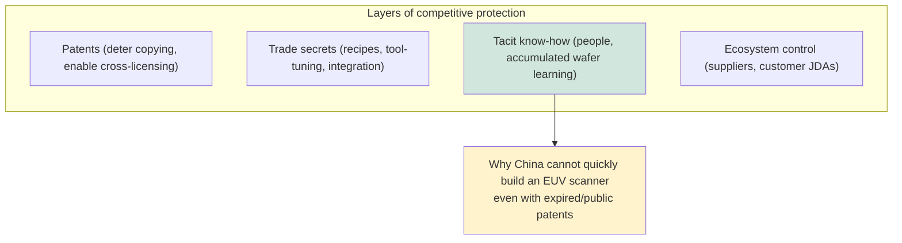
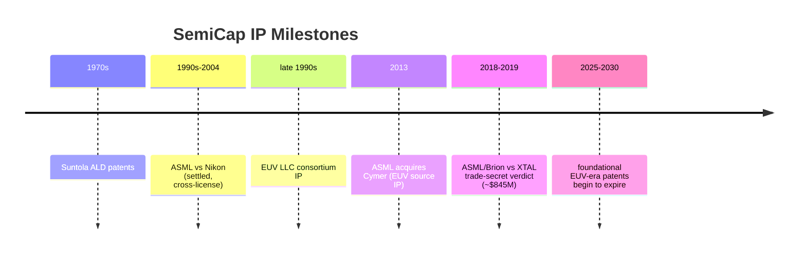

# Key Patents, IP Landscape, and Litigation

Intellectual property is the invisible architecture of the semiconductor-equipment industry. The deep moats that protect ASML's EUV monopoly, ASM's ALD leadership, Lam's etch dominance, and KLA's process-control franchise are built as much from patents and trade secrets as from engineering. Because the industry is so concentrated and the stakes so high, IP disputes have repeatedly reshaped the competitive landscape — and as China races to build a domestic equipment industry under export controls, IP (its creation, its protection, and its alleged misappropriation) has become a front line of geopolitical competition. This file surveys the patent landscape by technology area, the major historical disputes, patent-expiry dynamics, and the IP dimension of the U.S.–China contest.

---

## 📊 Visual Overview

*Original schematics; Mermaid diagrams render natively on GitHub.*

**The real moat is tacit know-how, not just patents**

**Selected IP milestones and disputes (timeline)**

---

## 1. Patent Landscape by Technology Area

### Lithography

Lithography is the most patent-dense and most litigated equipment area. **ASML, ZEISS, and Cymer** hold the foundational **EUV** patents spanning the light source (laser-produced tin plasma, droplet generation, collector optics), the Mo/Si multilayer reflective optics, the reticle and dual-stage handling, and the overall scanner architecture. Much early EUV IP traces to the U.S. **EUV LLC** consortium of the late 1990s (Intel, Motorola, AMD, and the national laboratories — Lawrence Livermore, Sandia, Lawrence Berkeley), whose licensing helped position ASML as the EUV leader while restricting access for Japanese rivals. ASML's acquisition of **Cymer (2013)** consolidated the source IP, and its partnership with (and stake in) **ZEISS** locks up the optics. The result is a patent thicket so dense, and so entangled with an irreproducible supply ecosystem, that it forms one of the strongest moats in any industry.

### Atomic Layer Deposition (ALD)

The foundational ALD patents trace to **Tuomo Suntola**, the Finnish scientist who invented "atomic layer epitaxy" in the 1970s. **ASM International** built much of its ALD leadership on a strong early patent position, and ALD IP — covering precursor chemistries, reactor designs, plasma-enhanced and spatial variants, and selective/area-selective deposition — is contested among **ASM, Applied Materials, Lam, and TEL**. As selective deposition becomes a key enabler at sub-3nm nodes, the patent race around inhibitor chemistries and self-aligned schemes has intensified.

### Etch and Atomic Layer Etch (ALE)

Etch IP concentrates on **plasma-source design** (CCP and ICP reactors, dual-frequency and pulsed-RF schemes), electrostatic-chuck and temperature control, and process chemistries. **Lam Research** holds a deep portfolio in CCP/ICP reactor and dielectric-etch technology; **Applied Materials** has significant **ALE and selective-etch** IP; **TEL** holds strong etch and integrated litho-etch patents. The newer frontiers — atomic layer etch, cryogenic etch, and isotropic selective etch for GAA channel release — are areas of active filing.

### CMP

CMP IP spans tool design (**Applied Materials, Ebara**) and the consumables — slurry formulations and pad designs (**Entegris/CMC, DuPont, Fujimi, 3M**) — where the chemistry-process co-engineering is often protected as much by trade secret as by patent.

### EUV Resist

The advanced-resist patent landscape is contested among **JSR (which acquired Inpria's tin-oxide metal-oxide resist IP), Tokyo Ohka, Fujifilm, Shin-Etsu, and Merck/EMD**, covering chemically amplified and metal-oxide chemistries — increasingly strategic as High-NA EUV demands new resist materials.

### Advanced Packaging and Hybrid Bonding

Hybrid bonding is the most actively contested packaging IP. **Xperi/Adeia (formerly Invensas)** holds a foundational portfolio around **Direct Bond Interconnect (DBI)** that it licenses broadly — including to major foundries and memory makers — making a non-manufacturing IP holder a central figure in the hybrid-bonding ecosystem. **Sony** holds important hybrid-bonding IP from its pioneering stacked CMOS image sensors; **TSMC** has built a substantial **SoIC** portfolio; and **EV Group and SUSS MicroTec** hold key wafer-bonding equipment IP.

### 3D NAND and DRAM

Memory IP is characterized by **broad cross-licensing** among the few memory makers — **Samsung, SK Hynix, Kioxia, Micron, and Western Digital** — covering 3D NAND architectures (channel formation, string stacking, word-line schemes) and DRAM cell structures. The cross-licensing reflects the reality that the handful of memory makers each hold thousands of overlapping patents and find mutual licensing more practical than litigation.

### GAA Nanosheet and CFET

The GAA and CFET patent landscape involves **IBM (a prolific source of foundational device IP, including early nanosheet and CFET concepts), Samsung, TSMC, and Intel**, plus **IMEC** (whose pre-competitive research generates IP licensed across the industry). As the industry transitions to GAA and develops CFET, the patents around inner-spacer formation, channel release, and dual-tier integration are being actively staked out.

---

## 2. Major IP Disputes and Settlements

### ASML vs. Nikon (1990s–2004)

A long-running, multi-front patent battle between **ASML and Nikon** over scanner and immersion-lithography technology. It was **settled in 2004** through cross-licensing and payments, clearing the legal path for the immersion-lithography era and, indirectly, for ASML's eventual dominance.

### Lam vs. Applied Materials (Etch)

The two etch leaders have a long history of patent disputes over plasma-etch technology, reflecting the intensity of competition in the highest-value etch applications. Such disputes have generally resolved through settlements and cross-licensing rather than altering the competitive order.

### ASML / Brion vs. XTAL (2018–2019)

A landmark **trade-secret** case: ASML's computational-lithography subsidiary **Brion** won a major verdict (~**$845 million**) against **XTAL**, a startup accused of misappropriating Brion's source code through former employees. XTAL was effectively bankrupted, and the case — which had China-linked dimensions, as XTAL was associated with Chinese-backed interests and a customer (Samsung) relationship — foreshadowed the IP-security concerns that now pervade the U.S.–China technology contest. It stands as a defining example of how trade-secret protection, not just patents, guards the industry's crown jewels.

---

## 3. Patent Expiry Analysis

A number of **foundational EUV-era patents begin expiring in the 2025–2030 window**, as the core inventions of the late 1990s and 2000s reach the end of their ~20-year terms. In principle, expiry lowers the legal barrier to entry. In practice, the **practical barrier remains the integrated know-how and supply ecosystem**, not the patents alone: even with expired patents, no competitor can replicate the ZEISS optics, the TRUMPF laser, the Cymer source, the decades of accumulated process learning, and the supplier network that together constitute an EUV scanner. Patent expiry is therefore far less consequential than it would be in most industries — the moat is built primarily from trade secrets, tacit manufacturing knowledge, and ecosystem control that no patent grant or expiry can transfer.

---

## 4. Trade Secrets and Government-Funded IP

Much of the industry's most valuable IP is held as **trade secret** rather than patent, precisely because the most critical know-how (exact process recipes, tool-tuning parameters, integration schemes) is more valuable kept hidden than disclosed in a patent. This makes **trade-secret litigation** (like the XTAL case) and employee-mobility disputes a recurring feature, and it makes IP security a growing corporate and national-security priority.

A significant share of foundational IP also originates in **government-funded research**: **DARPA** programs, the **CHIPS Act**-funded NSTC and university research, the legacy of **SEMATECH** and the national labs, and the **IMEC and Leti** joint-development agreements (JDAs) that distribute pre-competitive IP across their member companies. These public and consortium investments seed the IP that later flows into commercial tools, and the terms of access (who gets to license, under what restrictions) are increasingly shaped by national strategy.

---

## 5. China's Domestic IP Buildup

As China builds a domestic equipment industry under export controls (File 18), it is rapidly accumulating **patent filings** — **NAURA, AMEC, SMEE, Piotech, ACM, and others** have sharply increased filings, both to protect genuine domestic innovation and, in some Western assessments, to navigate around incumbent IP. China's patent office (CNIPA) shows a surge in semiconductor-equipment filings, and analyses of patent classes reveal China's areas of focus (etch, deposition, clean — where AMEC and NAURA are most credible) and its gaps (EUV lithography, advanced metrology — where the incumbents' IP and ecosystem remain unmatched).

The IP dimension is now inseparable from the geopolitical contest. Export controls restrict the transfer of equipment and the underlying technology; trade-secret enforcement guards against misappropriation; and patent positions shape who can build what. For the incumbents, IP — especially the trade secrets and ecosystem know-how that patents alone cannot capture — is the ultimate moat, more durable than any single patent and more valuable than any product, because it embodies the decades of accumulated learning that make the most advanced tools on Earth possible. The companies that control that knowledge control the leading edge, and protecting it has become as much a matter of national security as of corporate strategy.

---

## Extended Analysis: The Economics and Strategy of SemiCap IP

### A. Why Trade Secrets Outweigh Patents

A defining feature of SemiCap IP — unusual among technology industries — is that **trade secrets often matter more than patents**. The reason is structural: a patent requires public disclosure of the invention in exchange for a time-limited monopoly, but the most valuable knowledge in semiconductor manufacturing is the **tacit process know-how** — the exact recipe parameters, the tool-tuning procedures, the integration sequences, the accumulated learning from millions of wafers — that cannot be fully captured in a patent and is more valuable kept secret. An EUV scanner's patents could expire and a competitor still could not build one, because the irreproducible knowledge lives in ASML's, ZEISS's, and their suppliers' engineers and processes, not in the patent filings. This is why the **ASML/XTAL trade-secret case** was so significant — it protected source code and know-how, not a patent — and why **employee mobility, information security, and counterintelligence** have become central IP concerns. In the geopolitical contest (File 18), the fear is less patent infringement than the **transfer of tacit knowledge** through hiring, joint ventures, or espionage.

### B. The Cross-Licensing Equilibrium

In areas where many players hold overlapping patents — memory (Samsung, SK Hynix, Micron, Kioxia, WD) and, to a degree, the broad-portfolio equipment makers — the industry reaches a **cross-licensing equilibrium**: rather than litigate endlessly over thousands of overlapping patents, the major players cross-license their portfolios, paying balancing royalties, so that everyone has freedom to operate. This equilibrium is stable because the alternative (mutual litigation) is destructive to all, and because each player's portfolio is a deterrent against the others. It also raises a barrier to new entrants, who lack a portfolio to cross-license and may face infringement claims — a subtle but real moat. The memory industry's extensive cross-licensing is the canonical example.

### C. IP as a Geopolitical Instrument

IP has become inseparable from geopolitics. Export controls (File 18) restrict not just the shipment of tools but the transfer of the **technology and know-how** to make or service them. The **deemed-export** rules treat sharing controlled technology with a foreign national as an export, complicating global R&D. Trade-secret enforcement (the XTAL precedent) guards against misappropriation. And the incumbents' IP and know-how — the very thing export controls aim to protect — is the ultimate strategic asset, more durable than any product. For China (File 18), building a domestic IP base is both a genuine innovation effort and a navigation of the incumbents' patent thickets; for the incumbents and their governments, protecting IP and know-how is a matter of national security.

### D. Patent Filing Patterns as a Strategic Signal

Patent-filing data offers a window into where the industry is investing. Surges in filings around **selective/area-selective deposition, atomic layer etch, hybrid bonding, GAA inner-spacer processes, backside power, and EUV resists** map directly onto the frontier challenges described throughout this database — the vendors race to stake out the process IP that will define the GAA, backside-power, and CFET era before those technologies reach volume. China's rapid filing growth, concentrated in etch, deposition, and clean (where AMEC, NAURA, and Piotech are most credible) and sparse in EUV and advanced metrology, similarly maps its capabilities and gaps. Reading the patent landscape is thus a way of reading the technology roadmap itself — the IP filings of today foreshadow the manufacturing battles of tomorrow.

### E. The Durable Moat

The synthesis is that SemiCap's competitive moats rest on a **combination** of patents, trade secrets, ecosystem control, customer co-development relationships, and accumulated know-how that is far deeper than patents alone. Patent expiry (the 2025–2030 EUV-era expirations) lowers one barrier but leaves the others intact. The incumbents' true protection is the integrated knowledge — embodied in people, processes, supplier networks, and tacit learning — that no patent grant or expiry can transfer and that takes decades and tens of billions of dollars to build. This is why the competitive order in SemiCap changes so slowly, why the leaders' positions are so durable, and why the protection of IP and know-how has become as much a matter of national strategy as of corporate concern.

---

## Further Analysis: IP, Know-How, and the Limits of Replication

### A. The Knowledge That Cannot Be Copied

The deepest truth about SemiCap intellectual property is that the most valuable knowledge — the **tacit process and integration know-how** that makes a tool yield reliably in production — cannot be copied, bought, or transferred by any patent or document. It lives in the experience of thousands of engineers, in the accumulated learning from millions of processed wafers, in the subtle tuning procedures and integration sequences refined over years, and in the dense web of supplier and customer relationships. This is why China's massive, determined, state-backed effort, after years and tens of billions of dollars, has not produced a domestic EUV capability or matched the leading edge in advanced metrology — not because the patents are unavailable (many are public, and some are expiring), but because the **tacit knowledge and integrated ecosystem** that turn the patents into a working tool cannot be quickly replicated. An EUV scanner's patents could all expire tomorrow, and no competitor could build one, because the ZEISS optics know-how, the Cymer source know-how, the integration expertise, and the supplier network are not in the patents. This is the ultimate moat — knowledge embodied in people, processes, and relationships, accumulated over decades, that no legal mechanism can transfer — and it is the deepest reason the SemiCap competitive order is so durable and the leading edge so hard to penetrate.

### B. The Implications for IP Strategy and Security

This primacy of tacit know-how over formal IP shapes the industry's IP strategy and security in distinctive ways. Because the most valuable knowledge is tacit and best kept secret, the leaders rely heavily on **trade-secret protection** (guarding process recipes, tool-tuning, integration schemes) rather than patenting everything, and **information security and counterintelligence** (protecting against the loss of know-how through hiring, espionage, or joint ventures) become paramount. The ASML/XTAL trade-secret case exemplifies this — it protected source code and know-how, not a patent. In the geopolitical contest (File 18), the fear is less patent infringement than the **transfer of tacit knowledge**, which is why export controls restrict not just tools but technology and know-how, why "deemed-export" rules govern sharing knowledge with foreign nationals, and why employee mobility and joint-venture terms are scrutinized. Protecting the know-how — through trade-secret law, information security, careful management of personnel and partnerships, and the export-control regime — has become as much a corporate and national-security priority as protecting any product, because the know-how *is* the crown jewel. The patent portfolio matters (it deters direct copying and supports cross-licensing), but it is the layer beneath — the tacit, accumulated, irreplaceable knowledge — that constitutes the true and durable competitive advantage.

### C. Patent Trends as a Window on the Future

For all the primacy of tacit know-how, the **formal patent landscape** remains a valuable window on the industry's direction, because the surges in filings reveal where the leaders are investing to stake out the IP that will define the next generation of manufacturing. The current concentration of filings around **selective and area-selective deposition, atomic layer etch, hybrid bonding, GAA inner-spacer and channel-release processes, backside power, EUV resists and masks, and CFET integration** maps precisely onto the frontier challenges of the GAA, backside-power, and CFET era (Files 15, 23) — the vendors racing to lock in the process IP for technologies that will reach volume in the coming years. China's filing patterns (concentrated in etch, deposition, and clean, where its makers are most credible; sparse in EUV and advanced metrology, where the gaps remain) similarly map its capabilities and limits. Reading the patent landscape is thus a way of reading the technology roadmap — the IP filings of today foreshadow the manufacturing battles of tomorrow — and it complements the analysis of the production roadmap (File 15) and the frontier research (File 23) with a view of where the industry is investing its inventive effort. The patent landscape and the tacit know-how together constitute the intellectual foundation of the industry: the formal IP staking out the frontier, and the tacit knowledge embodying the accumulated learning that turns frontier inventions into manufacturable technology — both essential, both strategic, and both at the heart of the durable competitive advantage that defines the SemiCap leaders.
