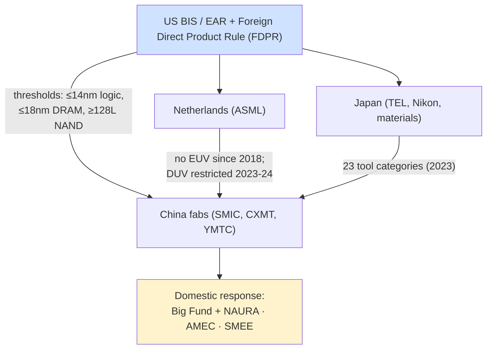
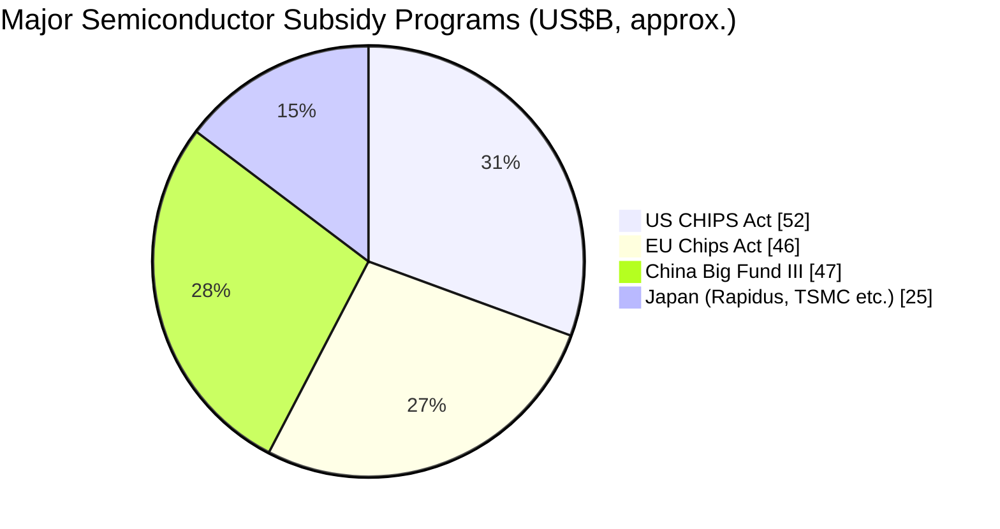

# Geopolitics, Export Controls, and Supply Chain Security

Since roughly 2018, semiconductor capital equipment has moved from the periphery of geopolitics to its center. The discovery that a handful of tools gate the entire advanced-chip supply chain transformed SemiCap into the most powerful lever in great-power technology competition. Governments learned that **controlling the equipment is far more effective than controlling the chips** — deny a rival access to EUV, advanced etch, and advanced metrology, and its leading-edge ambitions freeze. The result is an escalating contest of export controls, subsidies, and industrial policy that now shapes every major SemiCap company's strategy, revenue, and risk profile. This file traces the export-control regime, the subsidy programs, China's response, and the long-term supply-chain implications.

---

## 📊 Visual Overview

*Original schematics; Mermaid diagrams render natively on GitHub.*

**How equipment export controls work — and China's response**



**Why equipment is the perfect chokepoint**

```
 Chips:     made by the billions, designed by hundreds of firms → hard to control
 Equipment: a few hundred EUV tools, ~1 supplier, one tool gates many chips,
            and needs ongoing service/parts → IDEAL control point
```

**Subsidy programs (approximate headline size, US$B)**



---

## 1. The Legal Architecture: ITAR, EAR, and the FDPR

U.S. control over semiconductor technology rests on two regimes. **ITAR (International Traffic in Arms Regulations)** governs a narrow set of defense-grade and radiation-hardened items. Far more consequential is the **EAR (Export Administration Regulations)**, administered by the **Bureau of Industry and Security (BIS)**, which controls dual-use technology — including essentially all advanced semiconductor equipment.

The decisive instrument is the **Foreign Direct Product Rule (FDPR)**, which extends U.S. jurisdiction to **foreign-made goods that incorporate U.S. technology or software**. Because virtually every advanced tool on Earth — including ASML's EUV scanners — contains U.S.-origin components, software, or design, the FDPR gives the United States extraterritorial reach over the entire global equipment supply chain. This is why the U.S. can effectively restrict a Dutch company's exports: the FDPR, combined with diplomatic pressure and allied coordination, makes U.S. controls global in practice.

---

## 2. The October 2022 Rules and Their Escalation

The watershed came on **October 7, 2022**, when BIS issued sweeping rules targeting China's advanced-chip capability. The rules restricted the export to China of equipment capable of producing:
- **Logic at ≤16/14nm** (FinFET-class and below),
- **DRAM at ≤18nm** half-pitch,
- **NAND at ≥128 layers**,

plus restrictions on advanced computing chips and on the activities of "U.S. persons" supporting Chinese advanced manufacturing. The rules directly curtailed China-bound sales by **Applied Materials, Lam Research, and KLA**, each of which had derived a substantial share of revenue from China.

Subsequent updates **tightened and broadened** the controls: the **October 2023** package refined the thresholds, closed loopholes, expanded the entity list, and constrained additional categories; further updates through **2024 and 2025** continued the pattern — expanding the FDPR's reach, adding Chinese fabs and toolmakers to the entity list, and restricting servicing and spare parts. The trajectory has been one of steady escalation, with each round closing gaps the previous round left open.

---

## 3. ASML, EUV, and DUV Restrictions

ASML occupies the most sensitive position. It has **never been granted a license to ship EUV to China** (since 2018, under Dutch export policy aligned with U.S. pressure), meaning China has been categorically denied the single most important tool for leading-edge logic and advanced DRAM. The contest then shifted to **DUV immersion** scanners (the 193i tools used for multi-patterning and mature nodes): through **2023–2024**, the Netherlands progressively restricted exports of ASML's most advanced immersion systems to China, and the U.S. extended controls (including on servicing) to limit China's access to and support of installed DUV tools. ASML, for which China had become a large revenue source (amplified by a pre-restriction buying surge), faces a managed decline of its China business even as the rest of its market grows.

---

## 4. Allied Coordination: The Netherlands, Japan, and Korea

U.S. controls are effective only because key allies — home to the rest of the equipment ecosystem — coordinate. **The Netherlands** (ASML) aligned its EUV and DUV policies with U.S. objectives. **Japan**, home to TEL, Nikon, Canon, Screen, and the critical materials suppliers, imposed its **own export controls in March 2023** covering **23 categories of equipment** (etch, deposition, lithography, cleaning, testing), affecting TEL and others and aligning Japan with the U.S.–Dutch framework. **South Korea** (home to Samsung and SK Hynix, which operate fabs in China) occupies a more delicate position — pressured to align while protecting its companies' large Chinese operations. This **trilateral-plus coordination** (sometimes informally called the "Chip 4" dynamic with Taiwan) is what makes the controls bite; without it, China could simply buy from non-U.S. suppliers.

---

## 5. The Subsidy Era: CHIPS Act, EU Chips Act, and Beyond

In parallel with restrictions, the major economies launched enormous **subsidy programs** to localize capacity and reduce dependence on East Asia:

- **U.S. CHIPS and Science Act (2022):** ~**$52 billion**, including ~$39B in manufacturing incentives and ~$11B for R&D (anchoring the **National Semiconductor Technology Center, NSTC**). It catalyzed **TSMC Arizona, Intel Ohio and Arizona, Samsung Texas, and Micron New York**. Critically, the Act includes **"guardrails"** prohibiting recipients from expanding advanced capacity in China for ten years — tying subsidies to decoupling.
- **EU Chips Act (2023):** ~**€43 billion** mobilized, supporting **ASML, IMEC, Infineon, STMicroelectronics**, and new fabs (the **TSMC/ESMC Dresden** joint venture, Intel's planned **Magdeburg** site, though the latter was paused). Europe's strategy emphasizes its strengths — equipment (ASML), research (IMEC), and automotive/industrial/power chips.
- **Japan** backed **Rapidus** (an ambitious 2nm venture with IBM and IMEC) and the **TSMC Kumamoto** fabs with substantial subsidies, seeking to rebuild its leading-edge position.
- **South Korea** announced a massive semiconductor "mega-cluster" plan; **India** launched an incentive scheme attracting assembly and some fab investment; and **Taiwan**, **Singapore**, and others maintain their own support.

The net effect is a global subsidy race that is reshaping *where* capacity is built — often at higher cost and slower pace than the established Asian clusters — and creating a wave of new fab construction that drives equipment demand even as the China market contracts.

---

## 6. China's Response: The Big Fund and Domestic Equipment

China has responded to the controls with a determined drive for **self-sufficiency**, funded by the **National IC Industry Investment Fund ("Big Fund")**: **Phase I (~¥139B/~$22B, 2014), Phase II (~¥204B/~$30B, 2019), and Phase III (~¥344B/~$47B, 2024)** — the largest of the three, signaling intensified commitment under the pressure of controls.

The results are mixed but significant:
- **SMIC** reached **7nm-class** production (demonstrated in the **Huawei Kirin 9000S** processor, ~2023) using **DUV multi-patterning** rather than EUV — proving that meaningful leading-edge capability is possible without EUV, at higher cost and lower yield, but enough to alarm Western policymakers and to demonstrate the limits of controls.
- **Domestic equipment makers** — **NAURA** (etch, deposition, thermal, clean), **AMEC** (etch, MOCVD), **Piotech** (deposition), **ACM Research** (clean), **Kingsemi** (track), **SiCarrier** (a Huawei-linked broad-equipment effort), and **SMEE** (lithography) — are climbing the technology ladder, gaining strong share in **mature nodes** and many front-end categories while still facing **major gaps at the leading edge**, above all in **EUV lithography and advanced metrology**.
- **SMEE's domestic lithography** remains limited to mature-node DUV; a domestic EUV capability, while a stated goal and the subject of research reports, is widely assessed to be many years away.

The controls have thus produced a paradox: they have **slowed** China's leading-edge progress and denied it EUV, while simultaneously **accelerating** China's domestic-equipment industry (by guaranteeing it a captive market) and prompting a near-term surge in Chinese **mature-node** capacity and tool buying. Whether the controls ultimately contain China or merely delay it while spurring a formidable domestic competitor is the central strategic question.

---

## 7. Impact on the SemiCap Companies

For the equipment makers, China historically represented **20–45% of sales** (AMAT, Lam, KLA, ASML, TEL). The controls have produced a complex revenue picture: a **near-term surge** in Chinese mature-node buying (as Chinese fabs stockpiled tools ahead of further restrictions), followed by an expected **structural decline** in China-bound leading-edge revenue, partly offset by the subsidy-driven fab buildout elsewhere. Every major OEM now manages this tension — capturing Western and allied demand while navigating the loss of Chinese leading-edge sales and the rise of Chinese domestic competition in mature segments. **Export-control exposure** has become a primary investment consideration across the sector.

---

## 8. Alternative Assembly Locations and Other Dependencies

Beyond the leading edge, the controls and broader "de-risking" are reshaping the **back-end** as well: **India, Vietnam, Malaysia, and Thailand** are attracting assembly, packaging, and test investment as companies diversify away from concentration in China. Meanwhile, the supply chain harbors other dependencies — **rare earths and specialty materials** (where China holds strong positions), **neon and other gases** (a vulnerability exposed by the war in Ukraine, which disrupted Ukrainian neon supply), and the concentrated **Japanese materials** base. These dependencies cut in multiple directions, giving different actors different points of leverage and ensuring that supply-chain security will remain a permanent strategic concern.

---

## 9. Long-Term Strategic Implications

The geopoliticization of SemiCap has several durable implications. The industry will likely **bifurcate** to some degree into a Western-allied ecosystem and a Chinese domestic ecosystem, with reduced (but not zero) interchange. Equipment companies will continue to face the tension between a large Chinese market and escalating restrictions. Subsidy-driven capacity will be built in higher-cost locations, raising the cost floor of the industry. And **IP security** (File 17) will remain a front line, as the contest is fought not only over tools but over the knowledge to make them.

Above all, the episode has confirmed the central thesis of this database: semiconductor capital equipment is the **ultimate chokepoint** of the modern economy, and whoever controls the most advanced tools — and the ecosystem and knowledge behind them — holds decisive leverage over the future of computing, and therefore over economic and military power. That realization, more than any single rule or subsidy, is what has placed SemiCap permanently at the center of twenty-first-century geopolitics.

---

## Extended Analysis: Mechanisms, Effectiveness, and Second-Order Effects

### A. Why Equipment Is the Perfect Chokepoint

The reason export controls focus on equipment rather than chips is a matter of leverage geometry. Chips are made by the billions, designed by hundreds of companies, and shipped everywhere — controlling them is like trying to control water. Equipment, by contrast, is made by a handful of firms, in tiny volumes (a few hundred EUV scanners exist worldwide), and each tool gates the production of all the chips it makes. Denying one EUV scanner prevents an entire fab's worth of leading-edge production. Moreover, equipment requires ongoing **service, spare parts, software updates, and process support** from the OEM — so control extends beyond the initial sale into the tool's entire operating life, giving the controlling government a persistent lever (the ability to cut off servicing can disable an installed tool over time). This combination — extreme supply concentration, one-tool-gates-many-chips leverage, and lifecycle dependence — makes equipment the most effective possible chokepoint, which is precisely why it has become the central instrument of technology statecraft.

### B. The Tiered Logic of the Controls

The October 2022 rules and their successors embody a deliberate **tiered logic**: rather than banning all semiconductor trade with China (which would be economically catastrophic and diplomatically impossible), they target a precise capability frontier — advanced logic (≤16/14nm), advanced DRAM (≤18nm), and advanced NAND (≥128 layers) — chosen because these are the technologies with the greatest military and AI relevance and the ones where China most depends on foreign tools. Below that frontier (mature nodes), trade largely continues, because mature-node chips are ubiquitous, less strategically sensitive, and a market the Western OEMs value. This tiered approach aims to "yard with a high fence" — restrict the most sensitive technologies tightly while preserving broader trade — though the frontier has been progressively lowered and the fence raised with each update, and defining and policing the boundary (especially as Chinese capability advances) is an ongoing challenge.

### C. The SMIC 7nm Surprise and the Limits of Controls

The demonstration of a **7nm-class SMIC process in the Huawei Kirin 9000S** (around 2023), achieved using **DUV multi-patterning** without EUV, was a pivotal moment that revealed both the limits and the costs of the controls. It showed that a determined, well-funded manufacturer can reach 7nm-class capability without EUV — at higher cost, lower yield, and limited scalability, but enough to matter strategically and to embarrass the assumption that denying EUV would freeze China at much older nodes. At the same time, it underscored the controls' real bite: without EUV, SMIC faces severe cost and yield penalties and a hard ceiling on further scaling (5nm and below become extraordinarily difficult with DUV alone), and the subsequent tightening of DUV and servicing restrictions aimed precisely at closing the multi-patterning path. The episode crystallized the central strategic debate: do the controls *contain* China (slowing it and capping its ceiling) or merely *delay* it (while spurring a formidable domestic industry)? The honest answer is that they do both, and which effect dominates over the long run remains genuinely uncertain.

### D. Second-Order Effects on the Equipment Industry

The controls have produced a complex set of second-order effects on the SemiCap companies. In the **near term**, they triggered a *surge* in Chinese buying of mature-node and not-yet-restricted tools (as Chinese fabs stockpiled ahead of further restrictions), paradoxically boosting OEM revenue from China even as the long-term trajectory points down. In the **medium term**, they structurally reduce China-bound leading-edge revenue (a meaningful headwind for AMAT, Lam, KLA, ASML, and TEL, for whom China was 20–45% of sales). And they **accelerate Chinese domestic competition**: by guaranteeing domestic toolmakers (NAURA, AMEC, Piotech, ACM) a captive, subsidized market and by motivating intense self-sufficiency investment, the controls are helping to build the very competitors that will eventually erode the incumbents' mature-node share. There is a genuine strategic tension here: the controls protect the incumbents' leading-edge monopoly while simultaneously nurturing Chinese competition in the larger mature-node market — a trade-off whose long-run balance is hotly debated within the industry and among policymakers.

### E. The Subsidy Race and Its Risks

The parallel subsidy programs (CHIPS Act, EU Chips Act, and the Japanese, Korean, and Chinese equivalents) are reshaping *where* capacity is built, but they carry their own risks. Building fabs in the United States, Japan, and Europe is **more expensive and slower** than in the established Taiwanese and Korean clusters (higher labor and construction costs, less mature supply chains and talent pools, longer permitting) — the difficulties at TSMC's Arizona project (delays, cost and labor challenges) and the pause of Intel's Magdeburg plans illustrate the friction. There is also a risk of **overcapacity**: if every major economy subsidizes domestic capacity simultaneously, the result could be a glut, particularly at mature nodes (where China is adding enormous capacity), depressing prices and returns. And the subsidies raise the industry's **cost floor**, as more production shifts to higher-cost locations for strategic rather than economic reasons. For the equipment industry, the subsidy race is a near-term demand boon (more fabs being built means more tools sold) but a source of longer-term uncertainty about capacity utilization and the geographic and economic structure of the industry.

### F. The Long-Run Strategic Picture

The deepest implication is that the semiconductor industry is **partially bifurcating** into a Western-allied ecosystem and a Chinese domestic ecosystem, with reduced but not eliminated interchange. This bifurcation is costly (duplicated capacity, lost economies of scale, higher prices) but is being driven by national-security imperatives that override pure economic logic. For SemiCap, it means navigating two increasingly separate markets, managing the structural loss of China leading-edge business while capturing subsidy-driven Western demand, and facing rising Chinese competition in mature segments. The episode has permanently established semiconductor capital equipment as an instrument of statecraft and a central arena of great-power competition — a status that, whatever the future course of the specific controls, is unlikely to reverse, and that makes geopolitical analysis an inseparable part of understanding the equipment industry's prospects.
