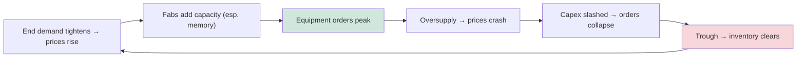

# SemiCap Market Data, Financial Analysis, and Investment Dynamics

The semiconductor-equipment industry is a large, fast-growing, violently cyclical, and extraordinarily profitable sector that sits at the intersection of deep technology and financial markets. Its handful of dominant firms enjoy some of the highest margins and strongest competitive moats in the global economy, yet their revenues swing dramatically with the wafer-fab-equipment (WFE) cycle. This file surveys the market's size and structure, revenue and market-share data, R&D intensity and cyclicality, equipment pricing, company financials, the M&A history that built today's giants, and the considerations that shape SemiCap as an investment.

*Note on figures: the numbers below are representative industry estimates (SEMI, Gartner, VLSI Research, TechInsights, and company disclosures); exact values vary by source and definition (WFE vs. total equipment including test and assembly), and should be read as approximate.*

---

## 📊 Visual Overview

*Original schematics; Mermaid diagrams render natively on GitHub.*

**Global semiconductor equipment market growth (US$B, approximate)**

```
 2015   ███████████████████ 37
 2018   ████████████████████████████████ 64
 2021   ████████████████████████████████████████████████████ 103
 2024   █████████████████████████████████████████████████████████ 113
 2030e  ████████████████████████████████████████████████████████████████████████████████ 160-200
```

**The cyclicality engine — the WFE boom-bust loop**



**Tool price spans orders of magnitude (approx. ASP)**

```
 High-NA EUV scanner   $380M+   ████████████████████████████████████████
 EUV scanner (NXE)     ~$180M   ███████████████████
 DUV immersion         ~$75M    ████████
 e-beam inspection     ~$50M    █████
 etch / ALD chamber    ~$2-6M   ▏
```

---

## 1. Global SemiCap TAM, 2015–2030

Total semiconductor equipment spending has roughly tripled over fifteen years, growing through a series of cycles:

| Year | Total Equipment (US$B, approx.) | Driver |
|---|---|---|
| 2015 | ~37 | Mobile-driven; post-PC trough |
| 2016 | ~41 | 3D NAND / DRAM ramp |
| 2017 | ~57 | Memory super-cycle begins |
| 2018 | ~64 | Peak memory boom |
| 2019 | ~60 | Memory correction |
| 2020 | ~71 | COVID digital demand; EUV ramp |
| 2021 | ~103 | Pandemic supply crunch; record capex |
| 2022 | ~107 | Leading-edge logic/foundry peak |
| 2023 | ~106 | China DUV pull-in offsets memory downturn |
| 2024 | ~113 | AI-driven logic + advanced packaging |
| 2025 (est.) | ~120–130 | AI capex, 2nm ramp, HBM |
| 2030 (proj.) | ~160–200+ | AI, 2nm/CFET, advanced packaging |

### Breakdown by Segment

| Segment | Approx. share of WFE | Leaders |
|---|---|---|
| Lithography | 20–25% | ASML |
| Deposition | 20–25% | AMAT, Lam, TEL, ASM |
| Etch | 18–22% | Lam, TEL, AMAT |
| Process control | 11–13% | KLA |
| CMP | 4–6% | AMAT, Ebara |
| Implant/thermal | 5–8% | AMAT, Axcelis |
| Clean | 5–7% | SCREEN, TEL, Lam |

### Breakdown by Geography (wafer-fab location)

Equipment spending follows fab construction: historically **China, Taiwan, and South Korea** have been the largest buyers, with China surging in 2023–2024 (mature-node buildout and pre-restriction stockpiling), Taiwan anchored by TSMC's leading-edge spend, and Korea by Samsung and SK Hynix memory. The **U.S., Japan, and Europe** are rising as subsidy-driven fabs come online.

---

## 2. Equipment-to-Capex Ratio and Leading Customers

Equipment typically represents **75–80% of a leading-edge fab's construction cost** — the dominant component of capital spending. The largest equipment buyers are the handful of leading-edge manufacturers:
- **TSMC** — the single largest WFE customer, with annual capex in the **$30–40B+** range in recent years, a double-digit share of total global WFE.
- **Samsung** — large spend across both leading-edge logic/foundry and memory.
- **Intel** — heavy spend on its IDM 2.0 / foundry buildout.
- **SK Hynix and Micron** — memory-driven, cyclical spend.
- **Chinese fabs (SMIC, CXMT, YMTC)** — significant mature-node and (constrained) advanced spend.

This concentration means a single customer's capex decision can move the entire equipment market.

---

## 3. Revenue and Market Share (2020–2024, approximate)

| Company | 2023 revenue (US$B, approx.) | Primary segments | Position |
|---|---|---|---|
| **ASML** | ~28 | Lithography | EUV monopoly |
| **Applied Materials** | ~26 | Deposition, etch, CMP, implant, control | Broadest portfolio |
| **Lam Research** | ~14–15 | Etch, deposition, clean | Etch leader |
| **Tokyo Electron** | ~13–15 | Track, etch, deposition, clean | Coater/developer leader |
| **KLA** | ~10 | Process control | Inspection/metrology leader |
| **ASM International** | ~3 | ALD, epitaxy | ALD leader |
| **SCREEN** | ~3 | Clean | Wet-clean leader |
| **Onto Innovation** | ~0.8 | Metrology | OCD/packaging |
| **Nova** | ~0.5 | Metrology | OCD specialist |
| **Axcelis** | ~1 | Ion implant | Implant specialist |

These five leaders — ASML, AMAT, Lam, TEL, KLA — together account for the large majority of WFE revenue, one of the most concentrated structures of any major industry.

---

## 4. R&D Intensity and Cyclicality

SemiCap firms sustain **R&D intensity of ~12–18% of revenue** — among the highest of any industry — funded by their high margins and large recurring-service revenue. This R&D is the foundation of their moats: the relentless investment required to stay ahead in EUV, ALD, etch, and process control is itself a barrier to entry.

**Cyclicality** is the defining financial characteristic. The WFE cycle is driven by end-market demand (especially the volatile memory market) and fab-construction waves. Historical cycles — the 2017–2018 memory boom and 2019 bust, the 2021–2022 pandemic-driven peak, the 2023 memory downturn (offset by China) — show swings of 20–40% in annual spending. The largest, most diversified firms (AMAT, Lam, TEL) buffer the cycle with broad portfolios spanning logic and memory; pure-plays (Axcelis, Lam's memory tilt) are more leveraged to specific cycles.

---

## 5. Equipment Pricing (ASPs)

Average selling prices vary by orders of magnitude across tool classes:

| Tool | Approx. ASP |
|---|---|
| EUV scanner (NXE) | ~$150–200M |
| High-NA EUV scanner (EXE) | ~$380M+ |
| DUV immersion scanner | ~$60–90M |
| Etch chamber/system | ~$3–6M per chamber; systems higher |
| ALD/CVD chamber | ~$2–5M |
| CMP system | ~$3–5M |
| Ion implanter | ~$3–8M |
| Inspection (e-beam / BBP optical) | ~$30–80M+ |
| CD-SEM | ~$3–6M |

The EUV and High-NA scanners are the highest-value individual tools in the industry, which is why ASML's revenue rivals the much broader-portfolio AMAT. The trend in ASPs is strongly **upward** — each lithography generation costs more, process control tools grow more sophisticated, and the rising number of process steps per node multiplies tool demand.

---

## 6. Key Financial Profile

The leaders share a recognizable financial signature:
- **Gross margins** typically **40–60%**, with **KLA and ASML at the high end** (reflecting monopoly/oligopoly pricing power) and the broad-portfolio firms somewhat lower.
- **Strong recurring revenue** from service, spares, and upgrades on large installed bases — which smooths the cycle and funds R&D.
- **High operating leverage** — fixed R&D and manufacturing costs mean profits swing more than revenue across the cycle.
- **Backlog and book-to-bill ratios** are closely watched leading indicators: book-to-bill above 1.0 signals expansion, below 1.0 contraction.

---

## 7. SemiCap M&A History

Today's giants were built substantially through acquisition, consolidating capabilities into broad platforms:

| Acquisition | Year | Significance |
|---|---|---|
| **Applied Materials / Varian** | 2011 | Added ion implantation to AMAT |
| **Lam Research / Novellus** | 2012 | Added deposition to Lam's etch, creating a deposition-etch powerhouse |
| **ASML / Cymer** | 2013 | Secured the EUV light source |
| **ASML / HMI (Hermes Microvision)** | 2016 | Added e-beam inspection |
| **KLA / Orbotech** | 2019 | Expanded into PCB, packaging, and specialty inspection |
| **Entegris / CMC Materials** | 2022 | Added CMP slurries to Entegris's materials portfolio |

Several proposed mega-deals were **blocked** — most notably **Applied Materials / Tokyo Electron (2013–2015)**, abandoned over U.S. antitrust concerns, and **AMAT/KKR's bid for Kokusai Electric (2023–2024)**, which fell through. The blocked deals reflect both the strategic value of consolidation and the antitrust limits on further concentration in an already-concentrated industry.

---

## 8. Investor Considerations

SemiCap presents investors with a distinctive risk-reward profile:
- **Cyclicality** — the central risk; revenues and especially earnings swing sharply with the WFE cycle, demanding a long-term view through the cycle.
- **China exposure** — the major swing factor; export controls structurally reduce China leading-edge revenue while the timing and depth remain uncertain (File 18).
- **Customer concentration** — a few customers drive demand; the loss or delay of a single customer's program is material.
- **R&D moats** — the flip side of the risks; the leaders' technological dominance and high margins are durable, and the competitive order rarely changes.
- **Gross-margin profiles** — the highest-margin franchises (ASML's EUV monopoly, KLA's process-control dominance) command premium valuations.
- **Secular tailwinds** — AI-driven capex, rising EUV/High-NA and process-control intensity per node, the explosion of advanced packaging, and SiC/GaN power growth provide multi-year structural demand beneath the cyclical noise.

The investment thesis for SemiCap ultimately rests on a paradox at the heart of this database: even as classical Moore's Law scaling slows and grows more expensive, the **complexity and cost of each node rise**, multiplying the demand for tools, driving up their value, and concentrating ever more of the industry's economics in the hands of the few firms that can make them. The slowing of dimensional scaling is not the end of the equipment industry's growth — it is the redistribution of that growth toward lithography, process control, new-materials processing, and packaging, and toward the handful of companies with the technology and the moats to dominate those frontiers.

---

## Extended Analysis: Cyclicality, Segment Dynamics, and the AI Super-Cycle

### A. Anatomy of the WFE Cycle

The WFE cycle is driven by the interaction of end-market demand, memory pricing, and fab-construction timing, and it has a recognizable rhythm. An **upturn** typically begins when end demand (PCs, phones, data centers, autos) tightens chip supply, prices firm, and manufacturers — especially memory makers — race to add capacity, ordering equipment in volume. Lead times stretch, OEM backlogs swell, and book-to-bill ratios climb above 1.0. The **peak** arrives when capacity additions catch up with (and often overshoot) demand. The **downturn** follows as oversupply crashes chip prices (memory most violently), manufacturers slash capex almost overnight, OEM orders evaporate, and book-to-bill falls below 1.0 — frequently a steep, sudden drop because capex is the most discretionary, most quickly cut line in a manufacturer's budget. The **trough** persists until inventories clear and demand recovers, seeding the next cycle.

Several features make the cycle tradeable and analyzable: it is led by **memory** (the most volatile segment), it is visible in advance through **book-to-bill and backlog** data, and it is buffered by **recurring service revenue** (the installed base needs spares and service regardless of new-tool demand, providing a floor). The largest, most diversified OEMs (Applied, Lam, TEL) ride the cycle with broad portfolios spanning logic and memory; pure-plays and memory-tilted firms (Lam's memory exposure, Axcelis) swing more.

### B. Segment Divergence

A crucial nuance is that the segments do **not** move in lockstep. **Leading-edge logic/foundry** (anchored by TSMC) follows the node-transition and now the AI cycle; **memory** follows the commodity-price cycle; **mature-node/specialty** follows automotive, industrial, and (recently) the chip-shortage-driven and China-localization-driven buildouts; and **advanced packaging** now follows the AI cycle largely independently. This divergence both smooths the aggregate (a memory downturn can coincide with a logic boom) and creates opportunity (the firms best exposed to the strongest segment at a given time outperform). The 2023 picture exemplified this: a memory downturn was substantially offset by a surge in Chinese mature-node tool buying and resilient leading-edge logic — so total WFE held roughly flat even as memory spending fell sharply.

### C. The AI Super-Cycle

The generative-AI boom of 2023 onward introduced a powerful new demand driver that cuts across segments. It drives **leading-edge logic** (NVIDIA/AMD GPUs on TSMC's most advanced nodes), **HBM** (high-bandwidth memory, the hottest corner of the DRAM market, requiring advanced DRAM plus TSV/stacking/bonding), and above all **advanced packaging** (CoWoS, whose capacity became a multi-year bottleneck on AI-accelerator supply). For the equipment industry, the AI super-cycle has several distinctive features: it concentrates demand at the **leading edge and in packaging** (favoring ASML, the advanced-deposition/etch/metrology leaders, and the packaging/bonding specialists), it has made **HBM and packaging** rare bright spots even during the broader memory downturn, and it has driven TSMC and the memory makers to multi-year capacity expansions specifically for AI. Whether the AI super-cycle proves durable or eventually corrects (as all cycles do) is a central question for the sector's medium-term outlook, but it has unambiguously shifted the center of gravity of equipment demand toward the leading edge, advanced DRAM/HBM, and advanced packaging.

### D. Valuation and the Quality of the Franchises

The SemiCap leaders command premium valuations because, beneath the cyclicality, they possess unusually high-quality franchises: monopoly or oligopoly market positions, the highest R&D intensity in industry (funding durable moats), high gross margins (40–60%, with ASML and KLA at the top), large recurring service revenue, and exposure to multi-decade secular growth (computing demand, AI, electrification). The investment debate centers on weighing these durable strengths against the cyclical risk, the structural China headwind (File 18), and customer concentration. The market generally awards the highest multiples to the firms with the strongest moats and the cleanest secular growth — **ASML** (EUV monopoly), **KLA** (process-control dominance, rising intensity per node), and the broad-portfolio leaders — reflecting the judgment that, across the cycle, these are among the highest-quality industrial franchises in the world. The deteriorating economics of dimensional scaling, far from undermining this thesis, reinforce it: as each node grows more complex and tool-intensive, the value captured by the equipment leaders grows, making SemiCap a leveraged, if cyclical, play on the entire future of computing.

---

## Further Analysis: The Long-Run Investment Thesis

### A. The Secular Growth Beneath the Cycle

Beneath the violent cyclicality that dominates the year-to-year picture lies a powerful **secular growth trend** that defines the long-run investment thesis for SemiCap. Over decades, total equipment spending has roughly tripled (from ~$37B in 2015 toward $120B+ by mid-decade and projected toward $160–200B+ by 2030), driven by forces that transcend the cycle: the relentless growth in demand for computing (now supercharged by AI), the rising cost and complexity of each node (more steps, more EUV, more process control, new materials, three-dimensional integration — each multiplying tool demand and value), the explosive growth of advanced packaging as a new spending category, and the electrification-driven growth of compound-semiconductor (SiC/GaN) equipment. The key insight is that the equipment market grows even as the *pace of dimensional scaling slows*, because the rising complexity and cost of each node more than offset the slowing cadence — more process steps per wafer, higher-value tools, rising process-control and lithography intensity, and entirely new categories. This secular growth, riding beneath the cyclical noise, is the foundation of the long-run thesis: SemiCap is a structurally growing industry, leveraged to the entire future of computing, even as it remains cyclical in the short run.

### B. The Quality of the Franchises

Layered atop the secular growth is the **exceptional quality of the leading franchises**, which is what makes SemiCap not merely a growing but a highly profitable and defensible industry. The leaders possess monopoly or oligopoly positions (ASML's EUV monopoly, KLA's process-control dominance, the concentrated structure of nearly every category), the highest R&D intensity in industry (funding durable moats), high gross margins (40–60%, with the monopoly holders at the top), large recurring service revenue (smoothing the cycle and funding R&D), and the deepest competitive moats in any industry (accumulated know-how, customer co-development, installed-base lock-in, patents and trade secrets — Files 14, 17). These franchises are remarkably durable: the competitive order changes slowly, the leaders' positions are defensible against even well-funded challengers (including China's subsidized makers), and the moats deepen as nodes grow harder. The combination of secular growth and exceptional franchise quality is what awards the SemiCap leaders their premium valuations and makes them, across the cycle, among the highest-quality industrial businesses in the world — a leveraged, if cyclical, play on the entire future of computing.

### C. The Risks That Define the Debate

The investment debate centers on weighing these strengths against a set of real risks. **Cyclicality** is the central near-term risk — revenues and especially earnings swing sharply with the WFE cycle, demanding a long-term view through the cycle and a tolerance for volatility. **China exposure** is the major structural swing factor — export controls (File 18) structurally reduce the incumbents' China leading-edge revenue while nurturing Chinese domestic competitors that threaten the mature-node market, and the timing, depth, and ultimate outcome of this dynamic remain genuinely uncertain. **Customer concentration** means a few customers (TSMC, Samsung, Intel, SK Hynix, Micron) drive demand, so the delay or loss of a single customer's program is material. **The AI super-cycle's durability** is an open question — the AI-driven surge in leading-edge and packaging demand has been a powerful tailwind, but all cycles eventually correct, and the depth of the eventual correction matters. And **the pace and cost of leading-edge scaling** — whether the industry can continue to extract economic value from ever-more-expensive nodes — underlies the long-run demand. Weighing the durable strengths (secular growth, franchise quality, deep moats) against these risks (cyclicality, China, concentration, AI-cycle durability) is the essence of the SemiCap investment debate, and the market generally awards the highest valuations to the firms with the strongest moats and cleanest secular growth (ASML, KLA, the broad-portfolio leaders), reflecting the judgment that, across the cycle, the quality of the franchises and the power of the secular growth outweigh the risks. The deteriorating economics of dimensional scaling, far from undermining this thesis, reinforce it: as each node grows more complex and tool-intensive, the value captured by the equipment leaders grows — making SemiCap, for all its cyclicality and geopolitical exposure, a leveraged play on the indispensable foundation of the digital and AI age.
