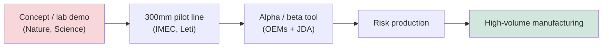
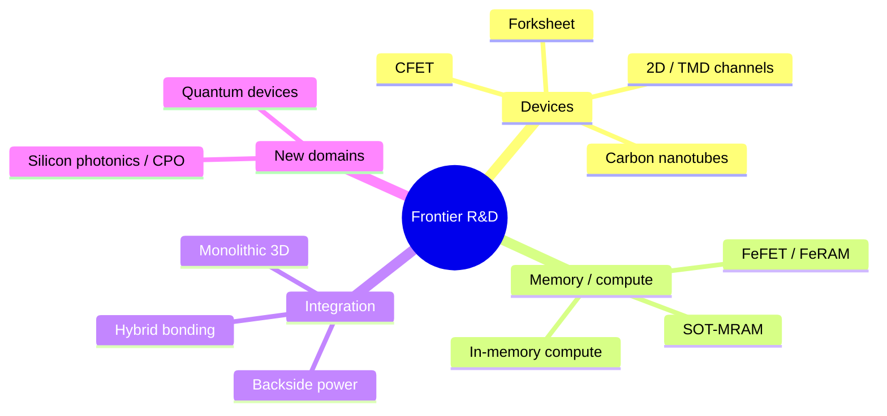

# Frontier Research Topics and Emerging Technologies in Semiconductor Manufacturing

> **Primary learning target.** This file is one of the two deepest sections of the database, surveying the frontier research — CFET, 2D-material channels, carbon nanotubes, backside power, advanced EUV, directed self-assembly, quantum-device fabrication, ferroelectrics, spintronics, silicon photonics, and neuromorphic computing — that will define the semiconductor manufacturing of the 2030s. Each section covers the physics, specific research results with named institutions and publication venues, and the detailed equipment and process implications.

The research frontier matters because, as detailed in File 15, the production roadmap is executed through a pipeline that converts the speculative research of one decade into the high-volume manufacturing of the next. The concepts demonstrated today at IEDM, the VLSI Symposia, SPIE, and in the Nature and Science journal families are the nodes and devices of the years ahead. This file maps that frontier.

---

## 📊 Visual Overview

*Original schematics; Mermaid diagrams render natively on GitHub.*

**CFET — two ways to stack nMOS over pMOS**


**2D channel material — a monolayer is far thinner than a silicon nanosheet**

```
 Silicon nanosheet body : ████ 4-7 nm
 MoS2 monolayer body    : ▏ ~0.65 nm   → shorter gate length before short-channel effects
 Key blockers: contact resistance (Fermi-level pinning), defects, 300mm uniformity
```

**The research-to-production pipeline (~5-10 years per concept)**



**Frontier map — what is being researched**



---

## SECTION 1: CFET (Complementary FET) — Deep Research Coverage

The Complementary FET, introduced in File 15 as the next architecture transition after GAA nanosheets, is the subject of intense research at IMEC, Intel, TSMC, Samsung, and the academic community. This section covers the process flows and research results in depth.

### 1.1 Monolithic versus Sequential CFET — The Fundamental Choice

A CFET stacks the nMOS and pMOS transistors vertically within one cell footprint, roughly halving standard-cell area versus side-by-side GAA. There are two fundamentally different ways to build it, and the choice shapes every downstream process decision.

**Monolithic CFET** builds both tiers in a single continuous process flow on one wafer. A tall superlattice — for example, **SiGe/Si/SiGe/Si** with bottom pairs for one device type and top pairs for the other — is grown, patterned, and processed together. The elegance of the monolithic approach (one wafer, ultimately the densest result) is offset by a severe constraint: every high-temperature step needed for the top tier (source/drain epitaxy, dopant-activation anneal) must be compatible with the **already-formed bottom tier**, sharply limiting the thermal budget and making low-temperature processing and laser anneal essential.

**Sequential CFET** processes the bottom tier fully on one wafer, then **bonds a second wafer on top**, thins it, and processes the top tier. Its decisive advantage is **thermal-budget freedom** — each tier is completed before bonding, so each can use its full thermal budget and be independently optimized (even using different channel materials for n and p). The cost is the need for **extremely precise wafer-to-wafer bonding alignment** and the formation of **inter-tier vias (ITVs)** connecting the levels.

### 1.2 Monolithic CFET Process Steps in Detail

A representative monolithic CFET flow proceeds as follows:
1. **Superlattice epitaxy:** grow the SiGe/Si/SiGe/Si stack, with germanium concentration in the sacrificial SiGe selected around **25–35%** (high enough for selective etch, low enough to avoid defects) and each layer roughly **6–8nm** thick, with abrupt interfaces and low defect density across the tall stack.
2. **Dual-fin/stack patterning** of the superlattice into device shapes.
3. **Inner-spacer formation for both tiers** — the inner-spacer process (lateral SiGe recess + low-k ALD fill, File 15) must now be executed for **both** the bottom and top device tiers, roughly doubling the complexity of the hardest GAA module.
4. **Selective channel release** — removing the sacrificial SiGe to release the channels, with the selectivity challenge compounded by the dual-tier structure.
5. **Bottom-tier gate deposition before top-tier FEOL** — the bottom transistor's gate metal must be formed and then **protected** while the top tier is processed.
6. **Self-aligned gate isolation dielectric** between the top and bottom gates — because nMOS and pMOS require different work functions but are vertically adjacent, a self-aligned dielectric must separate the two gates.
7. **Top-tier source/drain epitaxy** under a constrained thermal budget that will not damage the already-formed bottom gate.

### 1.3 Sequential CFET Process Steps in Detail

A representative sequential flow: process **wafer 1 (e.g., the nMOS bottom tier)** through FEOL, MOL, and partial BEOL; **bond wafer 2 face-to-face** to wafer 1 at sub-100nm (target <20nm) overlay; **thin wafer 2** to expose its device layer; process the **top tier (pMOS)** nanosheets on the thinned wafer 2; and form **inter-tier vias** connecting the source/drain and gates of the two tiers. The thermal-budget freedom allows independent optimization of each tier — for instance, a silicon nMOS bottom and a SiGe or even 2D-material pMOS top.

### 1.4 Key Research Publications

The CFET research record is rich and specific:
- **IMEC, IEDM 2022:** the first **monolithic CFET integration**, demonstrated at a contacted poly pitch of **48nm**, with an NMOS Si nanosheet stacked on a PMOS SiGe nanosheet, using a TiN-based inner spacer and work-function-metal gate tuning — a landmark proof of concept.
- **IMEC, IEDM 2023:** CFET with a **standard-cell demonstration**, showing the ~**50% cell-area reduction** versus GAA nanosheet that motivates the architecture.
- **Intel, IEDM 2021:** a **sequential CFET** concept with **inter-tier via (ITV)** resistance measurements, establishing the feasibility of the bonded approach.
- **TSMC, VLSI 2023:** a CFET scaling trajectory toward **CPP ≈ 30nm**, co-simulated with BEOL metallization.
- **Samsung, IEDM 2022:** MBCFET evolution toward CFET, with the **forksheet** discussed as an intermediate step.

### 1.5 The Forksheet as an Intermediate Step

Between GAA nanosheet and full CFET lies the **forksheet**, researched primarily at **IMEC**. In a forksheet, nMOS and pMOS are not stacked but are separated by a single **dielectric wall** built between them, allowing tighter n-to-p spacing and independent gate patterning on each side of the wall. This yields roughly a **20% density improvement** over GAA nanosheet — less than CFET's ~50% but with substantially lower process complexity — and offers a possible **2026–2028 insertion window** as a bridge technology before full CFET matures.

### 1.6 Equipment Implications of CFET

CFET stresses the equipment set in specific, demanding ways:
- **ALD gap-fill at openings below 3nm** for the gate fill between the stacked sheets.
- **Selective etch of SiGe at >100:1 selectivity** versus Si for the dual-material channel release.
- **Low-temperature (<400°C) high-k dielectric** with excellent interface quality (**Dit < ~5×10¹⁰ cm⁻²eV⁻¹**) to protect already-formed tiers.
- **Inter-tier via etch** at aspect ratios above 20:1 and CDs below 20nm.
- **Wafer-to-wafer bonding overlay below ~15nm (3σ)** for sequential CFET — beyond current production bonding capability.
- **Copper-free gate metals (Ru, Mo)** that fill sub-3nm gaps.

CFET thus represents the convergence of advanced transistor processing with the wafer-bonding and 3D-integration technologies of advanced packaging — the clearest sign that the future of scaling is vertical, three-dimensional device integration rather than continued planar shrink.

---

## SECTION 2: 2D Materials and TMD Transistors

If CFET is the next architecture, **two-dimensional channel materials** are the leading candidate for the next *channel* — the material that may eventually replace silicon when even thin silicon nanosheets run out of electrostatic room.

### 2.1 Physics Background

**Transition-metal dichalcogenides (TMDs)** have the formula **MX₂**, where M is a transition metal (Mo, W, Ti, Nb) and X is a chalcogen (S, Se, Te). They form a hexagonal lattice of layers held together by weak **van der Waals** forces, so they can be thinned to a single molecular layer. Crucially, while bulk TMDs have an *indirect* bandgap, a **monolayer achieves a direct bandgap**, and the monolayer is extraordinarily thin.

Key materials and their properties:
- **MoS₂** — nMOS candidate, monolayer bandgap ~1.8eV.
- **WS₂** — nMOS candidate, ~2.0eV.
- **WSe₂** — pMOS/ambipolar candidate, ~1.7eV.
- **MoSe₂, MoTe₂** — MoTe₂ (~1.1eV) is a pMOS candidate.
- **hBN (hexagonal boron nitride)** — an insulating 2D material useful as a gate dielectric or atomically clean substrate.

The decisive advantage is **body thickness**: a monolayer of MoS₂ is about **0.65nm** thick, versus 4–7nm for a silicon nanosheet. A thinner body means the gate can control a shorter channel before short-channel effects dominate, enabling theoretical gate lengths below ~3nm — far shorter than silicon allows.

### 2.2 Deposition Methods and Maturity

The central challenge of 2D materials is not the device physics (which is favorable) but the **manufacturing** — growing wafer-scale, low-defect, uniform films. The methods, in order of increasing manufacturability:
- **CVD sulfurization:** a metal precursor (MoO₃ or MoCl₅) reacts with sulfur vapor. Produces reasonable crystals but with **grain sizes of ~10–100nm**, **high defect density (10¹²–10¹³ cm⁻²)**, and non-uniform grain orientation — suitable for research, not manufacturing.
- **MOCVD:** metal-organic precursors (e.g., Mo(CO)₆ or molybdenum-cyclopentadienyl compounds with H₂S) give better uniformity over large areas. **Aixtron and Veeco** are developing MOCVD reactors for TMDs, and **IMEC demonstrated 300mm MOCVD MoS₂ in 2023** — the key manufacturability milestone — though grain size remains limiting.
- **ALD:** (e.g., MoCl₅ + H₂S) offers true layer-by-layer thickness control but lower crystallinity, requiring post-deposition anneal above ~500°C to crystallize.
- **MBE:** produces the best single-crystal quality but only on small (~2") wafers — not manufacturable at 300mm.

**Wafer-scale uniformity** is the crux: IMEC's 300mm demonstration showed sheet-resistance uniformity below ~10%, but the material is currently **thin-film-transistor-quality, not logic-quality** — the grain boundaries, defects, and variability remain far above what high-performance logic requires.

### 2.3 Key Device Results

The TMD research record contains several landmark results:
- **MIT, 2016 (Nature):** a MoS₂ transistor with a **1nm carbon-nanotube gate**, achieving a subthreshold swing of **65 mV/decade** at a **1nm gate length** — demonstrating MoS₂'s extreme-scaling potential.
- **TSMC, 2021 (Nature Electronics):** a MoS₂ **CMOS inverter** at ~**0.1 μm² cell area** with noise margin >40%, demonstrating CMOS compatibility of 2D channels.
- **IMEC, 2023 (IEDM):** **300mm MoS₂ NMOS** transistors on silicon by MOCVD, with **30nm gate length** and **Ion > 100 μA/μm** — the first manufacturing-compatible demonstration.
- **Stanford, 2022:** a WS₂ pFET with a semimetal **Bi₂O₃-related contact** achieving contact resistance below ~1 kΩ·μm — a record for TMD pFETs.
- **Peking University, 2021:** a MoS₂ FET at a **0.4nm effective gate length** using the MoS₂ edge as a gate — a proof of concept for sub-nanometer channel control.

### 2.4 The Contact-Resistance Problem

The single greatest obstacle to TMD transistors is **contact resistance**, rooted in **Fermi-level pinning** at the metal/TMD interface: the metal pins the semiconductor's Fermi level near mid-gap regardless of the metal's work function, creating a Schottky barrier even for low-work-function metals. Most metal contacts to TMDs show resistances of **1–100 kΩ·μm**, versus a target below ~100 Ω·μm for competitive logic.

Solutions under research:
- **Semimetal contacts** — In, Sn, Bi, Sb, whose near-zero bandgap suppresses the Schottky barrier. **MIT's 2021 result (Nature)** using **bismuth (Bi) contacts** achieved ~**123 Ω·μm** on MoS₂, a breakthrough that approached the competitive target.
- **Phase engineering** — locally converting MoS₂ from its semiconducting **2H phase** to its metallic **1T phase** at the contact region (via n-butyllithium or electron-beam treatment), achieving contact resistance below ~300 Ω·μm. The catch: the 1T phase is **metastable** and reverts to 2H above ~100°C, incompatible with standard CMOS thermal processing.
- **Graphene contacts** — providing a clean, van-der-Waals interface.

### 2.5 Dielectric Integration on TMDs

A second major challenge is depositing a high-quality **gate dielectric** on a TMD. The TMD surface is **atomically flat, chemically inert, and free of dangling bonds**, which is wonderful for transport but terrible for ALD nucleation — conventional high-k ALD does not nucleate well on the pristine surface, and there is no native oxide. Solutions include **organic seed layers** (e.g., a PTCDA seed followed by ALD Al₂O₃), **ozone pre-treatment**, extended-nucleation low-temperature ALD, and **AlOx seeding**. The best results achieve **HfO₂ on MoS₂ with EOT below 1nm** and interface-trap density around 10¹¹ cm⁻²eV⁻¹. **hBN as a gate dielectric** offers a near-ideal, lattice-matched interface (CVD hBN grown on Pt foil and transferred, giving subthreshold swings near 62 mV/dec), but it is not yet manufacturable at scale.

### 2.6 Roadmap to Integration

The IRDS "Beyond CMOS" outlook places TMD FETs in **early research now**, **technology development around 2028**, and **first HVM no earlier than ~2031** (most optimistic). The most likely integration path is **not** full TMD logic but **selective use** — for example, a **top-tier pMOS in a sequential CFET using WSe₂**, while the bottom nMOS remains silicon nanosheet — exploiting the thermal-budget freedom of sequential bonding to add a 2D tier without compromising the silicon tier. The key unsolved problems remain **grain size and uniformity, contact resistance, dielectric-interface quality, the 300mm MOCVD process, and balancing complementary n/p performance** — a formidable list, but one being attacked systematically by IMEC, TSMC, the academic community, and the equipment makers (Aixtron, Veeco, ASM, Applied) developing the deposition tools.

---

## SECTION 3: Carbon-Nanotube Field-Effect Transistors (CNFETs)

Carbon nanotubes offer some of the most attractive intrinsic transistor properties of any known material, yet they remain among the hardest to manufacture — a tantalizing combination that keeps them in the research frontier decades after their potential was recognized.

### 3.1 CNT Physics

A **single-wall carbon nanotube (SWCNT)** is a sheet of graphene rolled into a seamless tube, with a diameter of **0.5–2nm**. The way the sheet is rolled — described by the chirality indices **(n,m)** — determines whether the tube is **semiconducting or metallic**: roughly **one-third of randomly grown CNTs are metallic** and two-thirds semiconducting. As a transistor channel, a semiconducting CNT offers near-ideal **one-dimensional ballistic transport**, with intrinsic carrier mobility exceeding **100,000 cm²/V·s** and a mean free path beyond 1μm at room temperature — far superior to silicon. The transconductance and drive current per unit width can, in principle, exceed silicon's substantially.

The two defining challenges follow directly from the physics: the **metallic CNTs cause short circuits** in a transistor (requiring purity above **99.99% semiconducting**), and the tubes must be **aligned** parallel to the current flow at high density to deliver competitive drive current.

### 3.2 Separation and Sorting

Achieving 99.99%+ semiconducting purity requires sophisticated separation:
- **Gel-based separation** uses agarose gel chromatography exploiting subtle density differences; iterative runs reach ~99.9% purity.
- **Polymer wrapping** uses conjugated polymers such as **PFO (poly(9,9-dioctylfluorenyl-2,7-diyl))** that selectively wrap semiconducting tubes in a toluene dispersion, reaching ~**99.99%** — MIT's preferred method.
- **Aqueous two-phase extraction (ATPE)** uses surfactant-mixture partitioning to select semiconducting tubes in a scalable process.
- **Density-gradient ultracentrifugation (DGU)** uses a CsCl or iodixanol gradient for sub-nanometer diameter resolution and >99.9% purity, but is slow and expensive.

### 3.3 Alignment Techniques

Competitive drive current requires aligning CNTs parallel to current flow at densities of **~100–200 tubes per μm**:
- **Solution-based deposition on aligned substrates** (Langmuir–Blodgett, **floating evaporative self-assembly, FESA**) reaches ~100 CNT/μm with good local order but poor long-range order.
- **Epitaxial CNT growth on ST-cut quartz** grows tubes aligned along the quartz crystal's step edges (~95% alignment but only ~5 CNT/μm), then transfers them to a Si/SiO₂ wafer.
- **Dielectrophoresis (DEP)** uses an AC field to align tubes in solution for short-range local alignment.
- **Aerosol/inkjet printing** of CNT suspensions (IBM) provides local alignment in printed lanes.

### 3.4 Key Device Results

- **MIT, 2019 (Nature):** the landmark **RV16X-NANO**, a **16-bit RISC-V microprocessor built from ~14,000 CNFETs** — the most complex CNT-based circuit ever made, fully functional, fabricated using a manufacturing-compatible flow. MIT's **"MIXED" methodology** combined a metallic-CNT-removal step (electrical breakdown / RINSE process) with circuit-design techniques (DREAM) that tolerate residual metallic tubes, and the chip used 99.99%-purity semiconducting CNTs. MIT also demonstrated **3D integration** by stacking CNFET logic with RRAM memory.
- **Stanford, VLSI 2022:** CNFET **ring oscillators** with ~2ps stage delay, and performance extrapolations suggesting fT potential beyond 1THz.
- **IBM Research:** **sparse-aligned CNT FETs** achieving Ion/Ioff > 10⁶ with **Pd contacts** giving contact resistance below ~30 Ω·μm.
- **Peking University, 2023:** **~100 CNT/μm aligned-array** FETs at **10nm gate length** with the highest CNT-FET drive current to date — roughly 5× MIT's standard process.

### 3.5 Integration Challenges

Despite the spectacular intrinsic properties, CNFETs face severe manufacturing barriers:
- **Density at scale:** ~200 CNT/μm is needed for competitive logic at tight gate pitches, but wafer-scale *average* density remains far below the best isolated-device results.
- **Alignment uniformity:** good local alignment exists, but **300mm-scale uniform alignment is unsolved**.
- **Contacts and doping:** **Pd** works well for p-type CNTs (nearly Schottky-free), but reliable **n-type doping** (using benzyl viologen or rare-earth dopants) and stable n-type contacts (Sc, Y) are harder, complicating CMOS.
- **Process compatibility:** CNFET fabrication must be BEOL-compatible (<400°C), but CNTs are damaged by HF, aggressive plasma, and standard photoresist processing.
- **No committed roadmap:** no major foundry (TSMC, Samsung, Intel) has a committed CNFET HVM roadmap; the technology is classified as **exploratory research beyond 2030**. Its most plausible near-term role is in **3D-integrated, BEOL-compatible logic layers** stacked on silicon, exploiting CNTs' low-temperature processability — but the density and uniformity problems must be solved first.

---

## SECTION 4: Backside Power Delivery — Detailed Research Landscape

Backside power delivery (BSPDN), covered as a production technology in File 15, has a deep research literature that illuminates how it moved from concept to (near-)production in just a few years.

### 4.1 Research and Publication Landscape

- **Intel, IEDM 2021:** the first public disclosure of **PowerVia**, describing the test-vehicle architecture and reporting a large improvement in power-delivery-network efficiency, with backside-via resistance targets below ~1Ω per via at ~20nm diameter.
- **Intel, Hot Chips 2023 / VLSI 2023:** **PowerVia + RibbonFET co-integration** results on the Intel 18A path, with layout comparisons showing roughly a **20% standard-cell-area** benefit and demonstrated performance gains from reduced IR drop, validated on an Intel 4 test vehicle (reported ~6% frequency benefit and ~90% reduction in PDN-related droop).
- **TSMC, VLSI 2023:** the **Super Power Rail (SPR)** architecture, contrasting TSMC's direct-backside-contact approach with Intel's, and projecting the A16 power/performance benefits.
- **IMEC, IEDM 2022:** **BSPDN module development**, covering backside-via isolation, backside-PDN copper resistance, and **thermal simulation** showing how heat extraction changes when power is delivered from the back.
- **CEA-Leti, ~2023:** sequential-integration processes for BSPDN and bonding-alignment results, drawing on Leti's long expertise in 3D sequential integration.

### 4.2 Backside Via Technology (Nano-TSV)

The backside via is a **nano-scale through-silicon via**, far smaller than conventional TSVs:
- **Diameter:** **20–50nm** (versus 5–20μm for conventional TSV).
- **Formation:** etched from the wafer backside through ultra-thin (<5μm) remaining silicon (plus BOX if SOI, and ILD layers) to land on the source/drain or contact, at **aspect ratios above 40:1**, requiring an extremely anisotropic plasma etch (Bosch-like, but at a far smaller scale).
- **Fill:** barrier ALD (e.g., ~2nm TaN) + seed ALD (Ru or Cu) + Cu electroplating or Ru CVD fill — gap-fill at 20nm diameter is extreme.
- **Resistance:** research vehicles have measured ~**0.5Ω per via**, meeting Intel's sub-1Ω target.
- **Alignment:** **backside-to-frontside alignment** through the thinned wafer uses **infrared (IR) alignment** (silicon is transparent to sub-bandgap IR), with overlay targets below ~10nm (3σ).

### 4.3 Wafer Thinning for BSPDN

Thinning is the enabling and most delicate step:
- **Target thickness:** **below 5μm** of remaining silicon (some implementations below 2μm for the smallest nano-TSVs).
- **Process:** mechanical backgrind to ~50–100μm → CMP to ~10μm → wet etch (TMAH or KOH) or plasma etch to <5μm → final CMP.
- **Challenges at ultra-thin:** **wafer bow and warpage** (from FEOL/BEOL stress), **handling** (the wafer must be bonded to a carrier throughout), exposure of **silicon bulk defects** (COPs, micro-defects) at the new backside surface, and thermomechanical stress in subsequent processing.
- **Temporary bonding/debonding:** technologies such as **ZoneBond (Brewer Science)** and direct-bond approaches, with adhesives that survive 400°C and the subsequent etch chemistries; **SUSS MicroTec and EV Group** supply the bonding/debonding equipment, with laser or thermal-slide debonding.

BSPDN exemplifies how a single architectural idea creates a cascade of new equipment markets — backside etch, backside ALD, ultra-thin CMP, temporary bonding, IR alignment — and draws the advanced-packaging equipment makers deep into the front-end flow.

---

## SECTION 5: Advanced EUV — Stochastic Effects and Next-Generation Resist Research

EUV lithography, though now in high-volume production, remains a frontier research field, because its fundamental physics — the discreteness of EUV photons — imposes limits that intensify at every node.

### 5.1 Stochastic Effects in EUV

The root cause of EUV's stochastic problem is **photon shot noise**. EUV photons are energetic (~92 eV), so a useful exposure dose delivers relatively *few* photons per unit area. At a typical dose of ~20–30 mJ/cm², a 10nm² area receives only on the order of ~14–20 photons, and the **Poisson statistics** of such small numbers produce large *relative* fluctuations: √14 ≈ 3.7, a ~26% variation in photon count from feature to feature. This randomness translates directly into:
- **Line-edge / line-width roughness (LER/LWR):** the edges of printed lines wander randomly; 3σ LER is on the order of ~2.5nm at standard exposure, while the 2nm node needs below ~1.5nm — a hard limit set by photon statistics.
- **Stochastic defects:** random local dose deficits or excesses cause **bridges** (two lines merging) or **breaks** (a line discontinuity), at densities of ~0.01–0.1/cm² at acceptable doses — but HVM needs below ~0.001/cm².
- **The dose–LER–throughput triangle:** increasing dose reduces LER and stochastic defects but slows the scanner (lower throughput). This fundamental trade-off is the central tension of EUV process optimization.

### 5.2 Resist Research

Resist is where much of the stochastic battle is fought:
- **Chemically Amplified Resist (CAR):** the incumbent. A photoacid generator (PAG) absorbs EUV and generates acid, which diffuses and catalyzes the deprotection of the polymer. The **acid-diffusion length** is an irreducible contributor to LER, and the relatively low EUV absorption of organic CARs limits photon capture.
- **Metal-oxide resists (MOR):** **Inpria's tin-oxide-based** resist (Inpria acquired by **JSR** in 2021) uses tin-oxo cage precursors; the tin atoms **absorb EUV directly** (high cross-section), forming an inorganic oxide network on exposure. MOR demonstrates resolution below ~12nm pitch with LER around ~1.5nm — superior to CAR — but at the cost of **lower sensitivity** (higher dose), and is the leading candidate for High-NA EUV.
- **Molecular resists:** small-molecule resists with no polymer-chain diffusion, offering inherently lower LER; researched at IMEC, Cornell, and CEA-Leti, but at low maturity.
- **Sensitized CAR and PSCAR:** adding EUV-sensitizing molecules to CAR to improve quantum yield (IMEC, ~2022–2023), and **Photosensitized Chemically Amplified Resist (PSCAR)** — a two-step approach using a flood UV exposure after EUV to amplify acid generation (JSR/Tokyo Ohka) — both aim to improve sensitivity without an LER penalty.

### 5.3 EUV Mask and Pellicle Research

- **High-n absorbers:** the standard **TaN** absorber (n≈0.96, k≈0.03 at 13.5nm) causes 3D-mask shadowing effects. **High-n / low-thickness absorbers** (TaBN, Ni-, Co-, Ru-based) reduce these effects; **IMEC** has demonstrated high-n absorber masks that reduce sidelobe artifacts and image asymmetry.
- **Pellicles:** the polysilicon pellicle (~13nm thick) transmits ~88–90% at EUV but degrades under 1000+ W of EUV power. **ASML and TSMC are developing carbon-nanotube (CNT) pellicles** targeting >95% transmission and higher thermal tolerance for the higher-power scanners.
- **Actinic mask inspection:** EUV-relevant mask defects can only be seen at 13.5nm (actinically). **ZEISS AIMS EUV** (at the ASML campus) provides actinic inspection, but at limited (non-HVM) throughput; TSMC, Samsung, and Intel access it via ZEISS, and a faster next-generation actinic-inspection capability is in development for ~2026+. **Mask-blank defect density** must be below ~0.003/cm² for defects >20nm, with **Hoya and AGC** at the leading edge and blanks inspected at ZEISS — a supply-constrained chain (only three blank suppliers globally).

### 5.4 High-NA EUV (0.55 NA) Research Status

- **Tools:** the first **ASML EXE:5000** was installed at **IMEC (2023)** and at **Intel (first customer tool, 2024)**.
- **Anamorphic optics:** to control mask shadowing at 0.55 NA, the optics use **8× demagnification along the scan direction and 4× across the slit**. The reticle is still made at 4× magnification, but the printable **field halves** to **26mm × 16.5mm** — meaning large chips (e.g., big GPU compute arrays) must be **stitched** from multiple exposures.
- **Resolution:** at k1≈0.33, the minimum pitch is approximately λ/(2·NA) = 13.5/(2·0.55) ≈ 12.3nm, with ~16nm half-pitch achievable in practice.
- **Resist and stitching challenges:** the resist must resolve <16nm pitch (requiring metal-oxide resist) at thicknesses below ~20nm (to control mask-3D and absorption); and for chips exceeding 16.5mm in one dimension, **pattern stitching** with sub-1nm stitching error is required at the field boundary — a real design constraint for large dies.
- **IMEC High-NA results:** IMEC printed **16nm-pitch patterns (SPIE 2023)** with LER ~2.8nm, and reported significantly reduced mask-3D effects versus standard-NA EUV.
- **Intel 18A High-NA:** Intel targets the **first HVM High-NA insertion** on specific critical layers (e.g., cut and contact layers), with most layers still on standard EUV; the **$380M+ tool cost** limits early adoption to a few layers at the most advanced fabs.

Advanced EUV research thus spans physics (stochastics), chemistry (resists), materials (absorbers, pellicles, blanks), and optics (High-NA) — a multidisciplinary frontier on which the continued scaling of the entire industry depends.

---

## SECTION 6: Directed Self-Assembly (DSA) — Research and Manufacturing Status

Directed self-assembly harnesses the natural tendency of certain polymers to organize themselves into regular nanoscale patterns, guided by a lithographic template — offering a route to feature sizes and pitches below what lithography alone can resolve, at potentially low cost.

### 6.1 DSA Fundamentals

The workhorse material is the **block copolymer (BCP)** — a polymer chain made of two chemically immiscible blocks joined end to end, such as **PS-b-PMMA (polystyrene-block-poly(methyl methacrylate))**. Above a critical molecular weight, the two blocks **microphase-separate** spontaneously (they want to demix but are tethered together), forming regular nanoscale domains with a characteristic spacing **L₀** set by the block lengths.

- **Lamellar morphology:** symmetric BCPs form alternating lamellae at L₀/2 half-pitch. For typical PS-b-PMMA, L₀/2 is ~10–15nm (giving ~20–30nm half-pitch). **High-χ (high Flory–Huggins interaction parameter) BCPs** such as **PS-b-PDMS** or **PS-b-PTMSS** achieve much smaller domains (L₀/2 below ~8nm), reaching sub-10nm half-pitch potential.
- **Graphoepitaxy:** a topographic pre-pattern (a guiding trench or post, made by EUV or ArF immersion) orients and registers the BCP assembly. A powerful benefit is **pattern rectification** — the self-assembly smooths the line-edge roughness of the guiding pattern and regularizes the pitch, so the DSA result is *cleaner* than its lithographic template. The overlay of the BCP domains to the guide must be below ~L₀/4.
- **Chemoepitaxy:** a chemical-contrast pattern (alternating chemical brush stripes) on the surface directs the BCP without topography, requiring stricter surface-chemistry control. IMEC and Albany NanoTech are primary chemoepitaxy research sites.

### 6.2 Current Manufacturing Status

- **Samsung** has the most advanced DSA in (limited) production, using it for **contact-hole shrink in DRAM** (reported at IEDM 2018) and via-hole patterning via graphoepitaxy, and researching DSA for Kioxia-style 3D NAND staircase contacts.
- **Leading-edge logic** at TSMC and Intel does **not** yet use DSA in production.
- **Defect density** is the central barrier: BCP assembly produces defects — **dislocations, disclinations, and grain boundaries** in the ordered domains — at densities of ~10–100/cm², while logic requires below ~0.01/cm². Closing this gap is the primary research thrust.
- **The IMEC DSA program** (joint development with Dow, JSR, Merck, and TEL) demonstrated 10nm-pitch patterns with PS-b-PDMS on an EUV guide and drove defect density down from ~1000/cm² to ~10/cm² over 2019–2023, targeting below ~1/cm² by ~2026.
- **High-χ BCPs:** PS-b-PDMS (χ≈0.26 versus PS-b-PMMA's χ≈0.04) enables much smaller L₀, and TEL is working to integrate PS-b-PDMS into the coat-and-develop track.

### 6.3 Equipment for DSA

- **Coat-and-develop track** (TEL Lithius, SCREEN tracks): performs sequential BCP coating, soft bake, **self-assembly bake** (typically 230–250°C for PS-b-PMMA), UV treatment to fix the domains, and **selective removal of one block** (e.g., PMMA removed by acetic acid or O₂ plasma).
- **Inspection:** SEM-based defect inspection capable of detecting sub-5nm domain defects at DSA pitch — requiring e-beam inspection (HMI/ASML or KLA).
- **Overlay metrology:** BCP-to-guide overlay below ~5nm (3σ), measured with tools such as ASML YieldStar in research settings.

DSA's likely role, per the IRDS, is **insertion for specific layers (contacts, vias, line cuts) around 2026–2028**, complementing EUV (graphoepitaxy on an EUV guide) rather than replacing it — gated entirely by the defect-density challenge.

---

## SECTION 7: Quantum Computing Device Fabrication

Quantum computing has emerged as a major driver of specialized device fabrication, with several competing qubit technologies each imposing distinct and demanding manufacturing requirements. Although quantum devices are made in far lower volumes than classical chips, their fabrication pushes the frontier of materials purity, precision, and 3D integration, and increasingly draws on semiconductor-manufacturing equipment and know-how.

### 7.1 Superconducting Qubits (Transmon)

The **transmon** is currently the dominant superconducting qubit type, used by **IBM, Google, Rigetti, and IQM**. Its key non-linear element is the **Josephson junction (JJ)** — an **Al/AlOx/Al** tunnel junction.

- **JJ fabrication:** the classic approach is **shadow (Dolan-bridge) evaporation** — angle-evaporating aluminum through an e-beam-patterned resist mask, oxidizing the bottom electrode in situ under controlled O₂ partial pressure and temperature, then evaporating the top electrode at a different angle. The junction area (~200nm × 200nm) sets the Josephson energy E_J, which determines the qubit frequency.
- **Process environment:** a dedicated **low-contamination cleanroom** free of magnetic contaminants (no Cu, no Fe), with sub-nanometer surface roughness and stringent particle control, because contamination degrades the superconducting properties (Al gap Δ ≈ 170 μeV).
- **Substrate:** high-resistivity silicon (>10 kΩ·cm) or sapphire for low microwave loss, with critical pre-cleaning (HF to remove native oxide, anneal).
- **Dielectric loss and TLS:** **two-level systems (TLS)** at the Si/SiO₂ interface, substrate surface, and Al₂O₃ are the dominant decoherence sources; reducing TLS density (via hydrogen anneal, surface passivation) is a major research thrust at IBM and Google.
- **Niobium-based qubits:** **Nb** (Tc = 9.25K versus Al's 1.2K) is used for resonators and transmission lines, deposited by PVD and patterned by Cl₂/F plasma etch; its higher gap protects against radiation-induced quasiparticles. Intel and IQM use Nb.
- **3D integration:** IBM's "heavy-hex" topology and scaling require **flip-chip bonding** (indium micro-bump bonding, with bonding done so the joints survive cooldown to ~4K and below) to connect the qubit chip to a separate readout chip, with bump heights below ~5μm and alignment below ~5μm, managing cryogenic mechanical stress.
- **Yield and frequency targeting:** the JJ frequency spread across a 50-qubit chip is ~1–5% ("frequency crowding"), requiring individual qubit tuning via flux-bias lines, and post-fabrication **laser annealing of the JJ** (MIT, 2020) to trim junction resistance and target frequencies.

### 7.2 Trapped-Ion Qubits

- **Fabrication:** **surface-electrode ion traps** on silicon or quartz substrates, with gold or aluminum electrodes patterned by standard lithography (~1μm features). **DRIE-etched windows** in the silicon provide optical access for laser beams, and connections route to a cryogenic PCB via wirebonds.
- **Materials:** low-outgassing electrodes (gold preferred for ultra-high vacuum), alumina dielectric under the electrodes, SiO₂ ILD, and etched-Si surfaces with roughness below ~5nm (to minimize laser scatter).
- **Companies:** **IonQ, Quantinuum (Honeywell), and Oxford Ionics**; trap-chip fabrication is typically outsourced to **MEMS fabs** (e.g., specialized foundries, IMEC) rather than leading-edge logic fabs.
- **Photonic integration:** trap chips increasingly include **integrated photonics** (Si₃N₄ waveguides, grating couplers) for on-chip laser delivery — MIT/Lincoln Laboratory has pioneered integrated photonic trap chips.

### 7.3 Silicon Spin Qubits

- **Qubit:** a single electron spin in a **Si/SiGe or Si-MOS quantum dot**, offering long coherence times (T₂ up to seconds in isotopically purified silicon).
- **Fabrication:** uses a **standard 22nm/28nm-class CMOS process** with extremely tight gate pitch (30–50nm); single-electron control requires sub-threshold operation, and **cryogenic CMOS control electronics** can be co-integrated at ~4K.
- **Isotopically purified silicon:** natural silicon contains 4.7% **Si-29** (non-zero nuclear spin); using **99.99% Si-28** eliminates the nuclear-spin bath, extending T₂* from microseconds to >100μs. **Shin-Etsu and Wacker** supply purified silane for epitaxial Si-28 growth.
- **Intel's approach:** using existing **300mm CMOS fabs** (a modified 22nm FD-SOI process) to fabricate spin qubits — branded around its "Tunnel Falls" research chip — targeting large qubit arrays, in partnership with **QuTech (TU Delft)**. The decisive advantage is leveraging mature CMOS manufacturing; the challenge is that qubit uniformity demands sub-nanometer gate-oxide uniformity beyond current CMOS yield targets, and each qubit needs individual tuning.

### 7.4 Equipment for Quantum Device Fabrication

- **E-beam lithography:** the primary patterning tool for sub-100nm JJs and quantum-dot gates (Raith, JEOL, Elionix systems, often at 100kV for best resolution) — not yet at foundry scale.
- **PVD:** aluminum and niobium deposition (Plassys, AJA International) in dedicated low-contamination chambers with integrated in-situ oxidation.
- **DRIE:** silicon etch for ion-trap windows and surface topology (Oxford Instruments, SPTS).
- **Surface analysis:** XPS for Al₂O₃ characterization and HAADF-STEM for JJ cross-sections (often in collaboration with national labs).
- **Low-temperature PEALD:** ALD of Al₂O₃ or SiO₂ at ~80°C for qubit-compatible dielectrics (MIT research, using trimethylaluminum/water chemistry).

Quantum-device fabrication thus spans a spectrum from bespoke, e-beam-and-evaporation lab processes (superconducting and trapped-ion) to CMOS-foundry-leveraged manufacturing (silicon spin qubits), and as quantum systems scale, the pull toward semiconductor-manufacturing techniques — 300mm processing, ALD, advanced lithography, and 3D integration — grows steadily stronger.

---

## SECTION 8: Ferroelectric Devices — FeFET, FeRAM, and Negative Capacitance

The 2011 discovery that **hafnium oxide** can be made ferroelectric reignited the field of ferroelectric microelectronics, because — unlike the traditional perovskite ferroelectrics (PZT, BaTiO₃) — HfO₂ is fully CMOS-compatible, scalable to nanometer thicknesses, and depositable by ALD.

### 8.1 HfO₂-Based Ferroelectrics

- **Discovery:** **Böscke et al., 2011 (Applied Physics Letters)** showed that **doped HfO₂** (with Si, Y, Zr, Al, or Gd) exhibits a ferroelectric **orthorhombic phase** (space group Pca2₁), stable in films down to ~1nm — a property absent in bulk HfO₂ and incompatible-free with silicon, unlike the perovskites.
- **Key dopants:** **Si-doped (3–4 at%)** stabilizes the ferroelectric phase; **Zr-doped (HZO, ~50:50 HfO₂:ZrO₂)** gives a robust ferroelectric with remanent polarization 2Pr ~20–40 μC/cm²; **Al-doped** raises the coercive field; **Y-doped** gives the largest Pr but with uniformity challenges.
- **ALD deposition of HZO:** alternating HfCl₄/H₂O and ZrCl₄/H₂O cycles, with the Hf:Zr ratio controlled by the super-cycle ratio, deposited at 250–300°C (300mm-compatible), followed by a **post-deposition anneal at 400–500°C** that crystallizes the ferroelectric phase (a TaN capping electrode provides a crystallization template).

### 8.2 FeFET (Ferroelectric FET)

- **Structure:** a standard MOSFET with an HZO ferroelectric gate dielectric; the polarization state stores data non-volatilely, read out as a threshold-voltage shift (ΔVt ~1V); 1-bit or multi-bit operation is possible.
- **GlobalFoundries FeFET:** the **GF 22FDX FeFET** (on FD-SOI) was the first commercial FeFET (~2021), with endurance ~10⁹ cycles and >10-year retention at 85°C; an 8Mb FeFET array was demonstrated (Fraunhofer/GF, 2023).
- **FinFET FeFET:** Samsung demonstrated FeFET on a 28nm-class FinFET with conformal HZO on the fin sidewall, more complex than planar due to fin-surface passivation.
- **Key challenges:** the **wake-up effect** (Pr changes over the first 10³–10⁵ cycles), **imprint** (Vt shift after many same-state cycles), and **cycling fatigue** — all addressed through interface engineering (a SiO₂ or Al₂O₃ interlayer between HZO and silicon).
- **Applications:** embedded non-volatile memory (replacing NOR flash at 28nm and below), synaptic devices for analog compute, and logic-in-memory.

### 8.3 Negative-Capacitance FET (NCFET)

- **Concept:** **Salahuddin and Datta, 2008 (Nano Letters)** proposed that a ferroelectric in series with the gate oxide can amplify the gate voltage, yielding an effective **subthreshold swing below the 60 mV/decade Boltzmann limit** — potentially enabling lower-voltage, lower-power transistors.
- **Mechanism and controversy:** the ferroelectric's negative dQ/dV region (on the P–E curve) amplifies the gate potential, but whether observed sub-60mV/dec behavior reflects true steady-state negative capacitance or transient hysteresis remains **scientifically debated**.
- **Status:** **Samsung** stated that its SF3 GAA gate stack uses thin HZO with "NC" effects, though the mechanism is debated; **IMEC** has measured SS ≈ 52 mV/dec in DC HZO/SiO₂ stacks while AC measurements show hysteresis. NCFET remains a **research-stage** concept, not confirmed as an intentionally engineered HVM feature, with its physical mechanism still contested.

### 8.4 FeRAM (Ferroelectric RAM)

- **Structure:** a **1T1C** cell (access transistor + ferroelectric capacitor). HZO FeRAM targets embedded NVM below 28nm, where the traditional PZT FeRAM (not scalable, BEOL-incompatible) cannot go.
- **Integration:** HZO deposited in the BEOL after transistors at 350–400°C, with TiN top and bottom electrodes; ~10nm HZO films demonstrate Pr ≈ 18 μC/cm², endurance >10⁹, and >10-year retention at 85°C (TSMC research, IEDM 2022).
- **Developers:** Texas Instruments, Synaptics, and others are developing HZO FeRAM for embedded applications.

Ferroelectric HfO₂ thus opens a rich design space — non-volatile memory (FeFET, FeRAM), steep-slope transistors (NCFET, if the physics cooperates), and analog/neuromorphic devices (Section 11) — all built from a CMOS-compatible, ALD-deposited material, making it one of the most active and promising frontiers in emerging devices.

---

## SECTION 9: SOT-MRAM and Spin-Orbit Torque Devices

Magnetoresistive RAM stores information in the magnetization of a magnetic tunnel junction rather than in charge, offering non-volatility, high endurance, and fast switching — and its evolution illustrates how spintronic devices are entering mainstream embedded memory.

### 9.1 MRAM Evolution

- **Toggle MRAM (1st generation):** used two magnetically coupled layers switched by an external field; commercialized by **Everspin** but not scalable to advanced nodes.
- **STT-MRAM (Spin-Transfer Torque):** a write current passes *through* the MTJ, and the torque from the spin-polarized current switches the free layer. STT-MRAM is in production as **embedded MRAM**: **Samsung's 28nm eMRAM** (IEDM 2019), **TSMC's 22nm eMRAM** platform, and IBM's use of STT-MRAM as last-level cache. It targets NOR-flash and SRAM replacement for embedded applications.
- **SOT-MRAM (Spin-Orbit Torque):** a separate write-current path runs through a **heavy-metal layer** (W, Pt, Ta) adjacent to the free layer; the **spin Hall effect** in the heavy metal generates a pure spin current that switches the free layer *without* passing current through the tunnel barrier. This decouples the read and write paths, **extending tunnel-barrier lifetime** (endurance) and enabling faster, potentially lower-energy switching — at the cost of a more complex three-terminal cell.

### 9.2 MTJ Stack Structure and Deposition

A SOT-MRAM cell is built around a magnetic tunnel junction: **heavy metal (W/Pt/Ta, 3–5nm) / CoFeB free layer (1–1.5nm) / MgO tunnel barrier (~1nm) / CoFeB reference layer (2–3nm) / synthetic antiferromagnet (SAF: CoFe/Ru/CoFe pinning structure)**.

- **Deposition:** the full MTJ stack comprises ~30 layers, deposited by **PVD (magnetron sputtering)** in an **ultra-high-vacuum multi-chamber cluster tool**, with all layers deposited in situ without breaking vacuum (any contamination between layers degrades the magnetic properties).
- **MgO tunnel barrier:** formed by reactive sputtering of Mg in O₂ (or by depositing Mg and oxidizing); its thickness uniformity must be controlled to **below ~0.1nm**, because the tunneling magnetoresistance (TMR) ratio depends exponentially on barrier thickness. Target TMR is **>200%** for adequate read margin; lab results exceed 600% at room temperature.
- **Magnetic annealing:** a post-deposition anneal at 300–400°C in a **1–2 Tesla magnetic field** crystallizes the CoFeB into bcc CoFe at the MgO interface (essential for high TMR) and sets the SAF orientation.

### 9.3 MTJ Patterning — The IBE Challenge

Patterning the MTJ pillar is a distinctive challenge: conventional plasma (chemical) etch **cannot** be used, because the etched magnetic material is non-volatile and **redeposits on the pillar sidewalls**, creating conductive shorts across the tunnel barrier. Instead, MTJs are patterned by **Ion Beam Etching (IBE)** — physical sputtering with a broad **Ar⁺ beam at an oblique (~45°) angle** that mills the pillar while minimizing sidewall redeposition. IBE demands CD control to ±1nm at pillar diameters down to ~20nm with aspect ratios above 5:1. **SPTS (KLA) and Veeco** supply IBE tools. This patterning constraint is one of the defining manufacturing differences between MRAM and conventional CMOS.

### 9.4 SOT-MRAM Research Publications

- **IMEC, IEDM 2020:** the first **fully integrated SOT-MRAM array on a 300mm wafer**, using a tungsten heavy-metal layer, with ~40ns write speed and field-free switching enabled by a tilted-anisotropy scheme.
- **MIT, 2019 (Nature Materials):** W-based SOT switching with **~1ns pulses** at a critical current density ~3×10⁶ A/cm² — fast, though the required current remains high versus STT.
- **Samsung, IEDM 2022:** SOT-MRAM embedded in 28nm CMOS, targeting last-level-cache replacement, with ~5ns write, ~3ns read, and endurance >10¹¹ cycles.
- **Key challenge — field-free switching:** SOT switching intrinsically requires a symmetry-breaking field to set the switching direction. Solutions include **exchange bias from an antiferromagnet, tilted MTJ anisotropy, and shape anisotropy** — making field-free, deterministic switching a central research focus.

SOT-MRAM exemplifies how spintronic devices, with their unique PVD-stack and IBE-patterning requirements, are creating new equipment niches (UHV cluster sputtering, IBE, magnetic anneal) as they move from research toward embedded-memory production.

---

## SECTION 10: Silicon Photonics and Co-Packaged Optics (CPO)

As electrical interconnects approach their bandwidth limits, **silicon photonics** — building optical components in silicon using CMOS-compatible processes — has become essential to the future of data-center and AI-system interconnect, and **co-packaged optics (CPO)** is moving optical I/O directly into the chip package.

### 10.1 Why Silicon Photonics Now

- **The bandwidth wall:** electrical SerDes at 112 Gbps (PAM4) is reaching physical limits by ~2027–2028 due to insertion loss, and 224 Gbps SerDes is extremely challenging beyond ~1m reach. Optical interconnect is the only path to >10 Tb/s bandwidth density.
- **Co-packaged optics:** integrating optical transceivers *directly on the switch or accelerator package* (rather than as pluggable front-panel modules) eliminates lossy PCB traces, delivering ~10× bandwidth-density improvement and >30% power reduction — critical for AI clusters where inter-chip bandwidth limits scaling.

### 10.2 Silicon Photonics Device Fabrication

- **Si waveguides:** patterned in the 220nm silicon layer of an **SOI wafer (from Soitec, 200/300mm)** by DUV 193i lithography and dry etch (HBr/Cl₂ plasma), with **sidewall roughness below ~0.5nm** critical to keep propagation loss below ~1 dB/cm.
- **Ge photodetectors:** **selective Ge epitaxy** grown in a silicon-waveguide trench; germanium's 0.66eV bandgap absorbs at the 1550nm telecom wavelength, giving responsivity >1 A/W and bandwidth >100 GHz. The key challenge is reducing the Ge/Si **threading-dislocation density** (below ~10⁷ cm⁻²). IMEC grows Ge-on-Si using ASM epitaxy reactors.
- **Modulators:** **silicon PN-junction depletion modulators**, carrier-injection modulators, **SiGe electro-absorption modulators (EAM)**, and — for the highest performance — **lithium-niobate-on-insulator (LNOI)** modulators (via wafer bonding; HyperLight, PsiQuantum), targeting Vπ·L below ~1 V·cm and bandwidth >50 GHz.
- **Grating couplers:** shallow (~70nm) periodic etches in the waveguide that couple light from fiber or free space into the chip, with 70–80% efficiency (apodized gratings improve this).
- **Thermal tuning:** TiN heaters tune waveguide/ring-resonator wavelength (~100mW for a full free-spectral-range shift); phase-change materials (GST, Sb₂S₃) are researched for non-volatile tuning.
- **III-V/Si hybrid lasers:** silicon's indirect bandgap makes it a poor light emitter, so a **III-V laser** must be added — by wafer/die bonding (the mainstream, e.g., flip-chip III-V to silicon) or by **direct epitaxy of III-V on Si** (GaAs/InP on Si with buffer layers; the current dislocation-density record ~10¹⁰ cm⁻², with a target below ~10⁵). Intel has pioneered hybrid-laser integration.

### 10.3 CPO Manufacturing and Integration

- **CPO assembly:** a silicon-photonic chiplet (from Broadcom, Intel, Marvell, OpenLight, Ayar Labs) is bonded to a switch or accelerator ASIC (e.g., Broadcom Tomahawk, Cisco Silicon One) using **flip-chip micro-bumps or hybrid bonding**.
- **Fiber attach:** a multi-fiber connector is **edge-coupled** to the photonic chip, requiring **active alignment** to below ~1μm (using MEMS or piezo stages) and hermetic sealing for reliability — fiber attach is a key cost and yield driver.
- **Manufacturing challenges:** both the photonic components (waveguide, Ge detector, modulator) and the electrical ASIC must yield well simultaneously; Ge-detector dark-current uniformity, athermal modulator design for wavelength stability, and **laser reliability (>10 years at 70°C)** are central concerns.
- **Market and publications:** **Ayar Labs** (in-package optical I/O), **Intel** (CPO switch), **Broadcom** (production Si-photonic transceivers), and **Marvell/Coherent** are leaders. Representative results: **IMEC (OFC 2023)** demonstrated 300mm Si-photonic wafers with Ge-detector arrays; **Intel (Hot Chips 2023)** showed a 51.2 Tb/s CPO switch; **Broadcom (ECOC 2023)** reported production Si-photonic transceiver data.

Silicon photonics brings a new set of process requirements — ultra-smooth waveguide etch, Ge epitaxy, modulator doping, grating patterning, hybrid laser bonding, and active fiber alignment — into the semiconductor flow, and as AI drives insatiable bandwidth demand, it is becoming one of the fastest-growing frontiers adjacent to mainstream logic.

---

## SECTION 11: Neuromorphic and Analog In-Memory Computing

The energy cost of moving data between memory and processor — the "von Neumann bottleneck" — dominates the power consumption of neural-network inference. **Analog in-memory computing (IMC)** attacks this directly by performing computation *within* the memory array, and it has become a major driver of emerging-memory research.

### 11.1 Why Analog Compute

The dominant operation in neural-network inference is **matrix-vector multiplication (MVM)**. In a conventional digital system, this requires reading the weight matrix from memory and performing multiply-accumulate (MAC) operations in the processor — bottlenecked by memory bandwidth. In **analog IMC**, the weights are stored as the **conductances** of devices in a **crossbar array**; an input vector is applied as voltages; by **Ohm's law (I = V·G)** each device multiplies its input by its stored weight, and by **Kirchhoff's law** the currents sum along each column — performing the entire MVM in a single step, in O(1) time, where the computation happens. This can improve energy efficiency by orders of magnitude for inference.

### 11.2 Phase-Change Memory (PCM) for Analog Compute

- **Mechanism:** PCM uses a chalcogenide (**GST — Ge₂Sb₂Te₅**); the amorphous state is high-resistance (~MΩ), the crystalline state low-resistance (~kΩ). A slow, low-current pulse SETs (crystallizes); a fast, high-current spike RESETs (amorphizes).
- **Multi-level operation:** controlling the SET pulse produces **partial crystallization** and thus intermediate resistances — enabling multi-bit/analog weights. **IBM** demonstrated 4-level (and finer) analog PCM for neural networks (Nature, 2017).
- **IBM PCM crossbars:** IBM built **million-cell PCM crossbars** for deep-learning inference, demonstrating large-network inference with <1% accuracy loss versus GPU (reported at ISSCC ~2023). The key challenge is **conductance drift** (resistance increases over time, τ~hours), corrected by periodic drift compensation.
- **Foundry-integrated PCM:** integrated in BEOL with a W bottom electrode, sputtered GST, and TiN top electrode; GlobalFoundries and TSMC offer embedded PCM.

### 11.3 RRAM/ReRAM for Analog

- **Mechanism:** **HfOx RRAM** (HfO₂ deposited by ALD) forms a conductive **oxygen-vacancy filament** during a FORMING step; SET grows the filament (low resistance ~kΩ), RESET partially dissolves it (high resistance ~MΩ), with filament diameter below ~5nm.
- **Analog conductance:** controlling the SET pulse varies the filament, giving continuous (analog) conductance; the target is 256 levels (8-bit) per cell, though ~8–16 levels (3–4 bit) are reliable today.
- **Key challenge:** **cycle-to-cycle and device-to-device variability** (the filament formation is stochastic, varying conductance 10–30% per cycle), mitigated by compliance-current control, series resistors, and write-verify feedback.
- **Commercialization:** **TSMC/Weebit Nano** developed 28nm embedded RRAM (a Weebit selector + RRAM in BEOL), with production targeted ~2024–2025 for embedded NVM.

### 11.4 MRAM and Ferroelectric Devices for Analog

- **MRAM:** STT-MRAM's two states make true analog multi-level switching difficult (research stage); more viable is MRAM as a fast, high-endurance memory in near-memory-compute architectures.
- **Ferroelectric tunnel junctions (FTJ):** an HZO or BTO barrier between electrodes whose **polarization modulates the tunneling current** (~10× change); intermediate polarization states give 4–8 analog levels (demonstrated at MIT, Nature Electronics 2023). FTJs are CMOS-compatible (HZO at 400°C BEOL), non-volatile, and very low-energy (<1 fJ/bit), but have a small ON/OFF ratio (~10× versus RRAM's ~10³×).

### 11.5 Equipment and Outlook

Analog IMC and neuromorphic devices are built largely in the **BEOL** using ALD (HfOx, HZO), sputtering (GST, MTJ stacks), and the specialized patterning of each memory type (IBE for MRAM). Their integration leverages existing deposition and etch equipment adapted to new materials, plus the analog/mixed-signal design and test capability to handle the device variability. While still emerging, analog in-memory computing represents a potentially transformative shift in computer architecture — moving computation into the memory itself — and is one of the most active areas where emerging-memory device physics, materials, and equipment converge.

---

## SECTION 12: Key Research Institutions, Conferences, and Publication Landscape

The frontier research surveyed in this file is produced by a global ecosystem of institutions and disseminated through a well-defined set of conferences and journals. Understanding this landscape is essential to tracking where the industry is heading.

### 12.1 Research Institutions

- **IMEC (Leuven, Belgium):** the largest independent semiconductor research center (5,000+ researchers, ~€900M annual budget), running a 300mm pilot line co-funded by TSMC, Samsung, Intel, ASML, Applied, Lam, and TEL. Its annual **ITF (IMEC Technology Forum)** is a key industry event, and its programs span advanced CMOS (GAA → CFET), 2D materials, EUV, DSA, quantum, neuromorphic, and advanced packaging. IMEC is the single most influential pre-competitive hub.
- **CEA-Leti (Grenoble, France):** focused on FD-SOI, **3D sequential integration**, quantum computing, silicon photonics, and bioelectronics, in close partnership with STMicroelectronics and Soitec.
- **IBM Research (Albany, NY):** co-located with the GlobalFoundries Albany NanoTech complex; pioneered the **2nm nanosheet test chip (2021)**, leads CFET and post-silicon (CNT, TMD) research, and drives the **IBM Quantum** roadmap (Heron, Condor, and beyond). Key CFET partnerships with Samsung and Intel.
- **MIT Microsystems Technology Laboratories (MTL):** home of Max Shulaker's **CNFET** research, silicon spin qubits, photonic neural networks, and novel transistor architectures.
- **Stanford Nanofabrication Facility (SNF):** university fab supporting III-V photonics, MEMS, quantum, and 2D-material research; home of Sayeef Salahuddin's **negative-capacitance** group.
- **NIMS (Japan):** materials research in 2D materials, oxide electronics, and topological materials.
- **ITRI (Taiwan):** government research institute collaborating closely with TSMC on advanced packaging, compound semiconductors, and SiC power.
- **KAIST (Korea):** close ties to Samsung, with strength in advanced memory, 3D NAND, and neuromorphic research.
- **Fraunhofer Institutes (Germany):** multiple institutes — **IPMS** (MEMS, ferroelectrics/HZO), **IISB** (SiC, process simulation), **IAF** (III-V, GaN) — closely tied to Infineon, Bosch, and STMicroelectronics.
- **INL (Portugal):** the International Iberian Nanotechnology Laboratory, focused on 2D materials and quantum dots.
- **TSMC Research, Samsung, and Intel internal labs:** increasingly publish leading-edge results (N2, A16, RibbonFET, CFET) at the major conferences, often jointly with university partners (NTU, NTHU for TSMC).
- **Bell Labs (Nokia):** historically foundational to the field; now smaller, focused on photonics and quantum.

### 12.2 Key Conferences and Their Focus

- **IEDM (IEEE International Electron Devices Meeting):** December, San Francisco — the premier device-research conference, where new transistor architectures (FinFET, GAA, CFET), memory devices, and 3D integration are first disclosed. The single most important venue for learning new device breakthroughs.
- **VLSI Symposia (Technology and Circuits):** June, alternating Kyoto/Honolulu — process technology (VLSI-T) and circuits (VLSI-C); often the first venue for detailed foundry node data (TSMC N2, Intel 18A).
- **SPIE Advanced Lithography + Patterning:** February, San Jose — EUV, DSA, computational lithography, and resist research; the primary lithography conference.
- **AVS International ALD Conference:** July, rotating — ALD materials, precursors, equipment, and selective ALD; highly technical.
- **AVS International Symposium:** October — ALD, etch, deposition, and surface science across a broad scope.
- **EIPBN (Electron, Ion, and Photon Beam Technology and Nanofabrication):** June — e-beam lithography, focused ion beam, nanoimprint, and nanofabrication tools.
- **MRS Spring and Fall Meetings:** broad materials science — 2D materials, ferroelectrics, quantum — more fundamental than process-specific.
- **SRC TECHCON:** September, Austin — Semiconductor Research Corporation-sponsored university research, often previewing IEDM results.
- **Hot Chips:** August, Stanford — chip architecture, often the first venue for detailed process-node information in the context of products (Intel, AMD, Apple, NVIDIA).
- **OFC (Optical Fiber Communication Conference):** March — silicon photonics and optical-transceiver results.
- **ISSCC (International Solid-State Circuits Conference):** February, San Francisco — circuits and systems, including analog IMC, MRAM arrays, and qubit-control circuits.

### 12.3 The Publication Landscape

Beyond conferences, breakthrough results appear in the **Nature family** (Nature, Nature Electronics, Nature Materials, Nature Nanotechnology), **Science**, and specialized journals (IEEE Electron Device Letters, Applied Physics Letters, Advanced Materials). A characteristic pattern is that a device concept first appears as a single demonstration in a high-impact journal, then progresses to wafer-scale integration results at IEDM/VLSI, then (years later) to foundry-node disclosures — the same research-to-production pipeline described in File 15.

---

## Conclusion

The frontier research surveyed in this file — CFET and the 2D-material channels that may follow it, carbon nanotubes, backside power, the stochastics and High-NA optics of advanced EUV, directed self-assembly, the several flavors of quantum-device fabrication, ferroelectric HfO₂ devices, spin-orbit-torque memory, silicon photonics and co-packaged optics, and analog in-memory computing — represents the **leading edge of the leading edge**: the technologies being demonstrated today that will populate the production roadmap of the 2030s. Several unifying themes run through them. The future is **three-dimensional** (CFET, 3D integration, monolithic and sequential stacking). It is **materially diverse** (2D channels, ferroelectric HfO₂, chalcogenides, III-V photonics, superconductors). It increasingly **merges logic with memory and with photonics** (in-memory compute, co-packaged optics, FeFET logic-in-memory). And it is enabled, at every step, by **new equipment capabilities** — atomic-scale selective deposition and etch, ultra-precise wafer bonding, backside processing, ultra-smooth waveguide etch, UHV magnetic-stack sputtering, and in-cell 3D metrology. The companion File 15 maps the production roadmap that these technologies will feed; together, the two files trace the full arc from the frontier physics of today to the manufactured devices of tomorrow — the intellectual heart of this database, and the clearest available picture of where the most strategically important industry on Earth is heading.

---

## SECTION 13: Cryogenic CMOS and Quantum Control Electronics

A frontier that bridges quantum computing and mainstream CMOS is **cryogenic CMOS (cryo-CMOS)** — conventional silicon transistors designed and characterized to operate at deep-cryogenic temperatures (4K and below) to serve as the control and readout electronics for quantum processors. This is a manufacturing-relevant frontier because it leverages standard CMOS fabs for a wholly new operating regime.

### 13.1 The Wiring Bottleneck

Every superconducting or spin qubit requires control signals (microwave pulses, flux bias, gate voltages) and readout. In today's systems, these signals travel through coaxial cables and wiring from room-temperature electronics down into the dilution refrigerator. As qubit counts scale toward thousands and millions, this **"wiring bottleneck"** becomes untenable — there is simply no room, and no thermal budget, for one or more room-temperature cables per qubit. The solution is to place the control electronics **inside the cryostat, near the qubits**, which requires CMOS that works at 4K (or the ~100mK stage for some functions).

### 13.2 Cryo-CMOS Device Physics

Silicon transistors behave differently at cryogenic temperatures: the subthreshold slope steepens (approaching the theoretical limit as temperature drops), threshold voltages shift, carrier mobility changes, and new effects (incomplete dopant ionization, interface-trap freeze-out) appear. Characterizing and modeling these effects — and designing circuits (cryo-CMOS controllers, multiplexers, amplifiers, ADCs/DACs) that work reliably at 4K within a tight power budget (the cooling power available at 4K is only watts) — is an active research field. Intel's **"Horse Ridge"** cryogenic control chip (fabricated on a standard 22nm FinFET process) is a landmark demonstration, integrating the microwave control for multiple qubits on a single cryo-CMOS chip.

### 13.3 Manufacturing Implications

The key manufacturing insight is that cryo-CMOS is made in **standard 300mm CMOS fabs** — the same FinFET and FD-SOI processes used for commercial chips — with the novelty residing in characterization, modeling, and circuit design rather than in new process steps. This makes cryo-CMOS one of the more manufacturable quantum-adjacent technologies, and a path by which the enormous capability of mainstream CMOS manufacturing is brought to bear on the quantum scaling problem. As quantum systems scale, the co-integration of cryo-CMOS control with the qubit chip (via 3D integration and flip-chip bonding at cryogenic temperatures) becomes a significant packaging and integration challenge in its own right, drawing on the advanced-packaging equipment ecosystem (File 11).

---

## SECTION 14: Advanced-Packaging Research Frontiers

Beyond the production packaging technologies of File 11, a set of research frontiers is reshaping how chips will be integrated in the 2030s. Because density scaling increasingly comes from packaging rather than the transistor, these frontiers are among the most consequential in the entire industry.

### 14.1 Glass-Core Substrates

The organic substrates that have carried packages for decades are reaching their limits in flatness, dimensional stability, and interconnect density for very large multi-chiplet packages. **Glass-core substrates** — using a glass panel as the package core — offer superior flatness (critical for fine-pitch interconnect and large packages), better dimensional stability, the ability to form fine **through-glass vias (TGVs)**, and improved electrical performance. **Intel** has publicly committed to glass substrates for the second half of the decade, and the broader industry (Samsung, TSMC's substrate partners, and substrate makers such as Absolics/SKC) is investing heavily. Glass-substrate manufacturing brings new equipment requirements — glass-via formation (laser and etch), glass handling, and RDL on glass — into the packaging flow.

### 14.2 Panel-Level Packaging

Fan-out packaging (File 11) traditionally uses round reconstituted wafers, but moving to large **rectangular panels** (e.g., 300mm × 300mm or larger, akin to display-industry formats) dramatically improves area utilization and reduces cost for large packages. **Panel-level packaging (PLP)** is being pursued by ASE, Samsung, Powertech, and others, and it requires panel-format versions of molding, RDL lithography, plating, and inspection equipment — a significant equipment-development effort drawing partly on display-manufacturing technology.

### 14.3 Co-Packaged Optics Maturation

As covered in Section 10, co-packaged optics moves optical I/O into the package. The research frontier here includes **in-package optical interconnect between chiplets** (not just chip-to-network), **integrated lasers** (overcoming silicon's inability to emit light efficiently), **athermal designs** that maintain wavelength stability without power-hungry heaters, and the manufacturing yield and reliability needed for optics to coexist with high-value logic in the same package. Ayar Labs, Intel, Broadcom, and the broader photonics ecosystem are driving this, and it represents a convergence of silicon photonics, advanced packaging, and high-speed electronics.

### 14.4 Embedded and Microfluidic Cooling

As stacked 3D logic and high-power AI accelerators push power densities to extreme levels, **thermal management** becomes a primary packaging constraint. Research frontiers include **microfluidic cooling** (etching microchannels directly into the silicon or interposer and flowing coolant through them — demonstrated by IMEC, Georgia Tech, and others), advanced **thermal-interface materials**, **embedded liquid cooling** integrated into the package, and **backside thermal management** (using the backside of a thinned wafer as a heat-extraction path). Microfluidic cooling in particular brings MEMS-like channel-etching and fluidic-sealing processes into the packaging flow, and may become essential for the highest-power 3D-stacked systems.

### 14.5 Hybrid Bonding at Ever-Finer Pitch

The hybrid-bonding pitch race (File 11) continues toward and below **1μm** bond pitch, and ultimately toward sub-micron pitches that approach the density of on-chip wiring — blurring the line between "packaging" and "monolithic" integration. Achieving these pitches demands ever-better CMP (sub-nanometer roughness over large areas), ever-tighter alignment (well below 100nm, toward the tens of nanometers), and pristine surface preparation and cleanliness, pulling front-end-grade process control into the bonding flow. This trajectory — toward bond pitches fine enough that two bonded dies behave almost like one — is one of the most important in all of semiconductor technology, because it is the physical enabler of the "system of chiplets" that is replacing the monolithic SoC.

---

## SECTION 15: Monolithic 3D Integration Beyond CFET

CFET (Sections 1, File 15) stacks two transistor tiers, but the logical extension is **monolithic 3D integration (M3D)** — building *multiple* layers of active devices and interconnect sequentially on a single wafer, creating a true three-dimensional integrated circuit rather than a stack of two devices.

### 15.1 The Concept and Its Promise

In monolithic 3D, after a first layer of transistors and interconnect is built, a thin layer of semiconductor is formed *on top* (by deposition, crystallization, or layer transfer), and a second layer of transistors is built on it, connected to the first by ultra-fine **monolithic inter-tier vias (MIVs)** — far smaller than the TSVs or even the hybrid-bond pads of die-stacking, because they are made lithographically on a single wafer. This promises the highest possible vertical interconnect density and the shortest possible interconnects, with corresponding gains in performance, power, and density. CEA-Leti's **CoolCube** program is the flagship research effort, demonstrating sequential 3D integration with a low-temperature top tier.

### 15.2 The Thermal-Budget Problem

The defining challenge of monolithic 3D is **thermal budget**: building the upper device tiers must not damage the lower tiers' transistors and interconnects. Since copper interconnect and silicide degrade above ~400°C, the entire upper-tier transistor — including its channel formation, dopant activation, and gate dielectric — must be made at low temperature while still achieving good device quality. This drives intense research into **low-temperature epitaxy and crystallization, laser/flash activation that heats only the top layer, low-temperature high-k dielectrics, and alternative low-temperature channel materials** (including the 2D materials of Section 2, which can be deposited at low temperature and are therefore natural candidates for upper monolithic-3D tiers). The convergence is striking: 2D channels, sequential CFET, and monolithic 3D all point toward the same enabling technologies — low-temperature, high-quality device fabrication on top of completed structures.

### 15.3 Applications and Outlook

Monolithic 3D is attractive for **logic-on-logic** (stacking logic tiers), **logic-on-memory** (placing memory directly atop the logic that uses it, the ultimate near-memory computing), and **sensor/imager integration** (stacking sensing, processing, and memory). It overlaps with sequential CFET (which is, in a sense, a two-tier monolithic-3D device) and with the broader move toward 3D. Its timeline is long — beyond CFET, into the 2030s — and its realization depends on solving the low-temperature-processing challenges that also gate 2D materials and sequential integration. But it represents the logical endpoint of the industry's turn toward the third dimension: not just stacking dies or two transistor tiers, but building genuinely three-dimensional integrated circuits layer by layer.

---

## SECTION 16: Beyond-CMOS Logic Devices

Alongside the new channel materials and architectures that extend CMOS, researchers pursue **beyond-CMOS** logic devices that compute using fundamentally different physical principles — seeking to escape the energy limits of charge-based switching. The IRDS "Beyond CMOS" chapter tracks these, and while none is near production, several are scientifically important.

### 16.1 Tunnel FETs (TFETs)

The **tunnel FET** switches by modulating **band-to-band tunneling** rather than thermal injection over a barrier, which in principle allows a **subthreshold slope below the 60 mV/decade Boltzmann limit** — enabling much lower operating voltage and power. TFETs have been demonstrated in silicon, III-V (InAs/GaSb heterojunction), and 2D-material systems, but achieving simultaneously steep slope *and* high on-current has proven extremely difficult (the tunneling current is intrinsically small). TFETs remain a research device, attractive for ultra-low-power niche applications if the on-current problem can be solved. The negative-capacitance FET (Section 8) is an alternative route to sub-60mV/dec operation, with its own controversies.

### 16.2 Spintronic and Magnetoelectric Logic

Beyond memory (Section 9), spintronics offers **logic** concepts that encode information in spin rather than charge — including **spin-wave (magnonic) logic**, **magnetoelectric spin-orbit (MESO) logic** (proposed by Intel, using magnetoelectric switching and spin-orbit readout for very low switching energy), and all-spin logic. These promise non-volatility and potentially very low energy, but face challenges in interconnecting spin-based devices, signal gain/cascading, and switching speed. They are long-horizon research, important for the conceptual diversity they bring to the post-CMOS landscape.

### 16.3 Mott/Phase-Transition and Other Exotic Devices

Devices exploiting **Mott metal-insulator transitions** (e.g., in VO₂), **ferroelectric and phase-change** switching for logic, and various **neuromorphic** device concepts (Section 11) round out the beyond-CMOS exploration. A recurring theme is the search for a device that switches with far less energy than a charge-based transistor, or that natively performs a useful function (memory, oscillation, threshold behavior) that CMOS does inefficiently. Most are decades from production, if they reach it at all, but they keep open the possibility of a future computing substrate beyond the silicon transistor, and they inform the IRDS's long-range vision.

### 16.4 The Pragmatic Assessment

The pragmatic industry view is that **CMOS, extended by new materials (2D channels), new architectures (GAA, CFET, monolithic 3D), and 3D integration, will remain dominant well into the 2030s**, and that beyond-CMOS devices are most likely to enter first as **specialized accelerators or memory** for functions where they have a clear advantage (ultra-low-power sensing, in-memory compute, neuromorphic inference) rather than as a wholesale replacement for the CMOS logic transistor. The research nonetheless matters: it explores the ultimate physical limits of computation and seeds the concepts that may, eventually, succeed silicon — and it ensures that when classical scaling finally exhausts itself, the industry will have alternatives in hand.

---

## SECTION 17: Frontier Metrology and AI for Research

The frontier devices and processes surveyed in this file cannot be developed without equally advanced **metrology and characterization** — the ability to *see* and *measure* structures at the atomic scale, buried inside three-dimensional devices, often made of new materials. Research metrology is itself a frontier.

### 17.1 Atomic-Scale Characterization

The workhorses of research characterization are the electron microscopes: **aberration-corrected STEM/TEM** resolves individual atomic columns, mapping the structure of a nanosheet, an inner spacer, a Josephson junction, or a 2D-material/dielectric interface; **HAADF-STEM** provides atomic-number contrast; and **EELS and EDX** map composition atom-by-atom. **Atom probe tomography (APT)** reconstructs the three-dimensional position and identity of individual atoms, invaluable for mapping dopant distributions in junctions and contacts. **X-ray techniques** at synchrotrons (and increasingly in-fab) — XRR, XRD, small-angle scattering (CD-SAXS) — probe buried structure and strain non-destructively. These tools, supplied by Thermo Fisher, JEOL, Hitachi, and ZEISS, are the eyes of the research frontier.

### 17.2 In-Cell and 3D Metrology Research

As devices become three-dimensional, the central metrology challenge is measuring features *inside* the device — the width of a buried nanosheet, the recess of an inner spacer, the profile of a high-aspect-ratio etch, the alignment of bonded tiers. Research metrology pushes **model-based optical (scatterometry), X-ray, and e-beam** techniques toward true 3D, in-cell capability, and toward the throughput needed eventually to move from the research lab to the production line (File 08). This is one of the harder problems in the entire enterprise, because the very three-dimensionality that delivers density also hides the structures that must be measured to control the process.

### 17.3 AI for Materials and Process Research

Machine learning (File 22) is increasingly a research tool: **ML-accelerated first-principles simulation** (machine-learning interatomic potentials that approximate density-functional theory at a fraction of the cost) lets researchers screen new materials — dielectrics, 2D channels, ferroelectric dopants, contact metals — far faster than experiment alone; **generative models** propose candidate materials and process conditions; and **Bayesian-optimization and autonomous-experimentation** frameworks (self-driving labs) plan and execute experiments to optimize a process with minimal human intervention. As the materials and process space explodes with each new device concept, AI-accelerated discovery is becoming essential to navigating it, and it represents a deep coupling between the AI that the industry's products enable and the research that advances the industry itself.

---

## SECTION 18: Synthesis — How the Frontier Becomes the Mainstream

The seventeen preceding sections survey a remarkable breadth of frontier research, and it is worth drawing the threads together to see the shape of the future they collectively describe.

First, the future is **three-dimensional at every scale**: stacked transistors (CFET), stacked active layers (monolithic 3D), stacked dies (hybrid bonding), and stacked memory (HBM and logic-on-memory). The industry's center of gravity has decisively shifted from making features smaller to integrating devices vertically, and nearly every frontier in this file — CFET, monolithic 3D, advanced packaging, backside power, even quantum 3D integration — is a variation on that theme.

Second, the future is **materially diverse**. Silicon remains central, but it is increasingly joined by SiGe and germanium, 2D dichalcogenides, ferroelectric hafnia, chalcogenides, magnetic multilayers, III-V photonics, superconductors, and glass — each demanding its own deposition, etch, patterning, and metrology. The expansion of the materials set is one of the defining trends, and it places the materials suppliers and the equipment makers who can process new materials at the center of progress.

Third, the future **merges functions that were once separate**: logic with memory (in-memory compute, FeFET logic-in-memory, monolithic logic-on-memory), electronics with photonics (co-packaged optics, integrated lasers), and classical with quantum (cryo-CMOS control of qubits). The clean separation between processor, memory, interconnect, and I/O that defined the von Neumann era is dissolving into tightly integrated, heterogeneous systems.

Fourth, and most important for this database, every one of these frontiers is **enabled by equipment innovation**. Atomic-scale selective deposition and etch enable CFET and 2D channels; low-temperature processing enables monolithic 3D and 2D tiers; ultra-precise wafer bonding enables sequential CFET, 3D stacking, and quantum integration; backside processing enables BSPDN; ultra-smooth etch enables photonics; UHV magnetic sputtering and ion-beam etch enable spintronic memory; and in-cell 3D metrology enables control of all of it. The research frontier is, in the end, a frontier of **manufacturing capability** as much as of device physics — which is precisely why the equipment industry, far from facing decline as classical scaling slows, faces a proliferation of new and harder problems, each representing a new opportunity to create the tools that will turn today's frontier research into tomorrow's high-volume manufacturing.

The pipeline described in File 15 — from concept to pilot line to alpha/beta tool to high-volume manufacturing, spanning five to ten years — is the mechanism by which the contents of this file will, section by section, become the production reality of the 2030s. The researchers publishing at IEDM, VLSI, SPIE, and in the Nature journals today are writing the roadmap of the next decade; the equipment engineers building the tools to manufacture their demonstrations are building the means to realize it. Together, they ensure that the most strategically important industry on Earth will continue to advance — not along the single, simple axis of dimensional scaling that defined its first half-century, but across the rich, multi-dimensional frontier of materials, architectures, integration schemes, and computing paradigms that this file has mapped.

---

## SECTION 19: Ultra-Wide-Bandgap Semiconductors

Beyond the silicon carbide and gallium nitride covered in File 12, a frontier of **ultra-wide-bandgap (UWBG)** semiconductors promises power and RF devices operating at still higher voltages, temperatures, and frequencies — pushing the boundaries of what compound-semiconductor manufacturing can achieve.

### 19.1 Gallium Oxide (Ga₂O₃)

**β-Ga₂O₃** has an extraordinarily wide bandgap (~4.8eV) and a very high breakdown field, giving it a theoretical figure of merit for power devices several times that of SiC and GaN. Crucially — and unlike SiC — Ga₂O₃ **can be grown from a melt** (by edge-defined film-fed growth, Czochralski, or related methods), promising lower substrate cost than the slow sublimation growth of SiC. Research challenges are significant: Ga₂O₃ has **poor thermal conductivity** (requiring clever thermal management and substrate-transfer schemes), and **p-type doping is extremely difficult** (limiting device architectures largely to unipolar and field-effect designs). Companies and institutes (NCT in Japan, Novel Crystal Technology, and university groups) are advancing Ga₂O₃ substrates and devices, with the material seen as a potential future complement to SiC and GaN for ultra-high-voltage power electronics.

### 19.2 Diamond

**Diamond** is the ultimate wide-bandgap semiconductor (~5.5eV bandgap, the highest thermal conductivity of any material, and an extremely high breakdown field), making it the theoretical "perfect" power and RF semiconductor. But diamond is extraordinarily difficult to manufacture: growing large, low-defect single-crystal diamond wafers is an unsolved challenge (CVD diamond growth is slow and wafers small), and doping (especially n-type) is very hard. Diamond is therefore a long-horizon research material, pursued for extreme applications (high-power RF, harsh-environment electronics, and as a heat-spreading substrate for GaN — "GaN-on-diamond" — where its thermal conductivity is exploited even without using diamond as the active semiconductor).

### 19.3 Aluminum Nitride and AlGaN

**AlN** (~6.0eV) and high-aluminum-content **AlGaN** extend the GaN material system toward ultra-wide-bandgap territory and toward **deep-ultraviolet optoelectronics** (UV LEDs and lasers for sterilization and sensing). AlN substrates and AlGaN epitaxy are advancing, enabling both UWBG power/RF devices and DUV emitters. The manufacturing leverages and extends the MOCVD epitaxy ecosystem (Aixtron, Veeco) already serving GaN.

### 19.4 Significance

Ultra-wide-bandgap semiconductors represent the frontier of the **electrification and high-power** story that SiC and GaN are already driving (File 12). They will not displace silicon or even SiC/GaN in the near term — the materials and manufacturing challenges are too great — but they define the long-range trajectory of power and RF electronics, and they extend the compound-semiconductor equipment ecosystem (crystal growth, MOCVD epitaxy, high-temperature processing) toward ever-more-extreme materials. As with the logic frontier, the pacing factor is **materials and manufacturing capability** — substrate growth, doping, and thermal management — rather than device concept.

---

## SECTION 20: Memory Frontiers — 3D DRAM, Selectors, and Storage-Class Memory

Memory, like logic, is turning to new architectures and materials as conventional scaling slows, and several memory frontiers are reshaping the field beyond the 3D NAND and DRAM of File 13.

### 20.1 3D DRAM

DRAM has scaled primarily in two dimensions while building the capacitor vertically (File 13), but it is now approaching the same wall that drove NAND into the third dimension: the capacitor and access transistor can no longer shrink in-plane while storing and switching adequate charge. The industry is therefore developing **3D DRAM**, stacking DRAM cells vertically much as 3D NAND stacks flash cells. This is profoundly difficult — DRAM's need for a low-leakage capacitor and a fast, low-leakage access transistor is far less forgiving than NAND's charge-trap cell — and it requires new cell architectures (vertical-channel transistors, novel capacitor or capacitor-less designs, and possibly the **IGZO (indium-gallium-zinc-oxide) oxide-semiconductor** access transistors that offer extremely low leakage). Samsung, SK Hynix, and Micron are all researching 3D DRAM, with first production expected toward the end of the decade. The equipment implications mirror NAND's: high-aspect-ratio etch, conformal ALD, and HAR fill, applied to DRAM's more demanding requirements.

### 20.2 IGZO and Oxide-Semiconductor Transistors

**IGZO** and related amorphous oxide semiconductors, long used in display backplanes, are emerging as a memory and 3D-integration material because they offer **extraordinarily low off-state leakage** and can be **deposited at low temperature** (compatible with BEOL and 3D integration). This makes them candidates for **capacitor-less DRAM (gain cells)**, for the access transistors in 3D DRAM, and for **BEOL-integrated transistors** in monolithic 3D (Section 15). IMEC, TSMC, Intel, and the memory makers are all researching IGZO transistors, deposited by ALD or sputtering — bringing a display-industry material into the heart of advanced memory and 3D logic.

### 20.3 Selector Devices

The crossbar arrays that enable high-density emerging memory and in-memory compute (Section 11) require a **selector** at each cell to prevent "sneak-path" currents through unselected cells. Developing a selector that is highly non-linear, high-current, fast, and endurant is a major research challenge. **Ovonic Threshold Switches (OTS)** — chalcogenide-based selectors (used in Intel/Micron's 3D XPoint) — are the leading approach, alongside mixed-ionic-electronic-conduction and other novel selectors. The selector is often the limiting element in emerging-memory arrays, and selector research is a quiet but critical frontier.

### 20.4 Storage-Class Memory

The broader vision uniting these efforts is **storage-class memory (SCM)** — a tier between fast/expensive DRAM and slow/cheap NAND, offering near-DRAM speed with non-volatility and higher density than DRAM. 3D XPoint (Optane) was the most prominent SCM attempt; though Intel wound it down, the need it addressed — a memory-storage gap that grows with data-centric and AI workloads — remains, and emerging memories (PCM, MRAM, ReRAM, FeRAM) continue to be developed for SCM and embedded roles. The memory hierarchy of the 2030s is likely to be more diverse than today's clean DRAM/NAND split, populated by these emerging technologies in specialized niches.

---

## SECTION 21: Chiplet Interconnect Standards and Heterogeneous Integration

The chiplet revolution (Files 11, 15) depends not only on packaging *hardware* but on **interconnect standards** that let chiplets from different vendors and processes communicate — a frontier as much about ecosystem and standards as about physics, but one with direct manufacturing implications.

### 21.1 UCIe and Die-to-Die Standards

The emergence of **UCIe (Universal Chiplet Interconnect Express)** — an open industry standard backed by Intel, AMD, Arm, TSMC, Samsung, and others — aims to do for chiplets what PCIe did for boards: define a standard die-to-die interface (physical, protocol, and software layers) so that chiplets from different sources can be combined in a single package. Standardized interfaces (UCIe, and earlier efforts like BoW and Intel's AIB) are essential to realizing the full promise of the chiplet model — a marketplace of interoperable chiplets — and they shape the requirements for the packaging that connects them (bump pitch, channel reach, signal integrity). The standards drive the packaging roadmap toward the fine-pitch, high-bandwidth interconnect (2.5D, hybrid bonding) that UCIe's advanced variants assume.

### 21.2 Heterogeneous Integration Roadmap

The industry coordinates packaging's future through the **Heterogeneous Integration Roadmap (HIR)**, an IEEE-led effort analogous to the IRDS but focused on packaging and integration. The HIR maps the trajectory toward finer interconnect, larger packages, integrated photonics, embedded cooling, and the standards and design tools needed to make heterogeneous integration routine. It reflects the industry's recognition that packaging is now a primary scaling vector and deserves the same kind of coordinated roadmapping that transistor scaling long received.

### 21.3 Design and Test Implications

Heterogeneous integration creates new challenges in **design** (co-designing chiplets and package, partitioning systems — the STCO of File 15) and **test** (testing chiplets as known-good-die before assembly, and testing the assembled multi-die system — File 25). These are not equipment challenges per se, but they shape equipment requirements: the demand for known-good-die testing drives wafer-level and die-level test capability, and the complexity of multi-chiplet systems drives system-level test. The chiplet frontier thus ripples through the entire flow, from design tools to packaging equipment to test, and it is one of the most active areas of industry-wide collaboration precisely because no single company can realize the chiplet vision alone.

---

## SECTION 22: Concluding Perspective on the Research Frontier

This file has surveyed an extraordinary breadth of frontier research — from the CFET and 2D-material channels that will extend logic, through carbon nanotubes and beyond-CMOS devices, backside power and advanced EUV, directed self-assembly, the several quantum-device technologies, ferroelectric and spintronic memory, silicon photonics and co-packaged optics, neuromorphic and in-memory computing, cryogenic CMOS, monolithic 3D and advanced-packaging frontiers, ultra-wide-bandgap semiconductors, memory frontiers, and chiplet integration. No single laboratory or company commands all of these; collectively they are pursued by a global ecosystem — IMEC, Leti, IBM, MIT, Stanford, Fraunhofer, the national labs, the universities, the foundries' research arms, and the equipment and materials makers — coordinated loosely by the IRDS and HIR roadmaps and tightly by the shared pilot lines and joint-development agreements that turn frontier physics into manufacturable technology.

The deepest conclusion is that the semiconductor industry's future is not a single road but a **broadening frontier**. The first half-century of progress followed one dominant axis — dimensional scaling, the shrinking of the planar transistor. That axis is slowing and growing more expensive, but rather than reaching a dead end, the industry has discovered that the frontier opens out in many directions at once: into the third dimension (CFET, monolithic 3D, advanced packaging), into new materials (2D channels, ferroelectrics, ultra-wide-bandgap, photonics), into new physical principles (spintronics, quantum, neuromorphic), and into new system architectures (chiplets, in-memory compute, co-packaged optics). Each direction poses its own physics, its own materials, and — crucially for this database — its own **equipment and manufacturing challenges**, and therefore its own opportunities for the toolmakers who will build the means to realize it.

For the equipment industry, this is the central, hopeful implication: the end of easy dimensional scaling is not the end of growth but its **diversification**. As long as the world demands more computing — and the AI era guarantees that it will — the industry will continue to advance across this multi-dimensional frontier, and the companies that build the tools to manufacture each new device, material, and integration scheme will remain at the strategic center of the global economy. The research mapped in this file is the leading edge of that advance: the physics of today that will become the manufacturing of tomorrow, realized through the long, collaborative, capital-intensive pipeline that is the true engine of semiconductor progress.

---

## SECTION 23: Frontier Equipment Requirements — A Consolidated View

Because this database is fundamentally about semiconductor *equipment*, it is worth consolidating the equipment requirements that the frontier research in this file collectively demands. The table and discussion below map each major frontier technology to the new or extended equipment capabilities it requires — the concrete tool challenges that the equipment industry must solve to bring each frontier to manufacturing.

| Frontier technology | Critical equipment requirements |
|---|---|
| **CFET (monolithic)** | Dual-tier superlattice epitaxy; >100:1 selective channel-release etch; sub-3nm ALD gap-fill; self-aligned inter-gate isolation; low-T (<400°C) high-k; laser anneal |
| **CFET (sequential)** | Wafer-to-wafer bonding at <15nm overlay; ultra-thin wafer thinning/CMP; inter-tier via etch (AR>20:1, <20nm CD) and fill |
| **2D / TMD channels** | 300mm MOCVD/ALD of MoS₂/WSe₂; low-defect, uniform film growth; semimetal-contact deposition; seeded high-k ALD on inert surfaces; low-damage patterning |
| **Carbon nanotubes** | CNT purification and 300mm-scale alignment; BEOL-compatible (<400°C) integration; gentle patterning that does not damage CNTs |
| **Backside power (BSPDN)** | Wafer thinning to <5μm; nano-TSV etch (AR>40:1); backside barrier/seed ALD; temporary bond/debond; IR backside-to-frontside alignment |
| **High-NA EUV** | EXE-platform scanners; metal-oxide resist processing; <20nm-thin resist coating; field-stitching with <1nm error; faster actinic mask inspection |
| **DSA** | Coat-and-develop track with self-assembly bake; e-beam inspection at DSA pitch; <5nm overlay metrology |
| **Superconducting qubits** | E-beam lithography; UHV Al/Nb evaporation with in-situ oxidation; low-contamination cleanroom; cryogenic flip-chip bonding; JJ laser trimming |
| **Spin qubits** | 300mm CMOS (22/28nm); isotopically purified Si-28 epitaxy; sub-nm gate-oxide uniformity; cryo-CMOS co-integration |
| **Ferroelectric (HZO)** | ALD of HfO₂/ZrO₂ super-cycles; crystallization anneal with capping electrode; TiN electrode deposition; BEOL (<400°C) integration |
| **SOT-MRAM** | UHV multi-chamber PVD of ~30-layer MTJ stacks; reactive-sputter MgO with <0.1nm uniformity; magnetic-field anneal; ion-beam etch (±1nm CD) |
| **Silicon photonics / CPO** | <0.5nm-roughness waveguide etch; Ge-on-Si epitaxy; modulator doping; grating-coupler patterning; III-V laser bonding; sub-μm active fiber alignment |
| **Analog IMC / neuromorphic** | BEOL ALD (HfOx, HZO); chalcogenide (GST) sputtering and etch; crossbar integration; selector-device processing |
| **Monolithic 3D (M3D)** | Low-T epitaxy/crystallization; layer-tier-selective laser anneal; low-T high-k; monolithic inter-tier via lithography |
| **Glass substrates / panel packaging** | Through-glass-via formation (laser+etch); panel-format RDL litho and plating; glass handling; panel inspection |
| **Microfluidic cooling** | Deep silicon channel etch (DRIE); fluidic sealing and bonding; integration with active devices |

### 23.1 The Recurring Equipment Themes

Reading down this table, a small set of **recurring equipment themes** emerges as the connective tissue of the entire frontier:

- **Atomic-scale selective deposition and etch** appear in nearly every logic frontier (CFET, 2D, M3D) — the ability to add and remove material one atomic layer at a time, selectively on one material versus another, is the master capability of the angstrom era.
- **Conformal ALD gap-fill at sub-3nm dimensions** is required wherever channels are stacked and wrapped (CFET, GAA, 3D DRAM) — pushing ALD to its physical limits.
- **Precision wafer bonding** — at ever-tighter overlay — underlies sequential CFET, 3D stacking, photonics integration, and quantum 3D integration, making the bonding tool (EVG, SUSS, BESI) one of the most strategically rising equipment classes.
- **Ultra-thin wafer thinning and backside processing** — once a packaging niche — becomes mainstream through BSPDN and 3D integration, elevating CMP, grinding, and backside etch/ALD.
- **Low-temperature (<400°C) high-quality processing** is the common enabler of every "build-on-top" technology — monolithic 3D, sequential CFET, 2D tiers, BEOL memory, ferroelectrics — making low-thermal-budget deposition, activation (laser/flash), and dielectric formation a pervasive requirement.
- **In-cell, 3D, and new-material metrology** is required to see and control all of the above — the three-dimensionality and material diversity of the frontier make metrology harder exactly as it becomes more essential.
- **New patterning modalities** — High-NA EUV, DSA, nanoimprint, e-beam, and self-aligned schemes — proliferate as a single approach no longer suffices for all layers and applications.

### 23.2 The Strategic Implication for the Equipment Industry

The consolidated view confirms the thesis that runs through this entire database. The slowing of classical dimensional scaling does not shrink the equipment opportunity — it **multiplies and diversifies** it. Each frontier technology creates demand for new or dramatically extended tool capabilities, and the value of the equipment industry grows as the manufacturing challenges grow. The companies best positioned are those with the breadth to address multiple frontiers (the broad-portfolio leaders — Applied Materials, Lam, TEL), those with monopoly positions in pacing technologies (ASML in lithography, KLA in process control), those with leadership in the rising capabilities (ASM in ALD, the bonding specialists in wafer bonding, DISCO in thinning), and the materials and subsystem suppliers who enable each new process. The frontier research surveyed in this file is, ultimately, a forward map of where the equipment industry's next decade of innovation — and value creation — will occur.

---

## Appendix: Key Frontier-Technology Acronyms

- **CFET** — Complementary FET; vertically stacked nMOS/pMOS.
- **ITV / MIV** — Inter-Tier Via / Monolithic Inter-tier Via.
- **TMD** — Transition-Metal Dichalcogenide (e.g., MoS₂, WSe₂).
- **CNFET** — Carbon-Nanotube Field-Effect Transistor.
- **BSPDN / BPR** — Backside Power Delivery Network / Buried Power Rail.
- **DSA** — Directed Self-Assembly; **BCP** — Block Copolymer.
- **JJ** — Josephson Junction (superconducting qubit element).
- **TLS** — Two-Level System (qubit decoherence source).
- **HZO** — Hafnium-Zirconium Oxide (ferroelectric).
- **FeFET / FeRAM / FTJ** — Ferroelectric FET / RAM / Tunnel Junction.
- **NCFET** — Negative-Capacitance FET.
- **MTJ** — Magnetic Tunnel Junction; **TMR** — Tunneling Magnetoresistance.
- **STT / SOT** — Spin-Transfer Torque / Spin-Orbit Torque.
- **IBE** — Ion Beam Etching (MTJ patterning).
- **CPO** — Co-Packaged Optics; **LNOI** — Lithium-Niobate-On-Insulator.
- **IMC** — In-Memory Computing; **PCM / RRAM** — Phase-Change / Resistive RAM.
- **M3D** — Monolithic 3D integration.
- **IGZO** — Indium-Gallium-Zinc-Oxide (low-leakage oxide semiconductor).
- **UWBG** — Ultra-Wide-Bandgap (Ga₂O₃, diamond, AlN).
- **UCIe** — Universal Chiplet Interconnect Express.
- **TFET** — Tunnel FET; **MESO** — Magnetoelectric Spin-Orbit logic.
- **cryo-CMOS** — Cryogenic CMOS (quantum control electronics).

These terms, together with the roadmap vocabulary of File 15, constitute the working language of the semiconductor research frontier — the concepts that will define the manufacturing of the coming decade and that recur throughout this database.

---

## SECTION 24: Hyper-NA EUV and the Lithography Endgame

Looking past High-NA EUV (0.55 NA), ASML and ZEISS have publicly discussed the concept of **Hyper-NA EUV** — pushing the numerical aperture beyond 0.55, perhaps toward ~0.75 — as the potential next and possibly final step in optical-wavelength lithography. The motivation is the same as every prior NA increase: improved single-exposure resolution to delay or avoid the cost and overlay penalties of multi-patterning. But Hyper-NA faces formidable physics. Raising the NA further intensifies the **mask-3D and shadowing effects** that already forced the anamorphic optics of High-NA, likely requiring even more extreme anamorphic ratios or entirely new mask concepts (such as much thinner or attenuated-phase-shift EUV masks, or high-n absorbers). It further **shrinks the depth of focus** (which scales inversely with NA²), demanding ever-thinner resists and flatter wafers. And it would **further reduce the field size**, worsening the stitching problem for large chips. The resist, mask, and metrology ecosystems would each need another leap. Whether Hyper-NA proves manufacturable — or whether the industry instead leans on EUV multi-patterning, directed self-assembly, and 3D integration to continue scaling without it — is one of the open strategic questions of the 2030s, and the answer will shape tens of billions of dollars of equipment investment.

In parallel, researchers continue to explore lithography approaches that sidestep optical wavelength entirely: **multi-beam e-beam direct write** (massively parallel e-beam to overcome single-beam throughput, for maskless or specialty patterning), **nanoimprint** at the resolution frontier (Section File 03), and combinations of EUV with **DSA** rectification (Section 6) to reach pitches finer than EUV alone. The lithography endgame is likely to be **pluralistic** — not a single successor to High-NA, but a toolbox of complementary techniques (Hyper-NA where it can be made to work, EUV multi-patterning, DSA, self-aligned schemes, and nanoimprint for specific applications) deployed layer by layer according to the cost and resolution each requires. This pluralism is itself a frontier, because it demands that fabs and equipment makers master and integrate a wider variety of patterning approaches than ever before.

---

## SECTION 25: The Innovation Pipeline — Funding, Talent, and the Long Game

Underlying every technology in this file is a **human and financial system** that converts ideas into manufacturable technology over timescales of a decade or more — and that system is itself under strain and transformation in ways that will shape what the frontier can deliver.

**Funding.** Frontier semiconductor research is funded through a mix of corporate R&D (the equipment makers' 12–18%-of-revenue budgets, File 19, and the foundries' enormous development spending), consortium models (the IMEC and Leti membership structures, File 15), and a renewed wave of **government funding** unleashed by the geopolitical contest (File 18) — the U.S. CHIPS Act's R&D arm and the **National Semiconductor Technology Center (NSTC)**, the EU Chips Act's research pillar, Japan's backing of Rapidus and its research base, and China's Big Fund. This public re-engagement, after decades in which government research funding for semiconductors had waned, is reshaping the innovation pipeline — funding the pre-competitive research, the pilot lines, and the workforce development on which the frontier depends.

**Talent.** The industry faces a widely recognized **talent shortage** — too few engineers and scientists trained in the deep, multidisciplinary skills (device physics, materials science, plasma physics, precision mechanics, computational methods) that frontier semiconductor work requires. The geographic expansion of manufacturing (Files 18) compounds the challenge, as new fabs in the U.S., Japan, and Europe compete for scarce talent. Workforce development has become a strategic priority and a component of the subsidy programs, because no amount of capital can substitute for the human expertise that turns frontier research into manufacturable technology.

**The long game.** Perhaps the most important and least appreciated feature of the research frontier is its **timescale**. The technologies in this file are not next year's products; they are the products of the late 2020s and the 2030s, the result of research begun years ago and development that will continue for years more. High-NA EUV took over a decade from concept to first customer tool. CFET has been in research for years and will not reach volume before the late 2020s. 2D-channel transistors may not reach high volume before the 2030s. This long-horizon character means that the industry's future is, to a significant degree, **already visible** in today's research — the demonstrations at this year's IEDM and VLSI are a genuine preview of the next decade's manufacturing — and that the decisions and investments being made now, in funding, talent, and equipment development, will determine which of these frontiers are realized and by whom.

This is the ultimate message of the research frontier and of this database as a whole: semiconductor progress is a **long, collaborative, capital- and talent-intensive enterprise**, executed across a global ecosystem over timescales far longer than any product cycle, and increasingly central to economic and geopolitical power. The frontier research surveyed here is where that enterprise reaches furthest into the future — and the equipment industry that builds the tools to manufacture it is, and will remain, at the strategic heart of the most important technology on Earth.

---

## Final Synthesis: Reading the Frontier as a Map of the Future

The twenty-five sections of this file, taken together, constitute a map — not of where the semiconductor industry *is*, but of where it is *going*. Every production technology described in File 15 was, a decade ago, frontier research of exactly the kind surveyed here: the FinFET was a laboratory curiosity before it was Intel 22nm; EUV was a physics experiment before it patterned billions of chips; GAA nanosheets were IMEC demonstrations before they were Samsung SF3 and TSMC N2. The disciplined reader of this file can therefore use it as a forward-looking instrument: the CFET integrations at today's IEDM foreshadow the nodes of the late 2020s; the 300mm 2D-material demonstrations foreshadow the channels of the 2030s; the hybrid-bonding pitch reductions foreshadow the system-of-chiplets that will replace the monolithic SoC; the ferroelectric and spintronic memories foreshadow a more diverse memory hierarchy; and the quantum and neuromorphic devices foreshadow computing paradigms beyond the von Neumann machine.

What unites them all — and what makes this file part of an *equipment* database rather than merely a device-physics survey — is that each frontier becomes real only when the **manufacturing capability** to build it at scale, at yield, and at acceptable cost is created. The history of the industry is, at bottom, the history of that capability: of the lithography that patterns ever-finer features, the deposition and etch that build and sculpt ever-thinner and more selective layers, the bonding and thinning that integrate ever more in three dimensions, and the metrology that sees and controls it all. The frontier research surveyed here is the frontier of that capability as much as of device physics, and the equipment industry that builds the tools to manufacture it is the indispensable partner of every breakthrough.

That is the closing thought of this file and a fitting one for the database as a whole: the future of computing will be invented in the laboratories and pilot lines mapped here, but it will be *realized* in the fabs, on the tools, that the semiconductor capital-equipment industry builds. The frontier research and the equipment that will manufacture it are two halves of a single enterprise — and that enterprise, across its full breadth from raw silicon to frontier physics, is what this database has set out to map.
