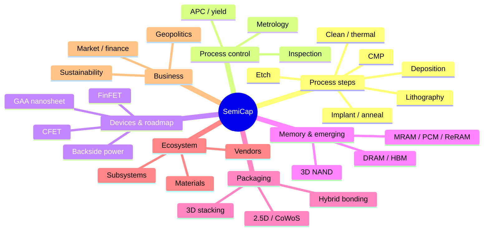

# Glossary of Semiconductor Capital Equipment Terms and Acronyms

A consolidated reference for the terms, acronyms, companies, and concepts used throughout this database. Definitions are written for quick reference; for fuller treatment, follow the file pointers (e.g., "File 15") to the relevant section. Entries are grouped by theme and ordered alphabetically within each group.

---

## 📊 Concept Map

*The database's themes at a glance (Mermaid mindmap renders natively on GitHub).*

---

## 1. Process Steps and Equipment Categories

- **ALD (Atomic Layer Deposition):** Deposition by self-limiting, surface-saturating reactions that add one sub-monolayer per cycle, giving angstrom-level thickness control and near-perfect conformality. The enabling technology for high-k gate stacks, FinFET/GAA, DRAM capacitors, and 3D NAND. (File 04)
- **ALE (Atomic Layer Etch):** The subtractive counterpart to ALD — removing material one atomic layer at a time via self-limiting cycles, for atomic-scale precision and low damage (e.g., GAA channel release). (File 05)
- **APCVD (Atmospheric Pressure CVD):** CVD at atmospheric pressure; high throughput, lower conformality; limited modern role. (File 04)
- **ASD (Area-Selective Deposition):** Selective ALD/CVD that grows material only on certain surfaces (e.g., metal not dielectric), enabling self-aligned structures that relax overlay requirements. (Files 04, 23)
- **BEOL (Back-End-of-Line):** The multi-level metal interconnect (up to 15–20 layers) connecting transistors; copper dual-damascene with low-k dielectrics, transitioning to Ru/Mo. (File 02)
- **CCP (Capacitively Coupled Plasma):** Plasma-etch source using parallel-plate electrodes; excels at dielectric etch (oxide, nitride, low-k). (File 05)
- **CMP (Chemical Mechanical Planarization):** Polishing the wafer flat by combined chemical softening and mechanical abrasion; essential for multilayer builds and for hybrid-bonding surface preparation. (File 06)
- **CVD (Chemical Vapor Deposition):** Film deposition by gas-phase precursor reaction at the surface; variants LPCVD, APCVD, PECVD, HDP-CVD, FCVD. (File 04)
- **DRIE (Deep Reactive-Ion Etch):** Deep silicon etch (often Bosch process) for TSVs, MEMS, and backside vias. (Files 05, 11)
- **FCVD (Flowable CVD):** CVD depositing a liquid-like film that wicks into narrow gaps before curing, solving void-free gap-fill. (File 04)
- **FEOL (Front-End-of-Line):** The transistor-building part of the flow — isolation, wells, gate stack, source/drain, contacts. (File 02)
- **HDP-CVD (High-Density Plasma CVD):** CVD with simultaneous sputter-etch for void-free gap-fill. (File 04)
- **IBE (Ion Beam Etch):** Physical etch with a broad ion beam at an angle; used to pattern MRAM MTJ pillars where plasma etch causes redeposition shorts. (File 23)
- **ICP (Inductively Coupled Plasma):** Plasma-etch source with independent flux/energy control; favored for conductor etch. (File 05)
- **iPVD (Ionized PVD):** PVD with ionized metal flux directed into high-aspect-ratio features for barrier/seed layers. (File 04)
- **LPCVD (Low-Pressure CVD):** Batch CVD at reduced pressure and high temperature for polysilicon, nitride, and TEOS oxide. (File 04)
- **MOL (Middle-of-Line):** The tightest-pitch local interconnect bridging FEOL and BEOL (local interconnect, self-aligned contacts, M0/V0). (File 02)
- **PEALD / PECVD (Plasma-Enhanced ALD / CVD):** Plasma-assisted deposition enabling lower temperatures, essential for BEOL's ≤400°C budget. (File 04)
- **PLAD (Plasma Doping):** Conformal, high-dose doping of 3D surfaces by plasma immersion. (File 07)
- **PVD (Physical Vapor Deposition):** Sputter deposition of metals from a solid target; barriers, seeds, electrodes. (File 04)
- **RIE (Reactive-Ion Etch):** Moderate-density plasma etch; predecessor to high-density-plasma etch. (File 05)
- **RTP (Rapid Thermal Processing):** Single-wafer lamp heating to peak temperature in seconds for dopant activation with minimal diffusion. (Files 07, 09)
- **SADP / SAQP (Self-Aligned Double/Quadruple Patterning):** Spacer-based multi-patterning that doubles/quadruples line density beyond single-exposure resolution. (File 03)
- **Selective etch:** Etch that removes one material while sparing an adjacent similar one (e.g., SiGe vs. Si for GAA channel release). (File 05)
- **Spatial ALD:** ALD with spatially (not temporally) separated precursor zones for higher throughput. (File 04)

---

## 2. Lithography

- **193i (ArF immersion):** 193 nm lithography with water immersion (NA up to 1.35); the workhorse for most layers and mature nodes. (File 03)
- **Actinic inspection:** EUV mask inspection at the 13.5 nm working wavelength (ZEISS AIMS EUV), needed to see EUV-relevant and stochastic defects. (Files 03, 08, 23)
- **CAR (Chemically Amplified Resist):** Photoresist using a photoacid generator to catalyze a solubility change; the incumbent EUV resist. (Files 03, 23)
- **Computational lithography:** Software (OPC, SMO, ILT) that pre-distorts mask/illumination to compensate for diffraction; increasingly GPU/AI-accelerated (cuLitho). (Files 03, 22)
- **DSA (Directed Self-Assembly):** Patterning by block-copolymer microphase separation guided by a lithographic pre-pattern; multiplies density and rectifies roughness. (Files 03, 23)
- **DUV (Deep Ultraviolet):** Lithography at 248 nm (KrF) and 193 nm (ArF); DUV immersion remains the industry workhorse. (File 03)
- **EUV (Extreme Ultraviolet):** 13.5 nm lithography using laser-produced tin-plasma source, all-reflective Mo/Si optics, and reflective masks; ASML's monopoly. (File 03)
- **High-NA EUV:** 0.55-NA EUV (ASML EXE platform) with anamorphic optics and a halved (26×16.5 mm) field; Intel 18A is first HVM insertion. (Files 03, 15, 23)
- **Hyper-NA EUV:** Proposed future EUV beyond 0.55 NA (~0.75); faces severe mask-3D, depth-of-focus, and field-size challenges. (File 23)
- **ILT (Inverse Lithography Technology):** Computing the ideal (often curvilinear) mask by solving the inverse imaging problem. (File 03)
- **k₁ factor:** Process factor in the Rayleigh resolution equation (Resolution = k₁·λ/NA); single-exposure floor ≈ 0.25. (File 03)
- **LELE (Litho-Etch-Litho-Etch):** Multi-patterning interleaving two exposures/etches to double density. (File 03)
- **LER / LWR (Line-Edge / Line-Width Roughness):** Random edge/width variation, a key EUV stochastic limit driven by photon shot noise. (Files 03, 23)
- **MOR (Metal-Oxide Resist):** Tin-oxide-based EUV resist (Inpria/JSR) with higher resolution and lower LER; key for High-NA. (Files 03, 16, 23)
- **NA (Numerical Aperture):** Light-gathering measure of the projection optics (NA = n·sinθ); higher NA improves resolution but shrinks depth of focus. (File 03)
- **NIL (Nanoimprint Lithography):** Patterning by physically stamping resist with a template (Canon); first foothold in 3D NAND. (File 03)
- **NTD (Negative-Tone Develop):** Resist/process scheme improving contrast for contact/trench layers. (File 03)
- **OPC (Optical Proximity Correction):** Mask-shape modification to compensate for diffraction and process effects. (File 03)
- **Overlay:** Alignment accuracy of each layer to those beneath; budgets approaching/below 2 nm at advanced nodes. (File 08)
- **Pellicle:** Thin protective membrane over the mask; EUV pellicles must transmit ~90% and survive high power (CNT pellicles in development). (Files 03, 23)
- **SMO (Source-Mask Optimization):** Joint optimization of illumination and mask pattern. (File 03)
- **Stochastic effects:** Random EUV defects (bridges, breaks) and roughness from photon shot noise; a central EUV challenge. (Files 03, 23)

---

## 3. Devices, Architectures, and Roadmap

- **BPR (Buried Power Rail):** Power rail buried in a substrate trench, freeing lower-metal routing; a step toward backside power. (File 15)
- **BSPDN (Backside Power Delivery Network):** Moving power delivery to the wafer backside via nano-TSVs, freeing the frontside for signal routing. Intel PowerVia, TSMC Super Power Rail. (Files 15, 23)
- **CFET (Complementary FET):** Vertically stacking nMOS over pMOS in one footprint (~50% cell-area reduction); monolithic or sequential (bonded) implementations. (Files 15, 23)
- **CPP / CGP (Contacted (Poly) Gate Pitch):** Minimum gate-to-gate distance including contact; the key horizontal density metric. (File 15)
- **Dennard scaling:** The (now-ended, ~2005–07) principle that power density stayed constant as transistors shrank; its end caused the multi-core and power-density era. (File 15)
- **DIBL (Drain-Induced Barrier Lowering):** Short-channel effect where drain voltage lowers the source barrier, degrading gate control. (File 15)
- **DTCO / STCO (Design-/System-Technology Co-Optimization):** Co-designing process with the cell library (DTCO) or the whole system/package (STCO) to extract gains beyond pure shrink. (File 15)
- **FinFET:** 3D transistor with the gate wrapping a thin silicon fin on three sides; first commercialized at Intel 22nm (2011). (File 15)
- **Forksheet:** Intermediate GAA architecture with nMOS/pMOS separated by a dielectric wall; ~20% denser than nanosheet, simpler than CFET. (Files 15, 23)
- **GAA (Gate-All-Around):** Transistor whose gate wraps the channel on all sides; nanosheet implementation succeeds FinFET (Samsung SF3, TSMC N2, Intel RibbonFET). (File 15)
- **HKMG (High-k/Metal Gate):** Gate stack using a high-k dielectric (HfO₂) and metal gate, introduced at 45nm to cut leakage. (Files 02, 15)
- **IRDS (International Roadmap for Devices and Systems):** IEEE-sponsored successor (2016–) to the ITRS; covers More Moore, More than Moore, and Beyond CMOS. (File 15)
- **ITRS (International Technology Roadmap for Semiconductors):** The 1992–2016 consensus industry roadmap. (File 15)
- **ITV / MIV (Inter-Tier / Monolithic Inter-tier Via):** Vertical connection between stacked device tiers in CFET / monolithic 3D. (File 23)
- **M3D (Monolithic 3D Integration):** Building multiple active device layers sequentially on one wafer; CEA-Leti CoolCube. (File 23)
- **MBCFET (Multi-Bridge-Channel FET):** Samsung's nanosheet (GAA) branding. (File 15)
- **MMP (Minimum Metal Pitch):** Tightest interconnect wiring pitch; the key interconnect density metric. (File 15)
- **MTr/mm² (Mega-Transistors per mm²):** Transistor density; the headline density figure. (File 15)
- **Nanosheet / Nanowire:** GAA channel cross-sections — wide thin sheet (more current, chosen for logic) vs. narrow wire (better electrostatics). (File 15)
- **NanoFlex:** TSMC's variable-nanosheet-width multi-Vt capability. (File 15)
- **Node naming problem:** "nm" node names are marketing labels, not physical dimensions; compare via CPP, MMP, density, SRAM cell instead. (File 15)
- **PowerVia:** Intel's backside power-delivery technology, paired with RibbonFET at 18A. (Files 15, 23)
- **RibbonFET:** Intel's GAA (nanosheet) transistor branding. (File 15)
- **SS (Subthreshold Slope):** How sharply a transistor turns off (mV/decade); ~60 mV/dec Boltzmann limit at room temperature. (File 15)
- **Super Power Rail (SPR):** TSMC's backside power-delivery technology (A16). (File 15)
- **Vdd:** Supply voltage; has scaled slowly since Dennard scaling ended, contributing to power-density limits. (File 15)

---

## 4. Memory and Emerging Devices

- **3D NAND:** Vertically stacked NAND flash (96→300+ layers) using high-aspect-ratio channel-hole etch and word-line replacement. (File 13)
- **DRAM:** Dynamic RAM (1T1C cell) scaling in-plane with vertical high-aspect-ratio capacitors; first memory to adopt EUV; moving toward 3D DRAM. (Files 13, 23)
- **FeFET / FeRAM / FTJ (Ferroelectric FET / RAM / Tunnel Junction):** Non-volatile devices using ferroelectric HfO₂ (HZO). (File 23)
- **HBM (High-Bandwidth Memory):** Stacked DRAM (8–16 dies via TSV/micro-bump, moving to hybrid bonding) beside logic on an interposer; central to AI. (Files 11, 13)
- **HZO (Hafnium-Zirconium Oxide):** CMOS-compatible ferroelectric (doped HfO₂) for FeFET/FeRAM and negative-capacitance research. (Files 16, 23)
- **IGZO (Indium-Gallium-Zinc-Oxide):** Low-leakage oxide semiconductor for 3D DRAM access transistors and BEOL/monolithic-3D devices. (File 23)
- **IMC (In-Memory Computing):** Performing matrix-vector multiply within a memory crossbar (Ohm's/Kirchhoff's laws) for energy-efficient AI inference. (File 23)
- **MTJ (Magnetic Tunnel Junction):** The storage element of MRAM (~30-layer PVD stack with MgO barrier). (Files 13, 23)
- **NCFET (Negative-Capacitance FET):** Proposed sub-60-mV/dec device using a ferroelectric gate; mechanism still debated. (File 23)
- **PCM (Phase-Change Memory):** Memory using amorphous/crystalline states of a chalcogenide (GST); used in analog compute. (Files 13, 23)
- **RRAM / ReRAM (Resistive RAM):** Memory using a conductive filament in a metal-oxide (HfOx ALD); for embedded NVM and analog compute. (Files 13, 23)
- **STT-MRAM / SOT-MRAM (Spin-Transfer-Torque / Spin-Orbit-Torque MRAM):** Magnetoresistive memory switched by spin-polarized current (STT) or a separate heavy-metal write path (SOT). (Files 13, 23)
- **TMR (Tunneling Magnetoresistance):** Resistance ratio between MTJ magnetic states; >200% needed for read margin. (File 23)

---

## 5. Beyond-Silicon and Compound Semiconductors

- **2DEG (Two-Dimensional Electron Gas):** The conductive channel at the AlGaN/GaN interface in GaN HEMTs. (File 12)
- **CNFET (Carbon-Nanotube FET):** Transistor using semiconducting carbon nanotubes; superb intrinsic properties but severe purity/alignment hurdles. (File 23)
- **GaN (Gallium Nitride):** Wide-bandgap semiconductor for power (GaN-on-Si) and RF (GaN-on-SiC); grown by MOCVD. (File 12)
- **HEMT (High-Electron-Mobility Transistor):** High-frequency/power transistor using a heterostructure 2DEG (GaN, GaAs, InGaAs). (File 12)
- **III-V:** Compound semiconductors (GaAs, InP, InGaAs) for RF and photonics; InP dominates data-center optics. (Files 12, 23)
- **MBE (Molecular Beam Epitaxy):** Ultra-high-vacuum epitaxy giving the highest-quality films; research/specialty, small wafers. (Files 04, 12)
- **MOCVD (Metal-Organic CVD):** Epitaxy for compound semiconductors (GaN, SiC, InP) and wafer-scale 2D-material growth; Aixtron, Veeco. (Files 04, 12, 23)
- **PVT (Physical Vapor Transport):** Seeded-sublimation crystal growth for SiC boules (~2,200–2,400°C); slow and defect-prone. (File 12)
- **SiC (Silicon Carbide):** Wide-bandgap semiconductor for high-voltage power (EVs, grid); 150→200 mm wafer transition is the key cost lever. (File 12)
- **TMD (Transition-Metal Dichalcogenide):** 2D channel materials (MoS₂, WS₂, WSe₂) with monolayer thickness for ultra-scaled channels. (File 23)
- **UWBG (Ultra-Wide-Bandgap):** Next-generation power/RF materials — Ga₂O₃, diamond, AlN. (File 23)

---

## 6. Advanced Packaging and Test

- **2.5D / CoWoS:** Side-by-side dies on a silicon interposer with TSVs (TSMC Chip-on-Wafer-on-Substrate); backbone of AI accelerators. (File 11)
- **ATE (Automated Test Equipment):** Testers applying patterns to verify chip function; Advantest, Teradyne. (File 25)
- **Chiplet:** A die that is one functional block of a larger system, integrated in a package with others. (Files 11, 15)
- **C4 / micro-bump:** Solder-bump interconnects for flip-chip and 3D stacking. (File 11)
- **CPO (Co-Packaged Optics):** Integrating optical transceivers directly in the package to beat the electrical bandwidth wall. (File 23)
- **DFT (Design-for-Test):** Designing chips for testability (scan, BIST, boundary scan, test compression). (File 25)
- **Foveros / SoIC / X-Cube:** Intel / TSMC / Samsung 3D die-stacking platforms (moving to hybrid bonding). (File 11)
- **FOWLP / InFO (Fan-Out Wafer-Level Packaging):** Dies embedded in a molded wafer with redistribution wiring fanned out (TSMC InFO). (File 11)
- **Hybrid bonding (Cu-Cu):** Direct copper-and-dielectric bonding at sub-10 µm (toward sub-1 µm) pitch; requires sub-nm CMP and tight alignment. (Files 06, 11)
- **KGD (Known-Good-Die):** A die tested and verified good before integration into a costly multi-die package. (File 25)
- **OSAT (Outsourced Semiconductor Assembly and Test):** Packaging/test subcontractors (ASE, Amkor, JCET). (File 11)
- **RDL (Redistribution Layer):** Fine-pitch wiring built over dies/interposers to route connections. (File 11)
- **SLT (System-Level Test):** Testing a packaged device in a realistic application environment; complements/replaces burn-in. (File 25)
- **TCB (Thermo-Compression Bonding):** Die bonding using heat and pressure for micro-bump stacks. (File 11)
- **TSV (Through-Silicon Via):** Vertical via through a wafer for 3D/2.5D interconnect; nano-TSVs for backside power. (Files 11, 15)
- **UCIe (Universal Chiplet Interconnect Express):** Open die-to-die interconnect standard for interoperable chiplets. (File 23)

---

## 7. Metrology, Process Control, and Reliability

- **APC (Advanced Process Control):** Using measurements to steer the process (run-to-run, feed-forward/back, FDC, virtual metrology). (File 08)
- **BTI (NBTI/PBTI — Bias Temperature Instability):** Threshold-voltage drift under bias/temperature; a reliability concern. (File 25)
- **CD (Critical Dimension):** A patterned feature's size; measured by CD-SEM, OCD/scatterometry, CD-AFM, TEM. (File 08)
- **CD-SEM:** Critical-dimension scanning electron microscopy; the workhorse inline CD tool (Hitachi High-Tech). (File 08)
- **D₀ (Defect Density):** Yield-killing defects per unit area; the central manufacturability metric. (File 15)
- **Electromigration:** Current-driven metal-atom transport causing interconnect failure (Black's equation). (File 25)
- **FDC (Fault Detection and Classification):** Monitoring tool sensors to detect excursions; increasingly ML-based. (Files 08, 22)
- **IBO / DBO (Image-/Diffraction-Based Overlay):** Optical overlay-measurement methods (KLA Archer, ASML YieldStar). (File 08)
- **OCD (Optical Critical Dimension) / Scatterometry:** Model-based optical metrology (RCWA) extracting 3D profiles from periodic structures. (File 08)
- **OEE (Overall Equipment Effectiveness):** Tool availability × performance × quality; the productivity metric. (File 24)
- **OES (Optical Emission Spectroscopy):** In-situ plasma/etch endpoint detection by emission lines. (Files 05, 08)
- **TDDB (Time-Dependent Dielectric Breakdown):** Gate-dielectric lifetime reliability test. (File 25)
- **Virtual metrology:** ML prediction of a wafer's measurements from tool sensor data, reducing physical sampling. (Files 08, 22)
- **Yield learning:** The process of driving defect density down and yield up along a learning curve during a node ramp. (File 15)

---

## 8. Materials, Subsystems, and Infrastructure

- **AMHS (Automated Material Handling System):** Overhead-hoist transport, stockers, and FOUP logistics in a fab (SEMI E84). (File 24)
- **CMP slurry / pad:** The abrasive chemistry and polyurethane pad consumables central to CMP cost and performance. (Files 06, 16)
- **EOT (Equivalent Oxide Thickness):** The SiO₂-equivalent thickness of a high-k gate dielectric. (File 02)
- **ESC (Electrostatic Chuck):** Wafer clamp providing electrostatic hold and multi-zone temperature control. (File 20)
- **F-GHG / PFC (Fluorinated Greenhouse Gas / Perfluorocarbon):** High-GWP process gases (NF₃, SF₆, CF₄) requiring abatement. (Files 20, 21)
- **FOUP (Front-Opening Unified Pod):** Standardized 300 mm wafer carrier providing a mini-environment (SEMI E47.1). (Files 20, 24)
- **High-k / Low-k / Ultra-low-k:** High-permittivity gate/capacitor dielectrics (HfO₂, ZrO₂) and low-permittivity BEOL insulators (SiOCH, porous, air gap). (Files 02, 16)
- **MFC (Mass Flow Controller):** Precise gas-flow regulator, critical for ALD dose control (Brooks, Horiba, Fujikin). (File 20)
- **Process kit:** Consumable chamber parts (ceramic liners, focus rings, electrodes) that erode and are replaced on a cycle. (File 20)
- **RF power / matching network:** The plasma-excitation subsystem (MKS, Advanced Energy) whose precision and pulsing govern etch/deposition. (File 20)
- **Ru / Mo / Co (Ruthenium / Molybdenum / Cobalt):** New BEOL interconnect metals replacing copper at the tightest pitches (barrier-less or thin-barrier). (Files 04, 15)
- **SOI (Silicon-on-Insulator):** Wafer with a thin silicon device layer over a buried oxide (Soitec Smart Cut); FD-SOI, RF-SOI, photonics. (Files 12, 16)
- **UPW (Ultrapure Water):** Water purified to >18.2 MΩ·cm resistivity and <0.5 ppb TOC for wafer rinsing. (Files 10, 24)
- **ULPA / HEPA:** Ultra-low / high-efficiency particulate air filters maintaining cleanroom particle levels. (File 24)

---

## 9. Companies and Institutions (Quick Reference)

- **AMAT (Applied Materials):** Broadest WFE portfolio — deposition, etch, CMP, implant, thermal, e-beam. (File 14)
- **AMEC / NAURA / Piotech / SMEE / SiCarrier:** China domestic equipment makers (etch, deposition, lithography). (Files 14, 18)
- **ASE / Amkor / JCET:** Leading OSATs (packaging/test). (File 11)
- **ASM International:** ALD and epitaxy leader. (File 14)
- **ASML:** Sole EUV/High-NA supplier; leading DUV maker. (Files 03, 14)
- **Advantest / Teradyne / Cohu:** Test (ATE, handlers). (File 25)
- **BESI / Kulicke & Soffa / ASM Pacific:** Packaging assembly and bonding. (File 11)
- **DISCO:** Dicing and grinding/thinning leader. (Files 11, 14)
- **EV Group / SUSS MicroTec:** Wafer-bonding and temporary-bond/debond. (Files 11, 14)
- **IMEC / CEA-Leti / IBM Research / Fraunhofer:** Pre-competitive research hubs. (Files 01, 15, 23)
- **KLA:** Dominant process-control (inspection/metrology) company. (Files 08, 14)
- **Kokusai Electric:** Batch furnace/ALD leader (memory). (File 14)
- **Lam Research:** Etch leader; strong deposition and clean (memory-exposed). (Files 05, 14)
- **MKS Instruments / Advanced Energy / Entegris:** Subsystems and materials. (Files 16, 20)
- **Onto Innovation / Nova:** Metrology specialists. (Files 08, 14)
- **SCREEN:** Single-wafer wet-clean leader. (Files 10, 14)
- **Shin-Etsu / SUMCO / JSR / TOK / AGC / Hoya:** Materials leaders (wafers, resist, EUV mask blanks). (File 16)
- **TEL (Tokyo Electron):** Coater/developer-track leader; broad etch, deposition, clean. (File 14)
- **ZEISS:** EUV/High-NA optics and actinic mask inspection. (Files 03, 14)

---

## 10. Market, Policy, and Economics

- **ASP (Average Selling Price):** Tool price (EUV ~$150–200M; High-NA ~$380M+; etch/ALD chambers ~$2–6M). (File 19)
- **BIS (Bureau of Industry and Security):** U.S. agency administering the EAR export controls. (File 18)
- **Book-to-bill:** Ratio of orders to shipments; >1.0 signals expansion. (File 19)
- **CHIPS Act / EU Chips Act:** U.S. (~$52B) and EU (~€43B) subsidy programs for domestic capacity and R&D. (File 18)
- **EAR (Export Administration Regulations):** U.S. dual-use export-control regime covering advanced equipment. (File 18)
- **FDPR (Foreign Direct Product Rule):** Extends U.S. jurisdiction to foreign goods incorporating U.S. technology — the key extraterritorial lever. (File 18)
- **"Big Fund" (National IC Industry Investment Fund):** China's state semiconductor fund (Phases I–III, ~$22B/$30B/$47B). (File 18)
- **TAM (Total Addressable Market):** Market size; SemiCap TAM ~$37B (2015) → ~$113B (2024) → ~$160–200B+ projected (2030). (File 19)
- **WFE (Wafer Fab Equipment):** Front-end process equipment; the core of the SemiCap market. (Files 01, 19)

---

## Cross-Reference Note

This glossary consolidates terms defined throughout the database. The two deep-dive files retain their own focused appendices — **File 15 (Appendix: Key Roadmap Acronyms)** and **File 23 (Appendix: Key Frontier-Technology Acronyms)** — for roadmap- and research-specific terms in context. For full treatment of any entry, follow its file pointer to the relevant section.
